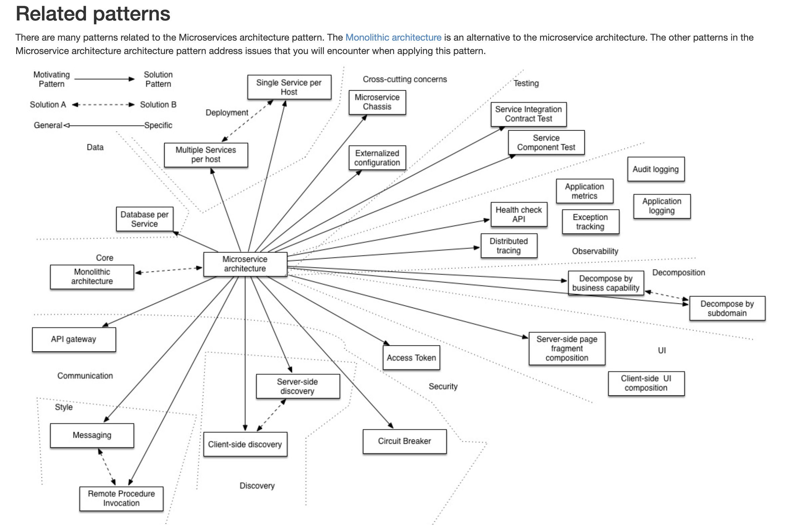
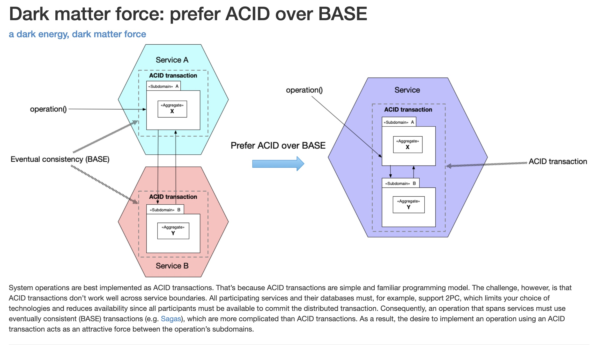

# 00 - Microservice architecture patterns

You are developing a business-critical enterprise application. 
You need to deliver changes rapidly, frequently and reliably - as measured by the `DORA metrics` - in order for 
your business to thrive in today’s volatile, uncertain, complex and ambiguous world. 
Consequently, your engineering organization is organized into small, loosely coupled, cross-functional teams. 
Each team delivers software using DevOps practices as defined by the `DevOps handbook`. 
In particular, it practices continuous deployment. The team delivers a stream of small, frequent changes that are tested 
by an automated deployment pipeline and deployed into production.

https://microservices.io/patterns/microservices.html

20-30 min de charla dónde te pedimos que directamente nos cuentes un proyecto del que te sientas orgulloso y domines
(2 min para ponernos en contexto del tu ROL en ese proyecto y 1 min la parte funcional) y luego nos lo bajes a nivel técnico.
(elección de tecnologías, bbdd, escalabilidad, rendimiento, arquitectura...etc...

Number of requests per second/minute.
Failed requests per second.
Average response time per service endpoint.
Distribution of time required for each request.
Average execution time for the fastest 10% and slowest 10% queries.
Success/failure rate by service.

## ACID over BASE

System operations are best implemented as `ACID transactions`. That’s because ACID transactions are simple and 
familiar programming model. The challenge, however, is that ACID transactions don’t work well across service boundaries. 
All participating services and their databases must, for example, support 2PC (two-phase-commit), which limits 
your choice of technologies and reduces availability since all participants must be available to commit 
the distributed transaction. Consequently, an operation that spans services must use `eventually consistent (BASE) 
transactions` (e.g. Sagas), which are more complicated than ACID transactions. As a result, the desire to implement 
an operation using an ACID transaction acts as an attractive force between the operation’s subdomains.

## Eventual consistency

The information is spread between several microservices and their databases. So sometimes, when you update a resource 
into a microservice, the updated information can take a time to spread on the remaining microservices. This is a problem. 
And this is why is called eventual consistency, because to be consistence maybe has to take a time to become.

## Anti-corruption layer Pattern

How do you prevent a legacy monolith’s domain model from polluting the domain model of a new service?
Define an anti-corruption layer, which translates between the two domain models.

