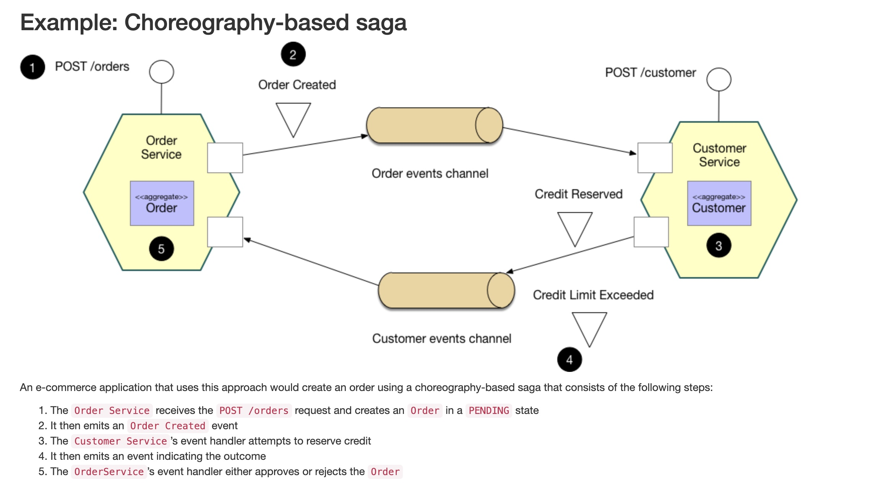
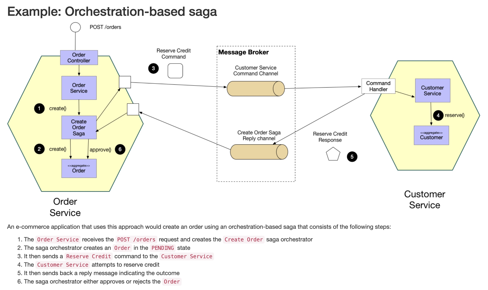

# 01 - Sagas

reference: 
- https://microservices.io/patterns/data/saga.html

## Pattern: Saga

Every microservice has its own responsibility and aggregates. 
But sometimes, to do one action you need the information of another aggregate located in another microservice.
For instance, exists two microservices to handle the customers and the orders. 
Imagine that a customer wants to do an order. So when the microservice orders receives a request for an order, 
it doesn't know if the customer has credit or not to pay the order. 
So the orders microservice has to do a call to the customer microservice, and from this, the customer microservice 
ask for the credit of the user and do the operation of pay, and sends a domain event to the order microservice to 
confirm or reject the order. The order microservice reads the answer and confirm or reject the order as the incoming 
message say. Everything involved has to be transactional, in both services. This is what the `saga pattern` is about.

There are two ways of coordination sagas:

- `Choreography`: each local transaction publishes domain events that trigger local transactions in other services, but
the transmitter doesn't know who is going to read the event (message). Only emits a domain event.
- `Orchestration`: an orchestrator (object) tells the participants what local transactions to execute. It knows the process 
and the participants in the process. Emits events, but these domain events are `commands` (ordenes) to do in the target microservice.

### Example: Choreography-based saga

### Example: Orchestration-based saga

### Choreography-based saga vs Orchestration-based saga

In the `Choreography-based` example the transmitter emits a domain event `order created`, but it doesn't know who is going to 
consume the message. It's only saying that the `order is created`. 
In the `Choreography-based` example the transmitter emits a domain event `reserves credit` so it's asking another known microservice 
that it has to do something. It's doing a command (emite una orden)