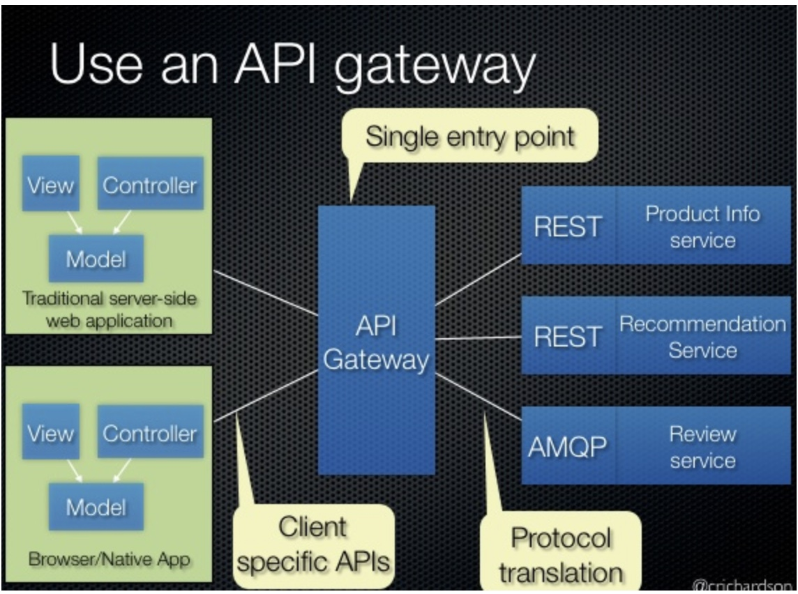

# 02 - API Gateway / backend for frontend Pattern

reference:
- https://microservices-io.translate.goog/patterns/apigateway.html

Take into account that the communication is via "http"

A `krakenD` is an example of api-gateway