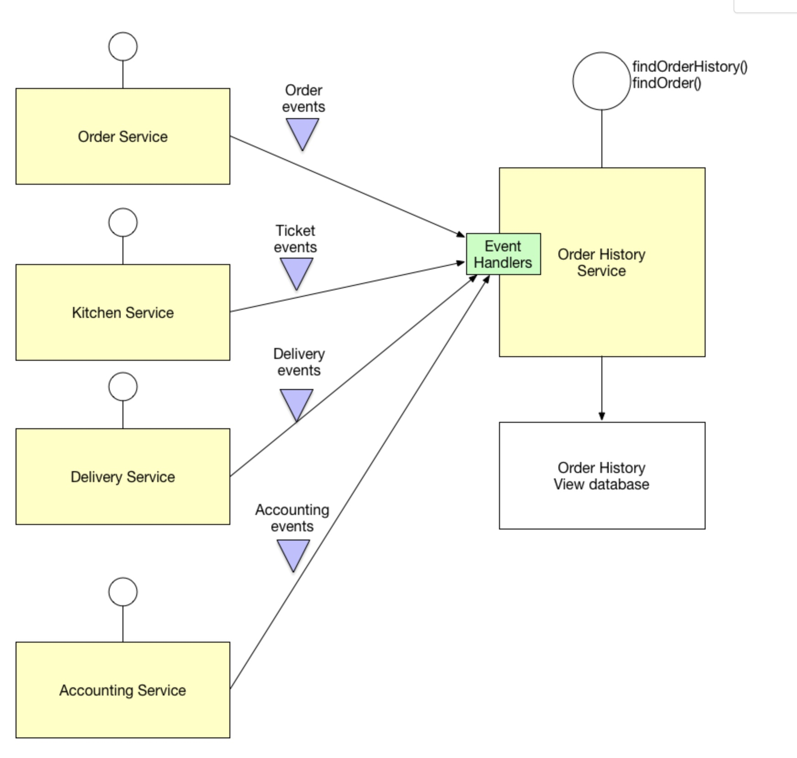

# 03- Command Query Responsibility Segregation (CQRS)

## 

There two part involved in this pattern: 
- the command, is the part which is involved to ask/prepare/aggregate/transform the data to store/send to the next stage.
For instance, the in the example all the services emits domain events, and there is a microservice which is listening these
domain events to aggregate the information and store it and its database.
- the query, is the part which is involved in serve the request.

In another examples, the ms-search-prod reads events from several topics, and updates the database. Once is done, emit a 
domain event to indicate that the domain was updated (so this is the command part of the CQRS pattern). 
So the event goes to another topic which another microservice is in charge to read and update its database. 
The clients of the apps, can ask for the info to this final microservice (so this is the query part of the CQRS pattern).