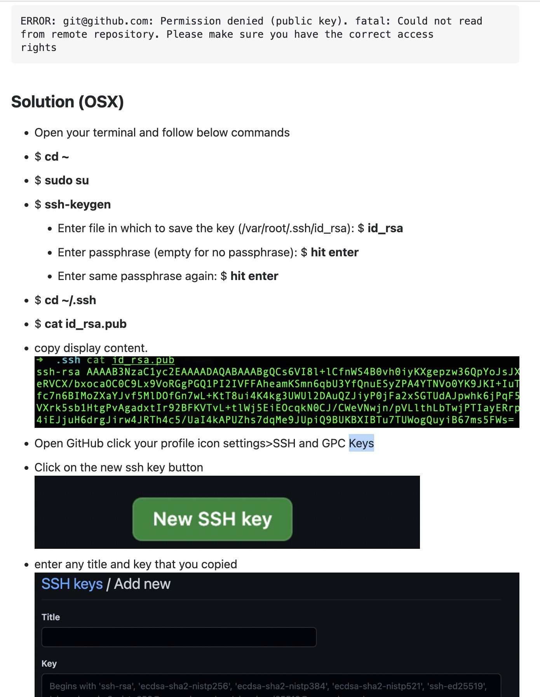

# Setting ssh keys

reference:
- https://docs.github.com/en/authentication/connecting-to-github-with-ssh/adding-a-new-ssh-key-to-your-github-account

## problem

```bash
> ms-ma--milanuncios-ads % git pull git@github.com: Permission denied (publickey).
fatal: Could not read from remote repository.
Please make sure you have the correct access rights and the repository exists.
```

## Solution: ssh configuration

For seeing the previous ssh configurations
```bash
cat ~/.ssh/config
```

you can see the shh profiles 

```bash
Host *
		AddKeysToAgent yes
		IgnoreUnknown UseKeychain
		UseKeychain yes
		IdentityFile ~/.ssh/id_rsa

Host development
        User usuarioX
        Port 22223
        ProxyJump gate

Host gate
        Hostname gate.somedomain.com
        User someUser
        Port 22223
        ForwardAgent yes
        IdentityFile ~/.ssh/id_rsa

Host pre-somedomain* pre-somedomain01 pre-somedomain02
        User anotheruser
        Port 22223
        ProxyJump gate

Host somedomain.whatever.com
        Port 29418
        User someUser
        IdentityFile ~/.ssh/id_ed25519%
```

to get the public key of the `~/.ssh/id_rsa` you have to do 

```bash
cat ~/.ssh/id_rsa_pub
```

go to github -> yourprofile -> settings -> SSH keys

in this page, create a new ssh key, and paste the content of `id_rsa_pub`

reboot the intellij and do `git pull`to see if everything is ok.




