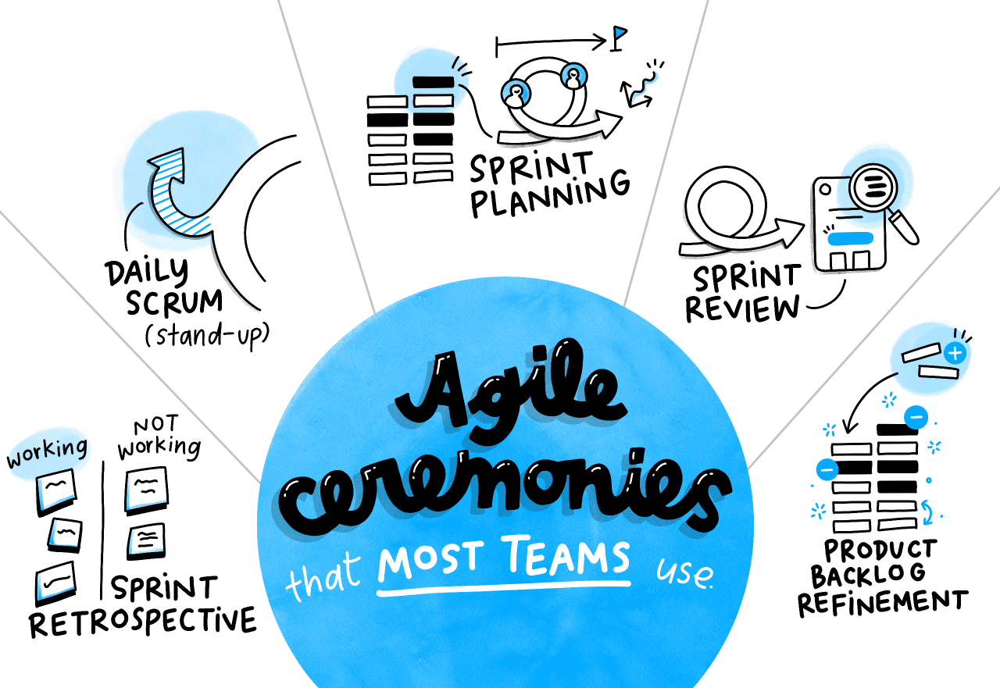
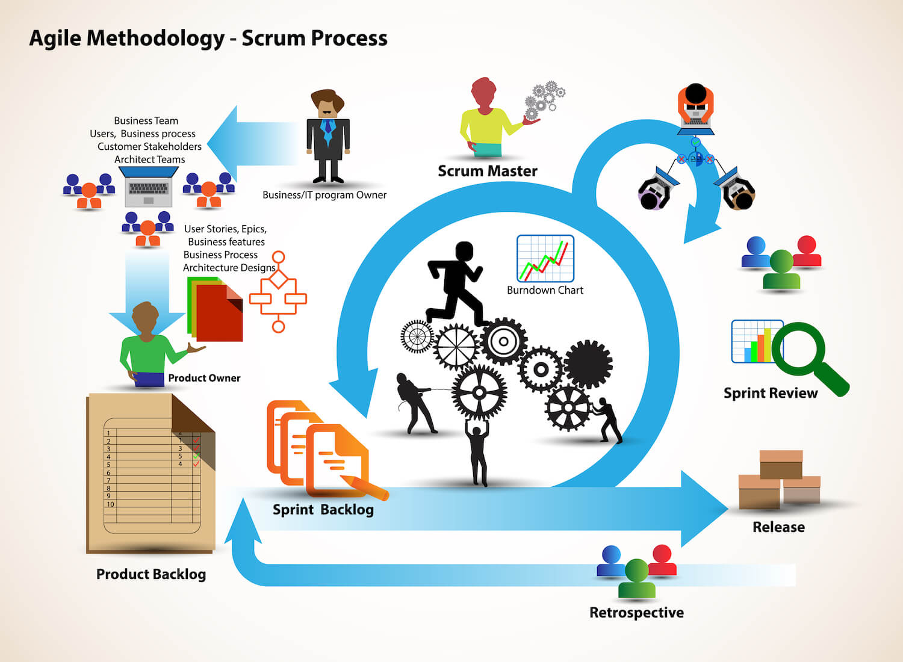

# Scrum

references:
- https://plan.io/blog/agile-ceremonies-guide/

## Ceremonies, in order
- daily
- product backlog refinement
- review
- retro
- sprint planning

- Backlog: Es la lista de tareas que deben realizar los equipos para desarrollar el producto o servicio deseado.
- Sprint: Es un período de tiempo para completar algunos conjuntos de tareas del backlog con el fin de consolidar un avance gradual en el producto o servicio.
- Propietario del producto Product Owner: Es la persona responsable de la defensa de los intereses de los clientes o usuarios finales, y de definir las tareas que se asignarán en el Backlog.
- Scrum Master: Es el encargado de ser un guardián de la metodología Scrum y asegurarse de que se está siguiendo correctamente.
- Daily Scrum: Son reuniones diarias, por lo general en la mañana, donde los miembros del equipo hablan sobre su progreso del día anterior y lo que quieren lograr ese día.
- Retrospectiva: Al final de cada Sprint el equipo se reúne para evaluar sus resultados, las dificultades que fueron superadas y planificar el siguiente Sprint, siempre basado en las enseñanzas del Sprint anterior.

## User stories

“As a [type of user] I want [some particular feature] so that [some benefit] is received.”