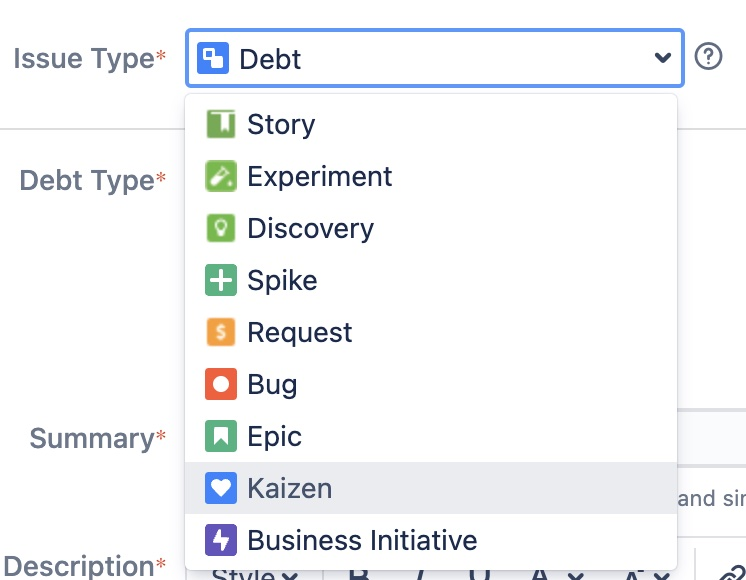

# Agile

reference:
- https://plan.io/blog/user-story-mapping/

- Definition of ready
- Definition of done
- MVP: Minimum Viable Product
- user stories
- epics
- tasks, subtasks
- Product owner
- stake holder
- development team 
- scrum master
- sprint
- sprint goal
- story telling, Ask an expert to tell a story [user-mapping](https://plan.io/blog/user-story-mapping/)
- prioritize
- business goals
- Request, bug, user story, experiment, discovery, spike, epic, kaizen, business initiative

