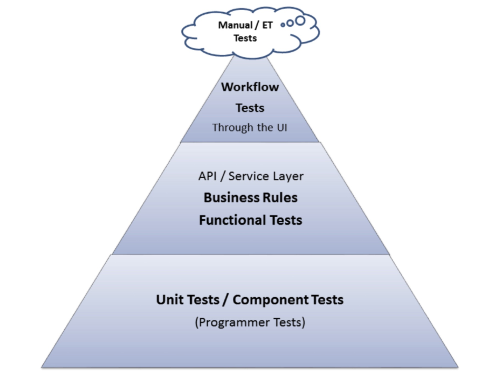

# Testing

- stubs
- mocking, spy
- pyramid test
- unit test
- integration test
- acceptance test
- "Pesticide Paradox" or "Pesticide Effect": a program has 100% test coverage but still contains bugs

## "Pesticide Paradox" or "Pesticide Effect"
Yes, there is a term commonly used in the software development industry to describe a situation where a program has 100% test coverage but still contains bugs. 
This phenomenon is referred to as the "Pesticide Paradox" or "Pesticide Effect".
The term is derived from the analogy of pesticide resistance in the biological world. 
When a pesticide is used extensively, pests may eventually develop resistance to it, rendering the pesticide ineffective. 
Similarly, if the same set of test cases is repeatedly applied without adding new or different test cases, the program may become resistant to those tests, and bugs that were not previously detected can remain undetected.
The Pesticide Paradox highlights the importance of continuously evolving and improving testing strategies. 
It emphasizes that relying solely on a fixed set of tests, even with 100% test coverage, may not be sufficient to uncover all potential issues in a program. It is essential to periodically review and enhance test cases, incorporate new test scenarios, and consider different testing techniques to ensure better test effectiveness and discover bugs that were previously missed.

