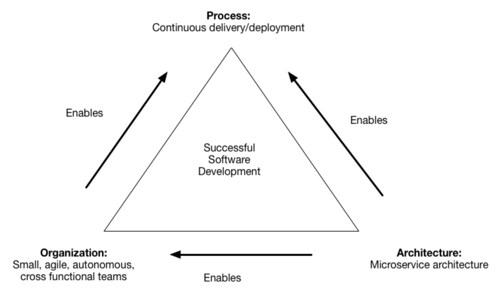
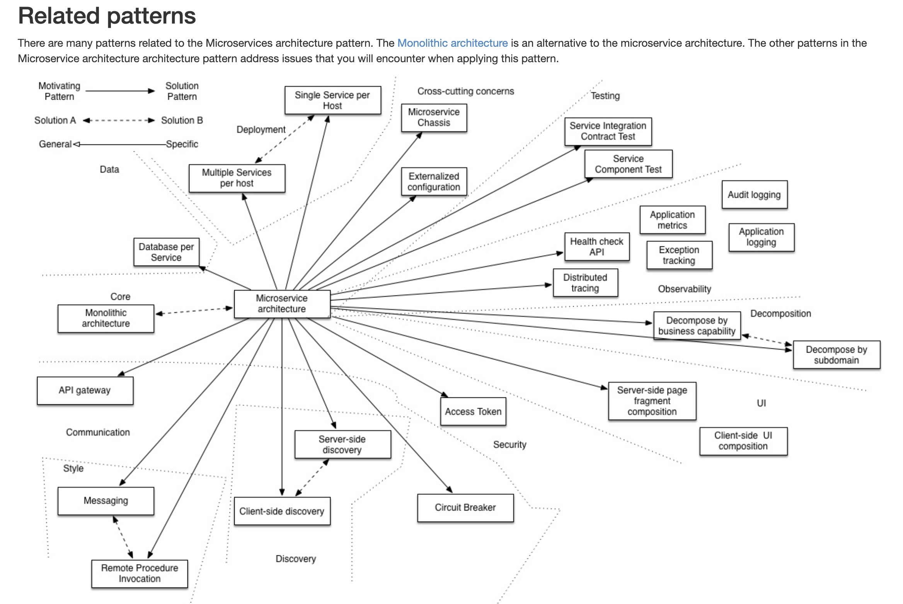
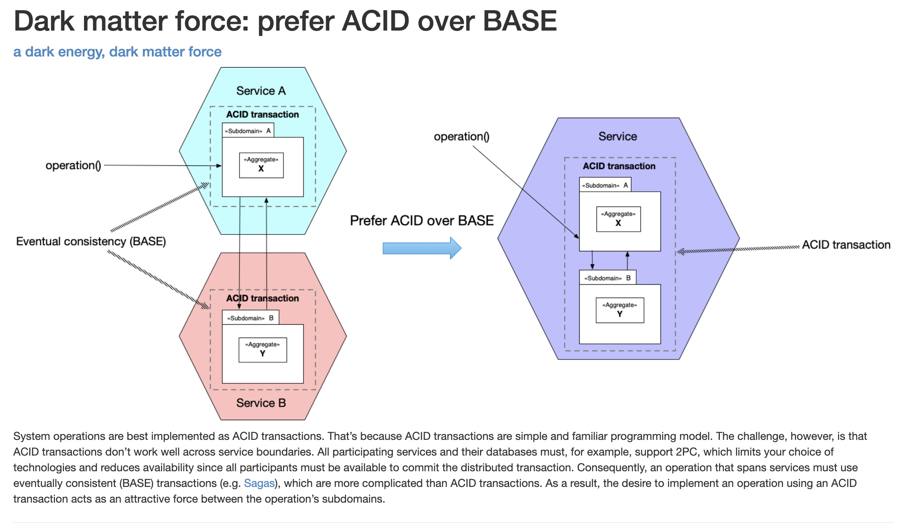

# 00 - Microservice architecture patterns

The goal of the microservice architecture is to accelerate software development by enabling continuous delivery/deployment.

The microservice architecture does this in two ways:

- Simplifies testing and enables components to deployed independently
- Structures the engineering organization as a collection of small (6-10 members), autonomous teams, each of which is responsible for one or more services

These benefits are not automatically guaranteed. Instead, they can only be achieved by the careful functional decomposition of the application into services.

A service must be small enough to be developed by a small team and to be easily tested. 
A useful guideline from object-oriented design (OOD) is the Single Responsibility Principle (SRP). 
The SRP defines a responsibility of a class as a reason to change, and states that a class should only have one reason to change. 
It make sense to apply the SRP to service design as well and design services that are cohesive and implement a small set of strongly related functions.

The application also be decomposed in a way so that most new and changed requirements only affect a single service. 
That is because changes that affect multiple services requires coordination across multiple teams, which slows down development. 
Another useful principle from OOD is the Common Closure Principle (CCP), which states that classes that change for the same reason should be in the same package. 
Perhaps, for instance, two classes implement different aspects of the same business rule. 
The goal is that when that business rule changes developers, only need to change code in a small number - ideally only one - of packages. 
This kind of thinking makes sense when designing services since it will help ensure that each change should impact only one service.

Forces
- The architecture must be stable
- Services must be `cohesive`. A service should implement a small set of strongly related functions.
- Services must conform to the Common `Closure Principle` - things that change together should be packaged together - to ensure that each change affect only one service
- Services must be `loosely coupled` - each service as an API that encapsulates its implementation. The implementation can be changed without affecting clients
- A service should be `testable`
- Each service be small enough to be developed by a `“two pizza”` team, i.e. a team of `6-10` people
- Each team that owns one or more services must be `autonomous. A team must be able to develop and deploy their services with minimal collaboration with other teams.

You are developing a business-critical enterprise application. 
You need to deliver changes rapidly, frequently and reliably - as measured by the `DORA metrics` - in order for 
your business to thrive in today’s volatile, uncertain, complex and ambiguous world. 
Consequently, your engineering organization is organized into small, loosely coupled, cross-functional teams. 
Each team delivers software using DevOps practices as defined by the `DevOps handbook`. 
In particular, it practices continuous deployment. The team delivers a stream of small, frequent changes that are tested 
by an automated deployment pipeline and deployed into production.

https://microservices.io/patterns/microservices.html

20-30 min de charla dónde te pedimos que directamente nos cuentes un proyecto del que te sientas orgulloso y domines
(2 min para ponernos en contexto del tu ROL en ese proyecto y 1 min la parte funcional) y luego nos lo bajes a nivel técnico.
(elección de tecnologías, bbdd, escalabilidad, rendimiento, arquitectura...etc...

Number of requests per second/minute.
Failed requests per second.
Average response time per service endpoint.
Distribution of time required for each request.
Average execution time for the fastest 10% and slowest 10% queries.
Success/failure rate by service.

## ACID over BASE

System operations are best implemented as `ACID transactions`. That’s because ACID transactions are simple and 
familiar programming model. The challenge, however, is that ACID transactions don’t work well across service boundaries. 
All participating services and their databases must, for example, support 2PC (two-phase-commit), which limits 
your choice of technologies and reduces availability since all participants must be available to commit 
the distributed transaction. Consequently, an operation that spans services must use `eventually consistent (BASE) 
transactions` (e.g. Sagas), which are more complicated than ACID transactions. As a result, the desire to implement 
an operation using an ACID transaction acts as an attractive force between the operation’s subdomains.

## Eventual consistency

The information is spread between several microservices and their databases. So sometimes, when you update a resource 
into a microservice, the updated information can take a time to spread on the remaining microservices. This is a problem. 
And this is why is called eventual consistency, because to be consistence maybe has to take a time to become.

## Anti-corruption layer Pattern

How do you prevent a legacy monolith’s domain model from polluting the domain model of a new service?

Define an anti-corruption layer, which translates between the two domain models.

## CAP theorem

In a distributed system ((P)artitioned) is not guarantee simultaneously at the same time when a communication network error occurs:
- (C)onsistency: Consistencia significa que todos los clientes ven los mismos datos al mismo tiempo, independientemente del nodo al que se conecten. Para que esto suceda, siempre que se escriban datos en un nodo, se debe reenviar o replicar al instante a todos los demás nodos del sistema antes de que la escritura se considere 'satisfactoria'.
- (A)vailability: Disponibilidad significa que cualquier cliente que realiza una solicitud de datos obtiene una respuesta, incluso si uno o más nodos están inactivos. Otra forma de indicar esto: todos los nodos activos del sistema distribuido devuelven una respuesta válida para cualquier solicitud, sin excepción.
- (P)artitioning: La tolerancia de las particiones significa que el clúster debe continuar trabajando a pesar de las interrupciones de comunicación que se produzcan entre los nodos del sistema.

Only two of them are possible.

If the system is (P)artitioned you have to choose between (C)onsistency or (A)vailability.

- (C)onsistency: you can return the written more recently updated if everything goes well, or return an error if the system crash

- (A)vailability: you can return the written more recently updated if everything goes well, or return not the last written if the system crash

[cap-theorem](https://www.ibm.com/es-es/topics/cap-theorem)