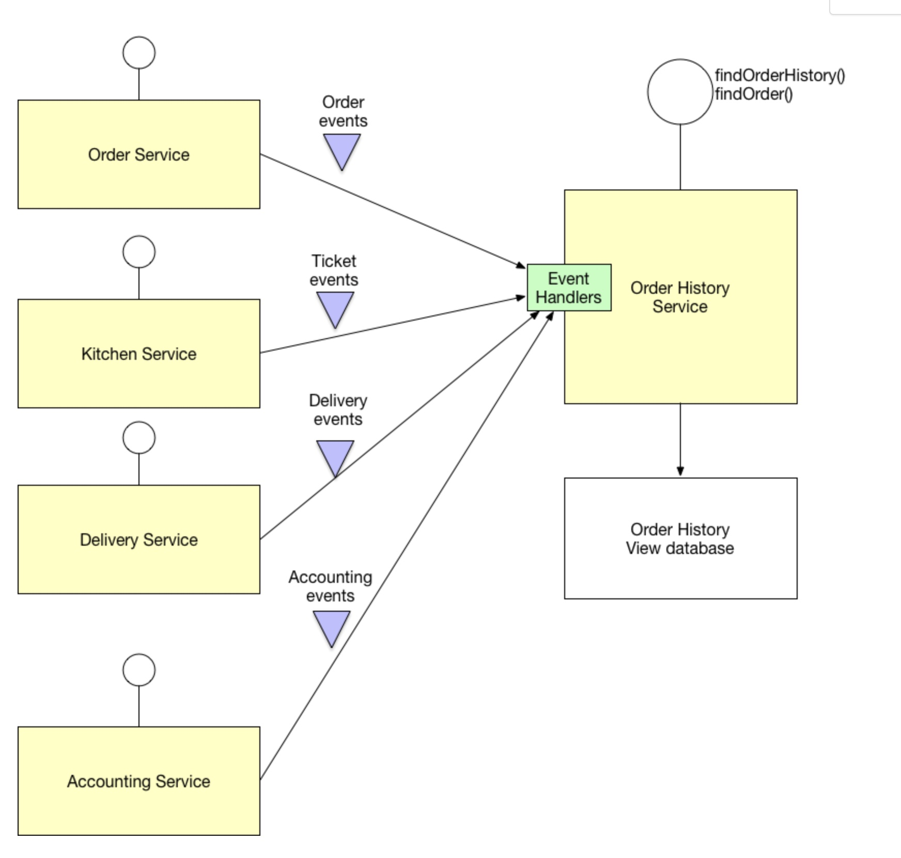

# 03- Command Query Responsibility Segregation (CQRS)

reference
- https://microservices.io/patterns/data/cqrs.html

## Problem

How to implement a query that retrieves data from multiple services in a microservice architecture?

## Solution

Define a view database, which is a read-only replica that is designed to support that query. The application keeps the replica up to data by subscribing to Domain events published by the service that own the data.

There two part involved in this pattern: 
- the command, is the part which is involved to ask/prepare/aggregate/transform the data to store/send to the next stage.
For instance, the in the example all the services emits domain events, and there is a microservice which is listening these
domain events to aggregate the information and store it and its database.
- the query, is the part which is involved in serve the request to the final apps or webapps.

In another examples, the ms-search-prod reads events from several topics, and updates the database. Once is done, emit a 
domain event to indicate that the domain was updated (so this is the command part of the CQRS pattern). 
So the event goes to another topic which another microservice is in charge to read and update its database. 
The clients of the apps, can ask for the info to this final microservice (so this is the query part of the CQRS pattern).

## Related patterns 
- The Database per Service pattern creates the need for this pattern
- The API Composition pattern is an alternative solution
- The Domain event pattern generates the events
- CQRS is often used with Event sourcing