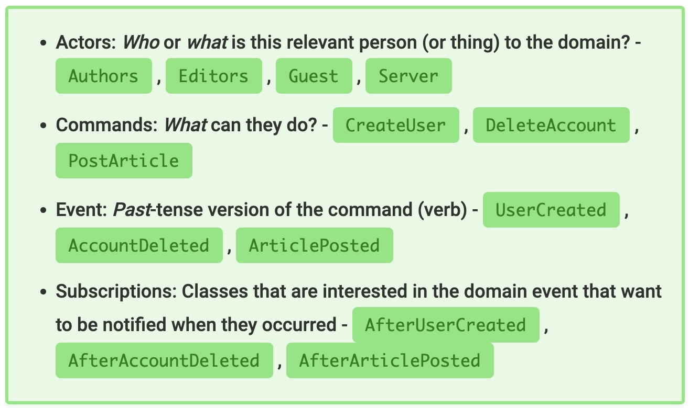
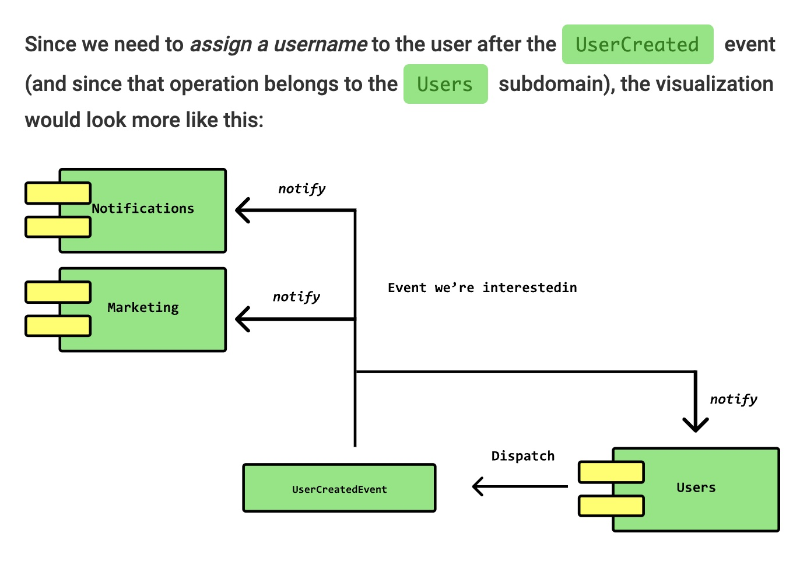

# Domain driven design

Talk with the actors domain experts to know how is the business. 

Understand the business with the ubiquitous language

Apply the single responsibility principle

Define the aggreagate root, aggregates and values objects.

Define the property and methods using ubiquitous language instead of technical language.

