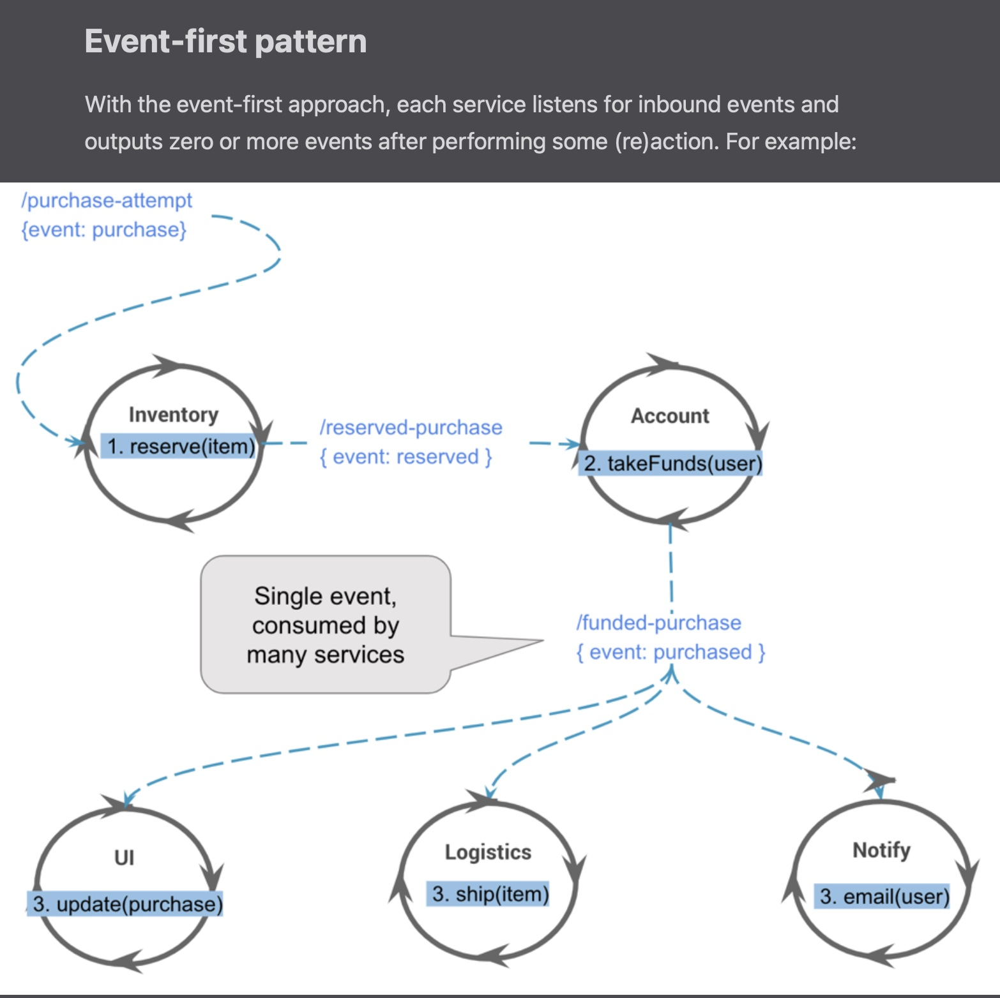
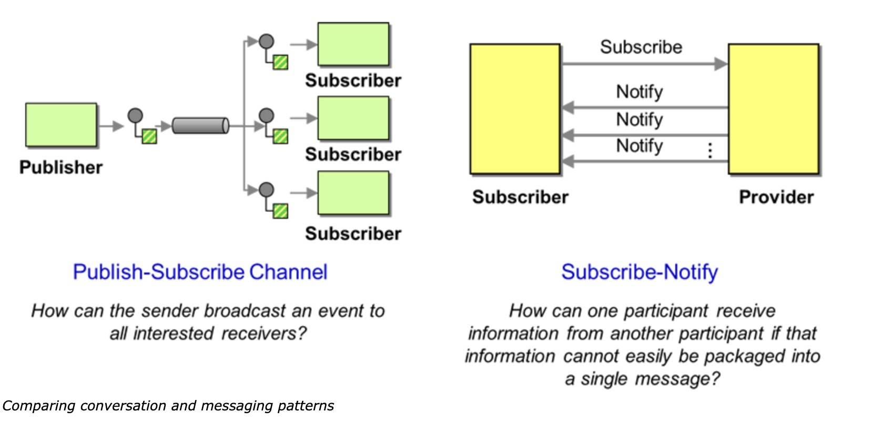

# 01 - Event Drive Architecture

reference: 
- https://www.confluent.io/blog/journey-to-event-driven-part-1-why-event-first-thinking-changes-everything/

## intro

bigger to smaller:

monolith -> SOA app -> microservices -> function as a service

At the beginning, the systems were designed thinking in data, on databases, tables and rows. 

Nowadays, the paradigm is changing in favour to event driven data architecture. 
That is, we have some microservices with several responsibilities, and they are communicating 
using messages (event sourcing). These messages are produced when something is happened into the ms core domain. 
For instance, an message is comming and consumed into a microservice, a row is stored into the database. 
This triggers another event, and produces an message to send to another kafka-topic. 
From here, there are some consumers who do something with these messages. 
And the process is repeated another time as it's explained previously.

- A sequence of related events represents a behavior: An item is added to and then removed from a shopping cart;
- A sequence of related events is commonly called a "stream."
- we start with the event rather than the highly-coupled concept of a command: "an event X has occurred," rather than "command Y should be executed."
- We think of streams and events much like a database table and rows.
- Streams and events are the basic building blocks of a data platform. 
In an event-driven streaming architecture, we use a "key" to create a logical grouping of events as a stream, similar to what 
we do with a database table. Streams represent the core data model, 
and stream processors are the connecting nodes that enable us to create flows, resulting in a streaming data topology. 
Stream processor patterns enable filtering, projections, joins, aggregations, materialized views, and other streaming functionality. 
Unlike in the table-and-rows model, events are front and center.

##  Importance of Event-Driven Architecture

To understand the importance of being event-driven, we’ll examine why events have become so pivotal in our thinking today. 
We will then evaluate the qualities and how events have become a first-class concern for the modern organization, 
as awareness of events underpins event-first thinking and design. 
I’ll then extrapolate design concepts against different perspectives of event patterns, such as the event command 
and event first, and why event-driven programming fulfills foundational requirements when choosing an architecture that 
supports evolution and elasticity.

## event-first approach

Asynchonous consuming versus synchronous requests.
Consume messages (Kafka) vs serve requests (REST)

The value of events is that a sequence of related events represent behavior 
(e.g., an item was added and then removed from a shopping cart, an error recurs every 24 hours 
or users always clicks through a site in a particular order)

A sequence of related events is commonly called a stream

When thinking of APIs, we start with the event rather than the highly coupled concept of a command, 
e.g., an event-X has occurred, rather than command-Y should be executed. 
This thinking underpins event-driven streaming systems.

A stream of events captures temporal behavior

## Considerations of the event-driven architecture

There are many considerations when evaluating the event-driven architecture. 
Events initially start out to as atomic and drive reactionary callbacks (functions). 
As a use case evolves, workflows develop and the criticality of the application generally increases along 
with the nature in which an event is considered.

This raises numerous questions: 
- Is ordering important? 
- Do I want to ensure transactionality? 
- How do I trust the execution? 
- Security? 
- Lineage? 
- Where did the event come from?

The key realization for the adoption of `event-first` thinking is that an event represents `a fact, something happened`; 
it is immutable and therefore changes how we think about our domain model

The basic attributes of an event include time, source, key, header, metadata and payload

The other consideration is that events do not exist in isolation, an event tends to be part of a flow of information, a stream

We define a stream as an unbounded sequence of related events that are associated through the use of an “eventKey,” 
a key that ties multiple events together.

In the real world, the nature of the “event” can be described as:

- Atomic: something happened (bid on an item, send an email, device temperature)
- Related: a stream or sequence of events (tracking a pricing change, device metrics changes over time)
- Behavioral: the accumulation of facts captures behavior

## Transitioning to event-first thinking

Event-first thinking changes how you think about what you are building

How is the event treated within a system? All of the following questions get asked as the event-driven architecture is developed:

- Is it observable, and are the flows of streams behaving as expected?
- Is it trusted, meaning transactional, exactly one or at least once? Will it scale?
- Is stateless processing, such as filtering, projection, cleaning or enrichment required? Is stateful processing, such as aggregations or stateful sequence processing required?
- Is a materialized view against the stream required? How many transactions per second are required for a windowed view?
- Do we want to scale/fan/map out (parallelize), fan in/collect and, build materialized views?
- Does it support error handling, such as error flows and dead letter queue?
- Does it send and transform events from one stream into others (stream processing)?
- Does it react and drive intelligence from the state collected from a stream (stream processing)?

In terms of increased adoption, we generally see these patterns as characteristic of an event-driven organization:

- Data pipelines (ETL, integration)
- Monitoring and alerting, including log collection and aggregation
- Event-driven microservices
- Enterprise wide event-driven microservices
- IoT
- Customer 360
- Digital transformation
- Real-time enterprise
- Central nervous system/digital nervous system

By embracing event-first thinking, we naturally inherit the foundations of event streaming platforms like event sourcing, replayability, stream processing and dataflow design, amongst others. We should also incorporate event-first thinking into an architecture that leverages a serverless stack to be event driven, multi-cloud and elastic.

The importance of events and event first thinking:

- Capture facts
- Capture behavior
- Provide a representation of the real world
- Model use cases of how we think
- Supports repeated evaluation and processing (a time machine)
- Provide horizontal scaling
- Speak the same language as the business

(`event-storming` practice to identify the events)

## Event-first versus event-command patterns for event-driven design

### event-command
Exposing an REST API is `event-command patterns.
REST applications are an `event → command pattern`
Calls are generally synchronously (http synchronously) (but sometimes can be asynchronously like websockets or whatever)

Problems:

They are coupled in multiple ways: 
- Firstly, the endpoint is known (i.e., the service address). 
- Secondly, the method being called is also known (i.e., an API call to doStuff), 
- and lastly, the calls tended to return a value (we have to wait to get the value)

### event-first

The `event-first` approach is unique in that it processes the event as a reaction; 
the emitter doesn’t call on a specific function; the API has been removed and it instead just sends an event. 
The emitter of the event doesn’t know which processors (or functions) are going to consume it, and the event becomes the API. 
This decoupling allows the set of consuming apps to change over time without any upstream changes required in the emitter.

`Event-first` analog: I walk into a room, generate an “entered room” event and the light turns on. This is a reaction to an event.

`Event-command` analog: I walk into a room, flip the light switch and the light turns on. This is a command.

In the `event-first` analog, I have no knowledge and don’t ask for the lights to be turned on;. Instead, a sensor detects my presence; `it has the responsibility`. 
In the `event-command` analog, `I have the responsibility` of knowing how to turn on the light and also making it happen.

The event-first approach forces an `inversion of responsibility`; it is a fundamental paradigm shift of how applications are developed

When new requirements are comming, 
for the event-command-based system, we need to change the main purchasing application to call these new systems. 
But for the pure event-first solution, we can simply add new processors (consumers) of the existing events, such as why(item) and checkInventory().

Notice how the event-driven approach allows many processors to react to the same “purchased” event (published via the /user-purchases topic)? This flexibility means functionality can run in parallel and be added, extended, upgraded or replaced without taking the system down. Decoupling is the key. The “event” also affords the opportunity to propagate versioning, security tokens, correlation IDs and other useful information.

The tradeoff of the `event-first` pattern:
- ability to support `traceability` (`observability`), 
- failure paths, 
- scaling 
- and explanation about why things have gone wrong

### Benefits of the event-first approach

The pure event-first approach described above demonstrates:

- Decoupling: Processors don’t know anything about upstream or downstream processors
- Encapsulation: There are clean boundaries between processors.
- Inverted knowledge: Knowledge and responsibility are reversed.
- Evolutionary change: The system and events can change over time.
- Event sourcing: When using a log and log-aware stream processors, we gain the ability to potentially 
rebuild and restore application state. It’s not a free lunch; the application state needs to be captured and managed.
- Evolutionary architecture is a natural benefit from event-first thinking and event-driven architectures

When you use the pure, event-driven approach, the architecture can change over time as different processors may react to 
events, which can be reprocessed while the data model evolves simultaneously. Perhaps the domain model has changed, or 
functionality is being extended. None of the originating events are lost, and the behavior is captured in the stream. 
With these foundations, you then have a system that supports architectural evolution as well as data and domain evolution.

This revaluation on technical design pushes us towards a pure eventing model where we throw out the event-command pattern 
and simply emit events. The benefit of this approach meets many modern requirements where systems are elastic, easily composible, 
expected to run 24×7 and, most importantly, are evolvable. 
The ability to progress domain models that are supported by events and remodel event streams is an essential requirement for the modern business.

Reference: 
- For a deep dive on `events vs commands`, check out Ben Stopford’s article 
[Build Services on a Backbone of Events](https://www.confluent.io/blog/build-services-backbone-events/).    
- Another great book on these principles called
[Building Evolutionary Architectures](https://www.thoughtworks.com/books/building-evolutionary-architectures). 
- Martin Fowler’s [Focusing on Events paints](https://martinfowler.com/eaaDev/EventNarrative.html)

## conversational patterns

- message patterns: there is a publisher who sends a message to a topic and there some subscribers who reads from this topic. 
The publisher and the subscribers don't know each to others. `Loosely coupled components`
- conversation patterns: there is a provider and several subscribers. 
The provider knows to the subscribers. `High coupled components`, there is a connection between each of them.

## buses

A service bus is a way of exchanging messages between components.

When the bus receives a message, it dispatches the message to the receiver(s).

[Different kinds of service bus: command bus, service bus and query bus](https://barryvanveen.nl/articles/59-different-kinds-of-service-bus-command-bus-service-bus-and-query-bus)

As you can imagine, different messages can and should be handled in a different way. That is why we have different kinds of service buses. The 3 buses I want to discuss are:

- Command bus
- Query bus
- Event bus

### Command bus

Messages (commands) signal the user's intention. Examples are CreateArticle or RegisterUser.
One command is handled by exactly one handler.
A command does not return any values.

### Query bus

Messages (queries) signal a question, different from a database query. Examples are LatestArticles or CommentsForArticle.
One query is handled by exactly one handler.
Queries return data.
Queries should not change the state of the application.

### Event bus

Messages (events) signal an event has happened. Examples are ArticleWasCreated or UserWasRegistered.
One event can be handled by any number of handlers ([0, inf]).
Only holds primitives (strings, integers, booleans), not whole classes.
Events should not return values.