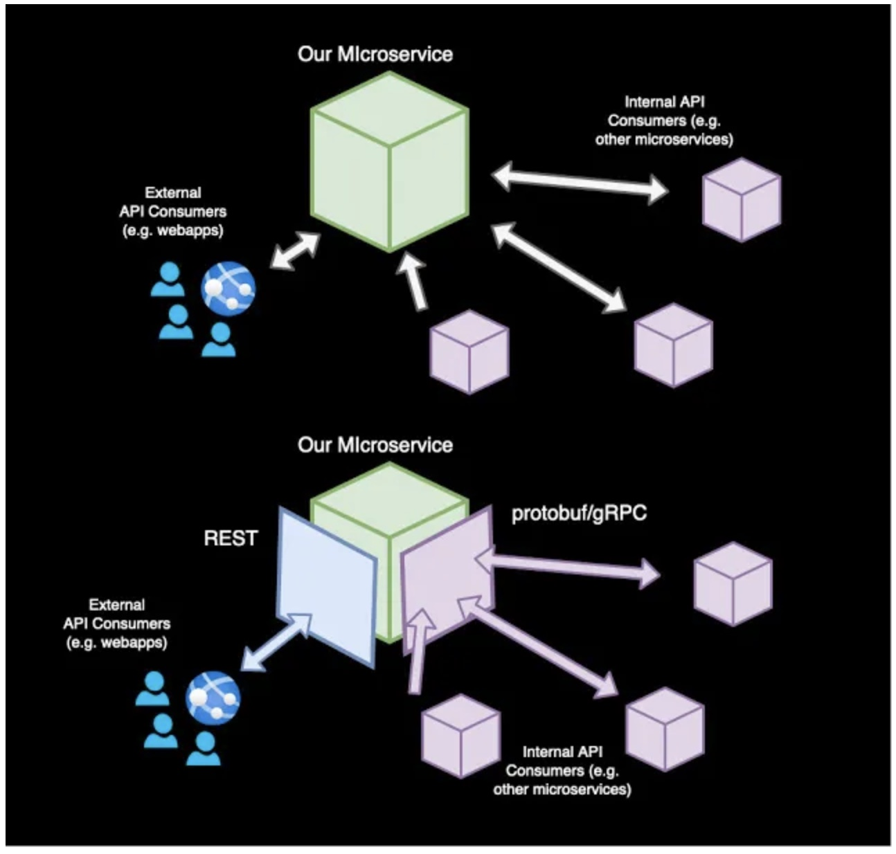
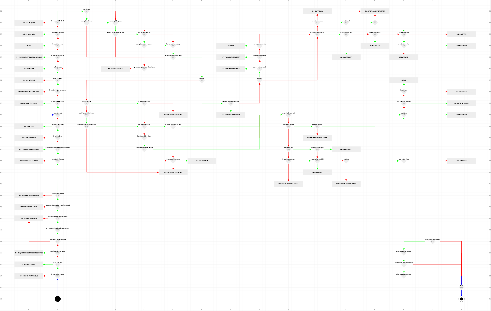
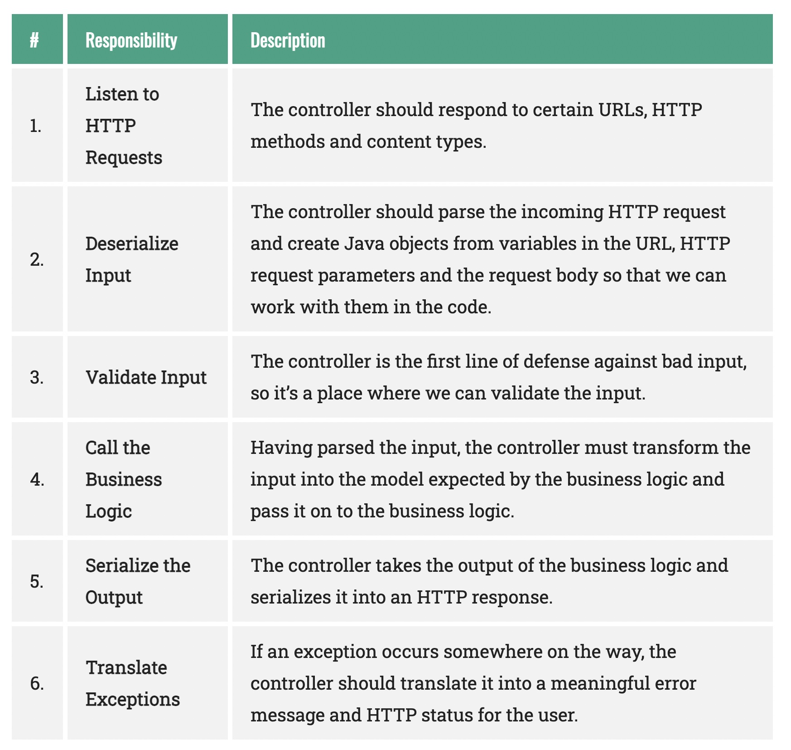

# 03 - Rest vs gRPC

## Rest vs gRPC

The architectural decision is, the micro-service will expose a gRPC API for the internal micro-services and 
a REST API for the web application (external clients).

- Protobuf. It is a data serialization format asn also a toolset, originally developed to define services. It is not supported by all programming languages but you can use protobuf with C++, Go, Python, Java, etc. To write a contract we have to write a file with the extension proto. This guide is helpful to know how.

- gRPC. It is based on the idea of defining a service, specifying the methods that can be called remotely with their parameters and return types (the protobuf file). On the server side, the server implements this interface and runs a gRPC server to handle client calls. On the client side, the client has a stub that provides the same methods as the server. It supports bi-directional streaming and fully integrates pluggable authentication with HTTP/2-based transport.

- Streaming. We mean the ability to establish mono or bi-directional communication between the two parts in a communication. The roles client/server are not so important as data can be pushed between them with no previous request once the communication has been established.

For service-to-service communications, RPC can be much more convenient thanks to new technologies like gRPC, but most developers are still using REST for external-facing services, which is one of the reasons of the shape of our example.

Enterprise API features:

- Cache. Settings related to caching can be different according to the consumer, with different needs of TTL (Time To Live), policies, methods, paths, etc.
- Rate Limits. The values can vary for every consumer and perhaps they don’t make sense for internal consumers.
- Security. The application of security restrictions and access (authentication and authorization) to a path cannot be relevant for all of the consumers.
- Streaming. REST does not support bi-directional communication and other techniques like polling, callbacks — preferred — and HTML5 Websockets can be used but they require extra changes in the API Consumer side and they have other implications and drawbacks.

## http codes

## Responsabilities

