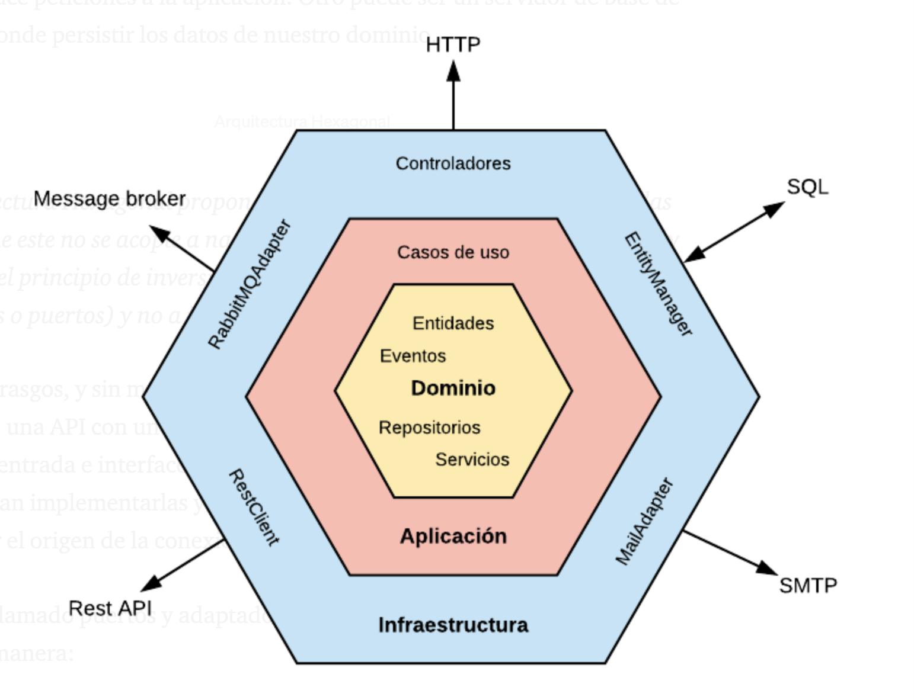
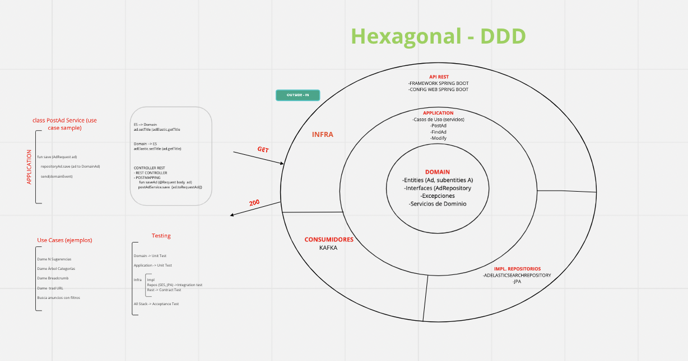

# Hexagonal: ports and adapters pattern

booster: Alistair Cockburn

Motivation, split the responsibility in different layers. 

In this way we can have a low coupling between parts, and evolve the app in an easy way.

Features:

- Framework independence
- Testable
- UI independence
- BBDD independence
- foreign agents independence 
- Resilence, failure tolerance 
- change tolerance of the code 
- Reusable code
- Maintainability
- adapters and ports

## Port and adapters

- Port: definition of interface
- Adapters: specific implementation for the interface

