# Akka: actor model implementation

reference
- https://doc.akka.io/docs/akka/current/typed/actors.html

elements play into:

- client: sends messages to the task queue to process a task
- task queue: is the mailbox, is storing the messages in the queue
- actor: is reading the mailbox queue, to process the messsages for doing some tasks

In order to do it loose coupling,
- the client runs in a thread or process
- the queue runs in a thread or process
- every actor runs in a single thread or process

In this way:

- when the client is sending a message to the queue, 
the communication can be async. The client doesn't need to block waiting the response or 
can wait to the ack and keep on working. 
- the same for the queue, is not blocking any process,
- when the actor is reading the process is independent on the client process, 
so the whole process itself is so fast.

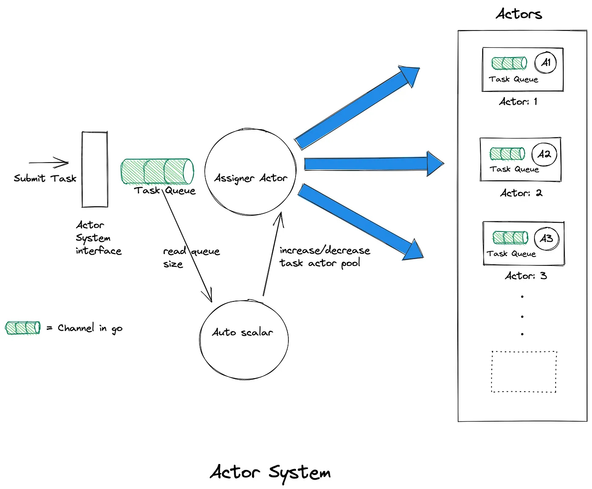

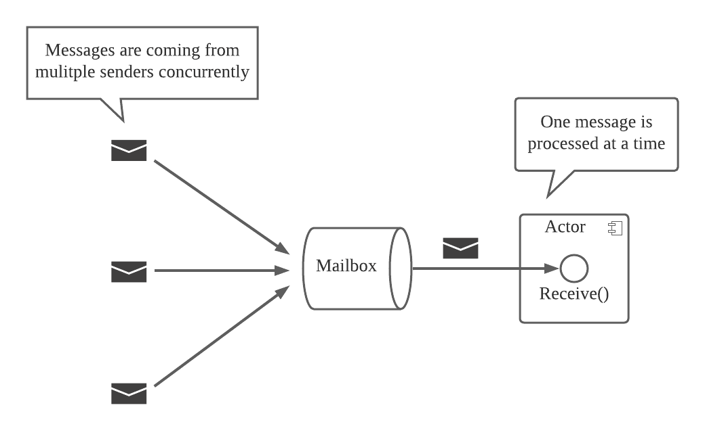

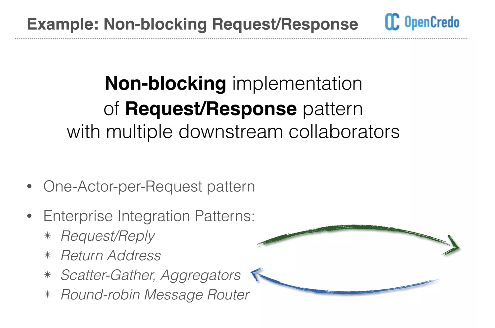

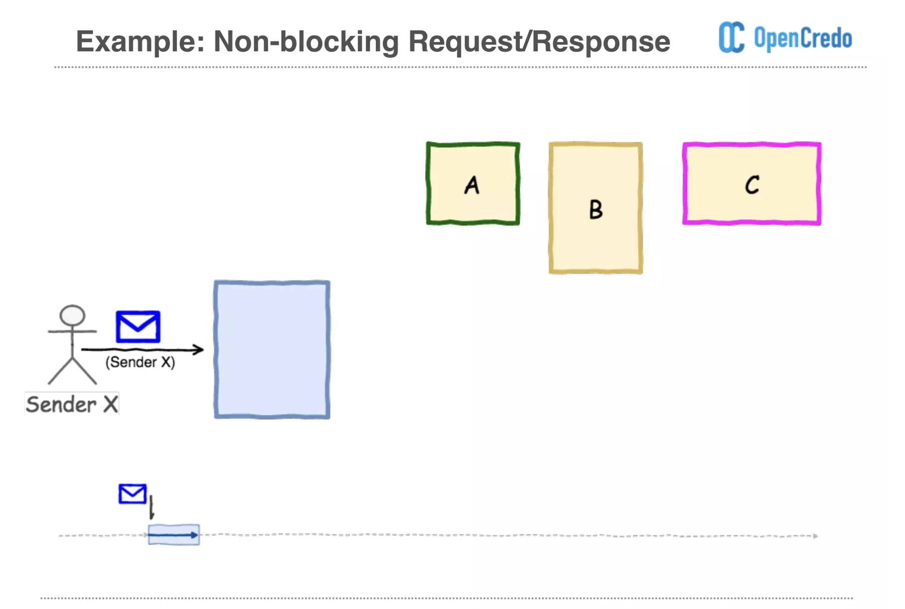

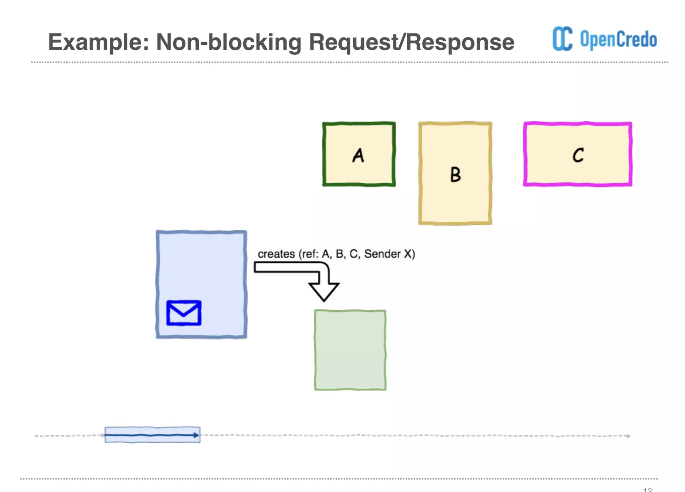

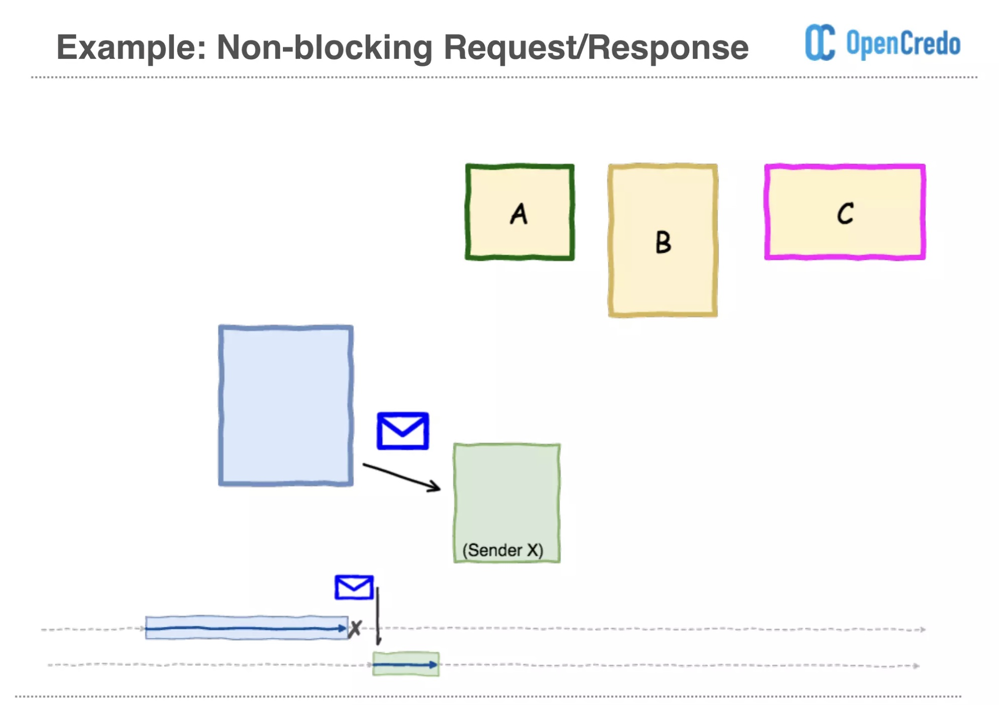

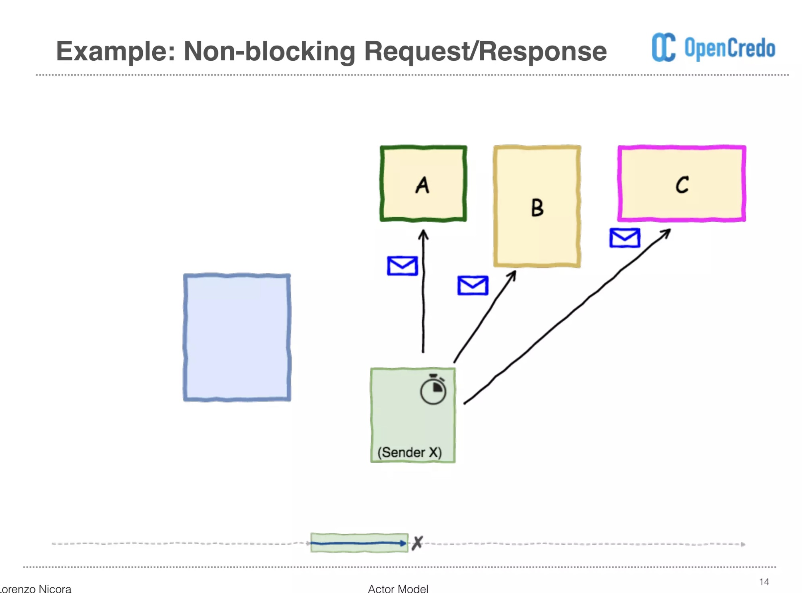

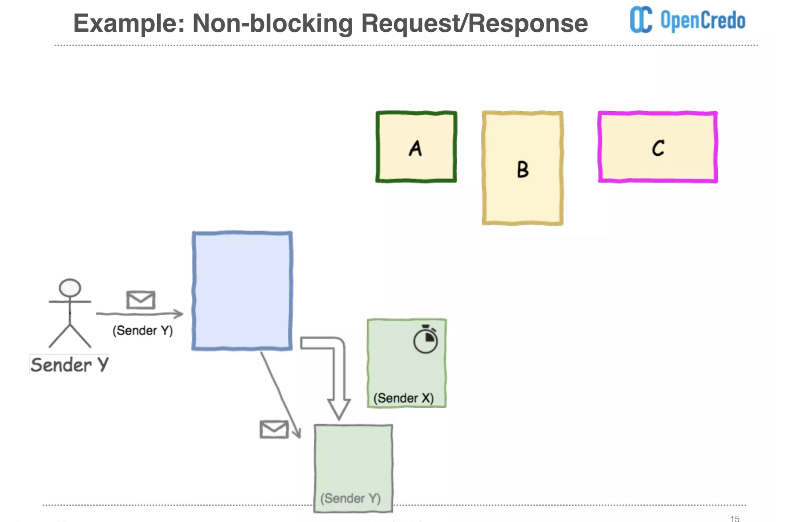

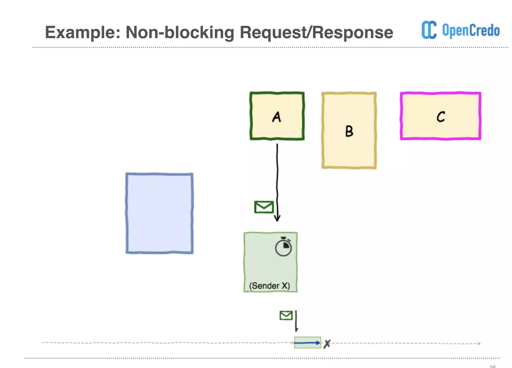

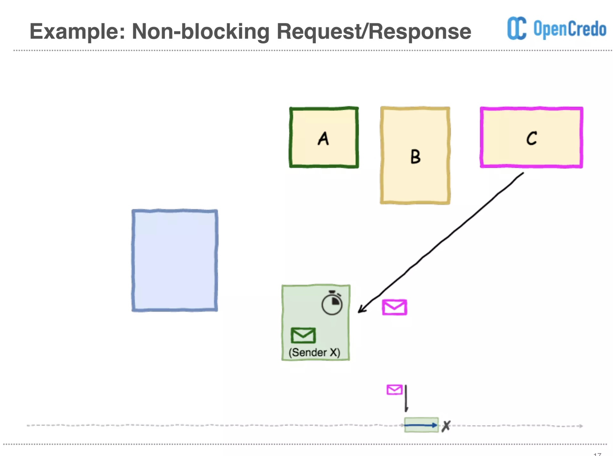

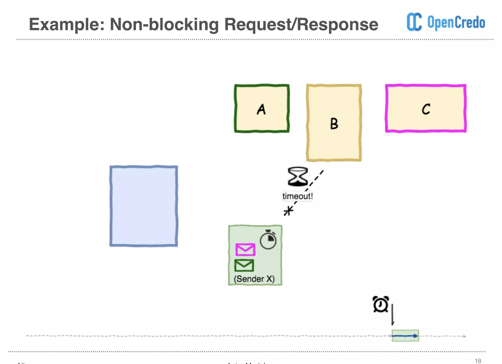

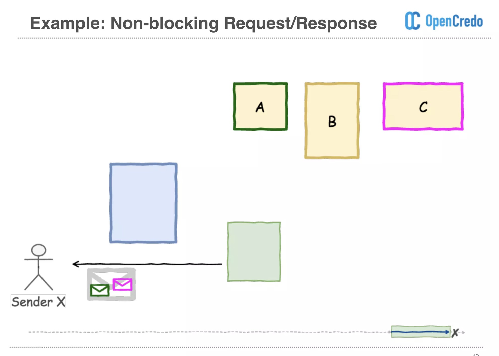