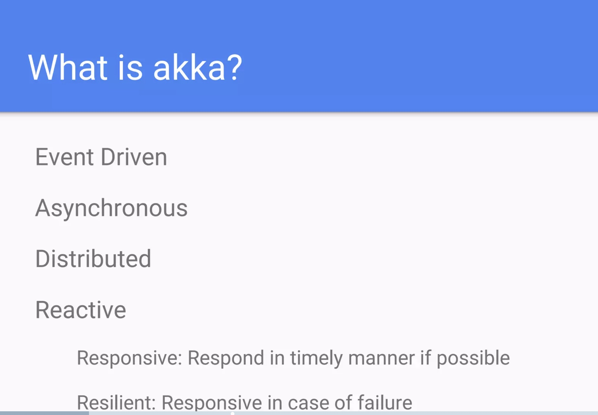
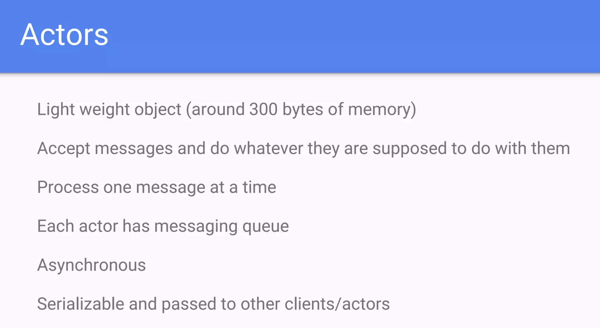
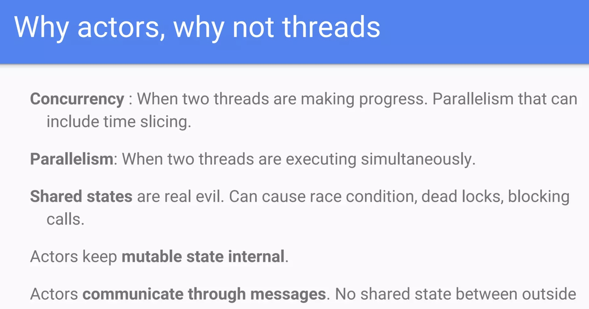
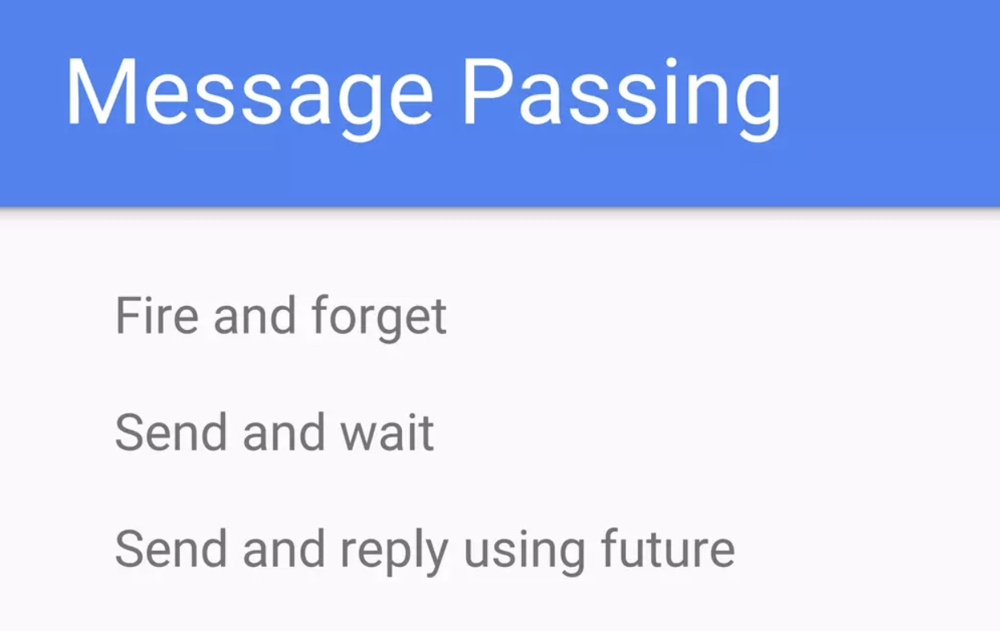
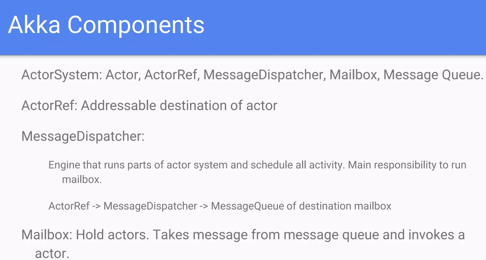
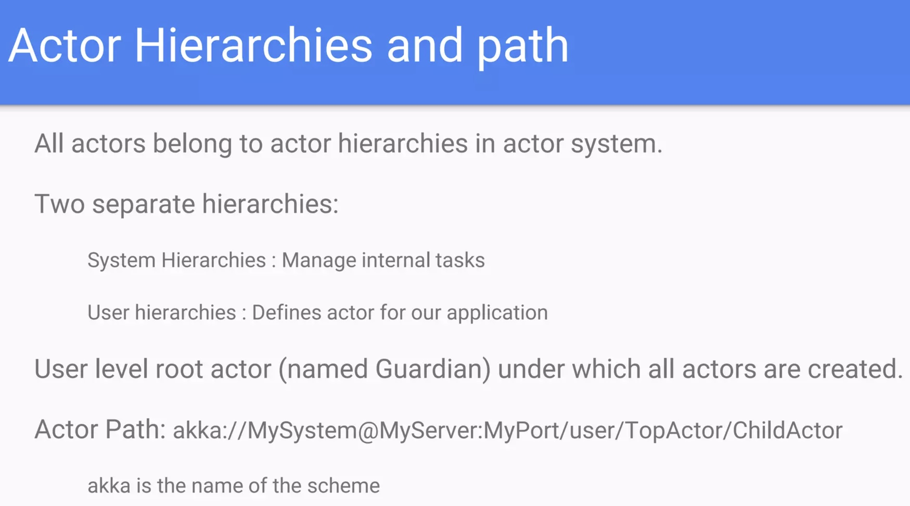
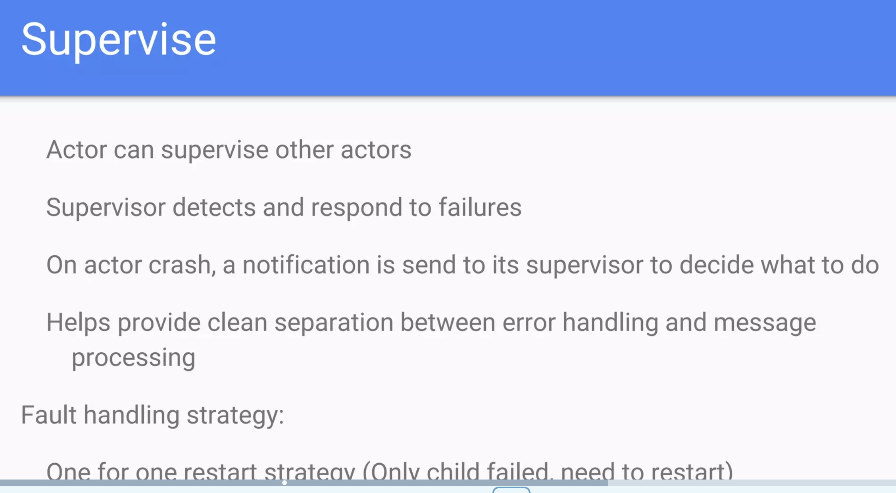
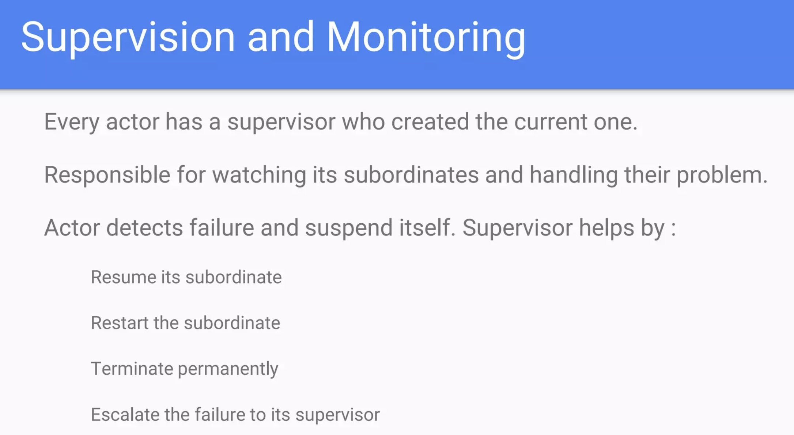
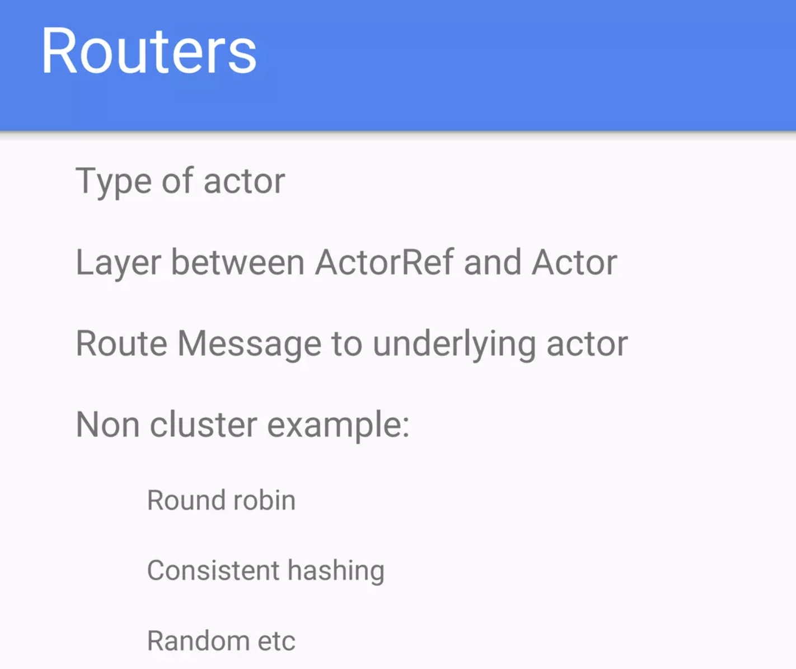
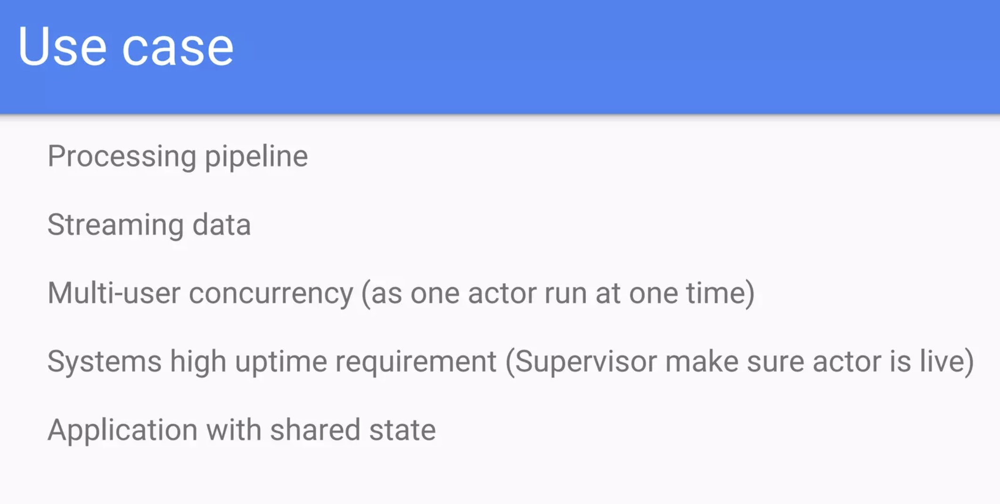

# Akka: actor model implementation

reference
- https://doc.akka.io/docs/akka/current/typed/actors.html

Akka creates a layer between the actors and the underlying system such that actors simply need to process messages. All the complexity of creating and scheduling threads, receiving and dispatching messages, and handling race conditions and synchronization, is relegated to the framework to handle transparently.

Akka strictly adheres to the [The Reactive Manifesto](https://www.reactivemanifesto.org/). Reactive applications aim at replacing traditional multithreaded applications with an architecture that satisfies one or more of the following requirements:

- Event-driven. Using Actors, one can write code that handles requests asynchronously and employs non-blocking operations exclusively.
- Scalable. In Akka, adding nodes without having to modify the code is possible, thanks both to message passing and location transparency.
- Resilient. Any application will encounter errors and fail at some point in time. Akka provides “supervision” (fault tolerance) strategies to facilitate a self-healing system.
- Responsive. Many of today’s high performance and rapid response applications need to give quick feedback to the user and therefore need to react to events in an extremely timely manner. Akka’s non-blocking, message-based strategy helps achieve this.

All the complexity of creating and scheduling threads, receiving and dispatching messages, and handling race conditions and synchronization, is relegated to the framework to handle transparently.

## Actor

An actor is essentially nothing more than an object that receives messages and takes actions to handle them. It is decoupled from the source of the message and its only responsibility is to properly recognize the type of message it has received and take action accordingly.

Upon receiving a message, an actor may take one or more of the following actions:

- Execute some operations itself (such as performing calculations, persisting data, calling an external web service, and so on)
- Forward the message, or a derived message, to another actor
- Instantiate a new actor and forward the message to it

Alternatively, the actor may choose to ignore the message entirely (i.e., it may choose inaction) if it deems it appropriate to do so.

