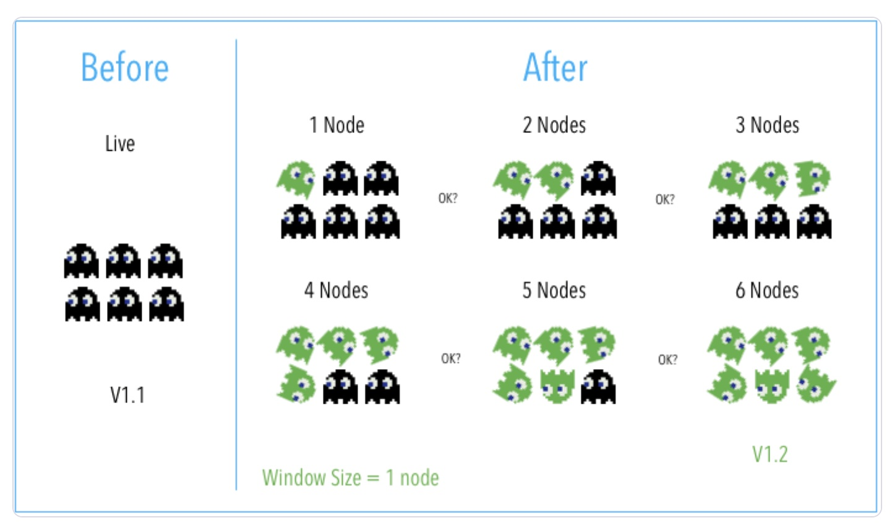
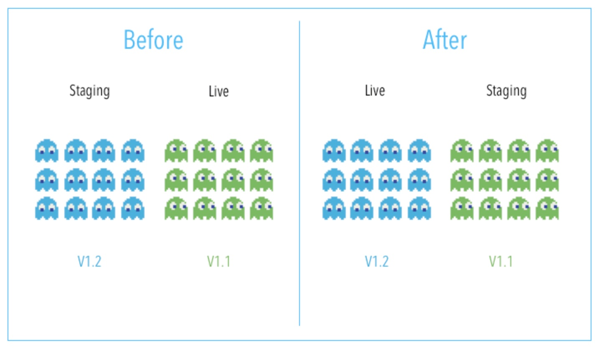
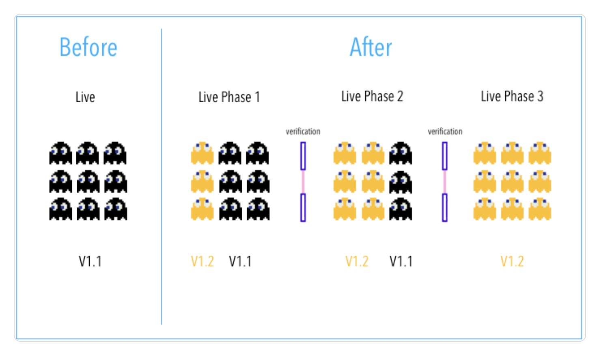

# 01 - Deployments

reference: 
- https://www.harness.io/blog/blue-green-canary-deployment-strategies

- https://developer.harness.io/docs/first-gen/continuous-delivery/concepts-cd/deployment-types/deployment-concepts-and-strategies/

## Classification

- `Basic deployment`: In a basic deployment, all nodes within a target environment are updated at the same time with a new service or artifact version. Because of this, basic deployments are not outage-proof and they slow down rollback processes or strategies. Of all the deployment strategies shared, it is the riskiest.
- `Rolling deployment`: A rolling deployment is a deployment strategy that updates running instances of an application with the new release. All nodes in a target environment are incrementally updated with the service or artifact version in integer N batches.

- `Blue/green deployment` is an application release model that gradually transfers user traffic from a previous version of an app or microservice to a nearly identical new release—both of which are running in production.

- `Canary deployment`: What is a canary deployment? A canary deployment is a progressive rollout of an application that splits traffic between an already-deployed version and a new version, rolling it out to a subset of users before rolling out fully.
  In blue-green deployment you serve the current app on one half of your environment (Blue) and deploy your new application to the other (Green) without affecting the blue environment. In canary deployment you cut over just a small subset of servers or nodes first, before finishing the others.

- `A/B Testing deployment`: In A/B testing, different versions of the same service run simultaneously as “experiments” in the same environment for a period of time. Experiments are either controlled by feature flags toggling, A/B testing tools, or through distinct service deployments. It is the experiment owner’s responsibility to define how user traffic is routed to each experiment and version of an application. Commonly, user traffic is routed based on specific rules or user demographics to perform measurements and comparisons between service versions. Target environments can then be updated with the optimal service version.

## Scaling services

- vertical: over the same instance you add more power, so the instance grows, and it's bigger, taller. 
It's really expensive in some cases, because you are asking for more memory and CPU. 
It's like you have a common car, and you change it for a ferrari. The ferrari is plenty of power but at the same time is really expensive. 
- horizontal: duplicate the instances, add more instances to the cluster. Cheap process. The point you have to think the microservices has to be stateless. 

The `database` scales `vertically` and the `microservices horizontally`.

## clusters

Cluster is a set of computers working at the same time for some of the next responsabilities: 

- `Failover o High Availability Computing Cluster` (Cluster de Alta Disponibilidad)
Garantiza que una red permanezca siempre activa. Para ello, en caso de que una computadora falle, 
ya sea por fallos de red, hardware o software, otra mantiene la red en funcionamiento 
- `Load Balancing` (Cluster de Balanceo de Carga)
El tipo de cluster load balancing es una estructura en la que todas las computadoras son responsables de realizar 
una determinada tarea.
Así, si uno de los equipos presenta un problema, se elimina automáticamente del sistema y la función inicial 
que le fue asignada se comparte entre los demás nodos.
- `High Performance Computing Cluster` (Cluster de Alto Rendimiento)
Este tipo de cluster se utiliza para realizar tareas de alto rendimiento, con el fin de garantizar al máximo sus altas prestaciones.
- `Procesamiento paralelo`
Este tipo de cluster transforma una tarea compleja en varias tareas sencillas y las distribuye entre los 
nodos integrados al sistema.

Another classification is regarding the type:
- `physical cluster`: the nodes are machines
- `virtual cluster`: the nodes are virtual nodes, so one machine can handle several of them.

