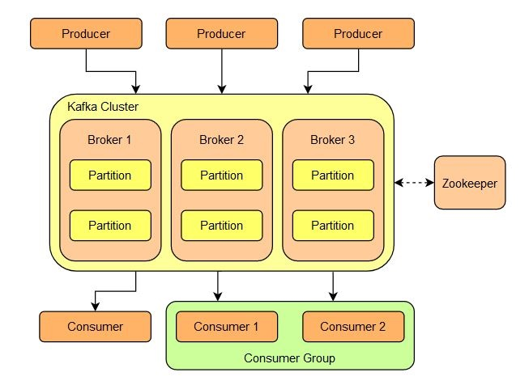
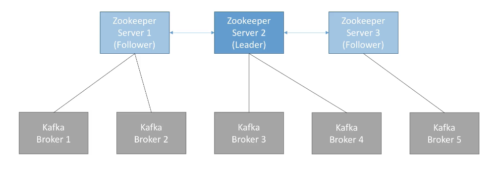
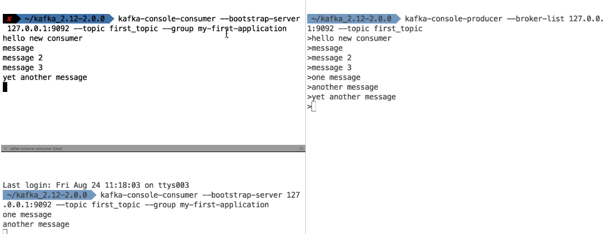
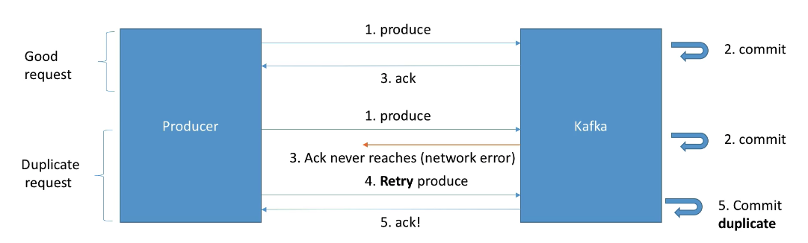
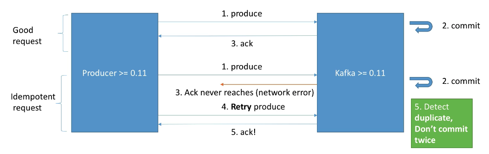
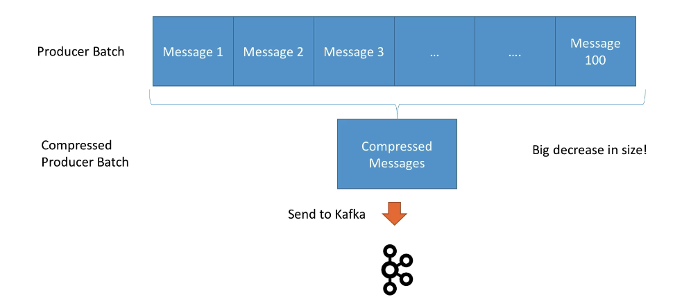
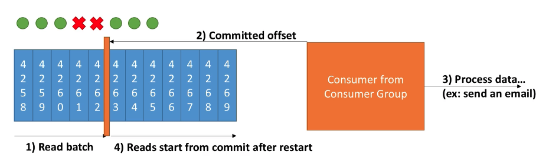
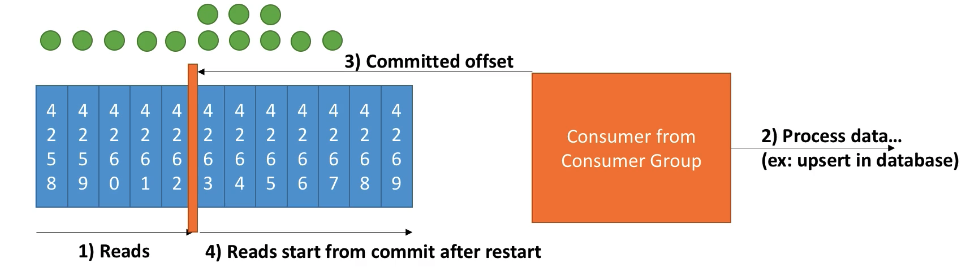
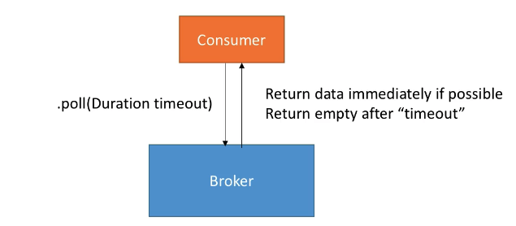

# Kafka for Beginners

A `message broker` is an intermediary software or platform that facilitates communication and data exchange between different applications or services. It acts as a central hub for routing messages, ensuring that messages from one application are efficiently delivered to their intended destinations. Message brokers enable decoupling of components in a distributed system, allowing applications to interact without having direct knowledge of each other.

The basic concept of a message broker involves three main components:

1. `Producers`: Producers are applications or components that generate and send messages to the message broker. These messages typically contain data or events that need to be processed or communicated to other parts of the system.

2. `Message Broker`: The message broker, also known as the message queue or `message-oriented middleware (MOM), is responsible for receiving, storing, and managing the messages from producers. It maintains a queue or topic where messages are stored until they are consumed by the consumers.

3. `Consumers`: Consumers are applications or components that receive and process messages from the message broker. They subscribe to specific queues or topics in the broker to receive messages relevant to their needs.

Key features of message brokers include:

1. `Asynchronous Communication`: Message brokers enable asynchronous communication between applications. Producers can send messages without waiting for consumers to process them immediately, which helps in handling bursts of traffic and managing spikes in demand.

2. `Decoupling`: Message brokers allow components to interact without direct dependencies. Producers and consumers can evolve independently, which improves system flexibility and scalability.

3. `Load Balancing`: Message brokers can distribute messages among multiple consumers to balance the load and ensure efficient processing.

4. `Message Persistence`: Message brokers typically offer options to store messages persistently, ensuring that messages are not lost even if the system experiences failures or crashes.

5. `Message Routing`: Message brokers can route messages based on various criteria, such as topic, content, or priority, allowing for targeted delivery to specific consumers.

Commonly used message brokers include:

- `Apache Kafka`: A distributed streaming platform that handles real-time data feeds with high-throughput and fault tolerance.
- `RabbitMQ`: An open-source message broker that supports multiple messaging protocols, including Advanced Message Queuing Protocol (AMQP).
- `Apache ActiveMQ`: A popular message broker with support for multiple messaging patterns, including point-to-point and publish-subscribe.
- `Amazon SQS (Simple Queue Service)`: A managed message queue service provided by AWS.

Message brokers play a crucial role in building scalable and resilient distributed systems, especially in microservices architectures and event-driven systems, where different services need to communicate effectively and independently.

## 1. Kafka Introduction



## offset earliest vs latest

Scenario: 

- producer sends messages 1, 2, 3, 4

- consumer receives messages 1, 2, 3, 4

- consumer crashes/disconnects

- producer sends messages 5, 6, 7

- consumer comes back up and should receive messages starting from 5 instead of 7

When a consumer joins a consumer group it will fetch the last committed offset, so it will restart to read from 5, 6, 7 if before crashing it committed the latest offset (so 4). The earliest and latest values for the auto.offset.reset property is used when a consumer starts but there is no committed offset for the assigned partition. In this case you can chose if you want to re-read all the messages from the beginning (earliest) or just after the last one (latest).

### Kafka in 5 minutes

Allows to decouple data streams & systems

Distributed, resilient, fault tolerant

- scale to 100s of brokers
- millions of messages per second
- latency less than 10ms

Use cases:

- messaging
- tracking
- metrics
- logs
- stream processing
- integration with big data technologies

## 2. Kafka Theory

### Topic, partitions and offsets

- topic: a stream of data
    - similar to table (without constraints)
    - you can have as many as you want
    - identified by name
- topic are split in partitions:
    - Each partition is ordered
    - When creating topic you must specify the number of partitions
    - Each messaging within a partition gets an incremental id, called offset
    - Each partition can have different number of messages
    - Offset only have a meaning for a specific partition
    - Order is guaranteed only within a partition
    - Data retention default one week, offset grows infinitely
    - Data is assigned randomly roa partition unless a key is provided

### Brokers and Topics

- A kafka cluster is composed of multiple brokers (servers)
- Each broker is identified with its ID (integer)
- Each broker contains certain topic partitions (not all the data)
- When you connect to any broker you connect to the entire clusters
- A good number to get started is 3 brokers


### Topic replication

- Topics should have a replication factor between 2 and 3
- If broker is down another broker can serve the data

Example: Topic with 2 partitions and replication factor of 2 (every partition has 2 replicas)


Leader of a partition:

- Only one broker can be a leader for a given partition
- Only the leader can receive and serve data for a partition
- The other brokers will sync the data
- Each partition has one leader and multiple ISR (in-sync replicas)
- If a broker falls Zookeeper will set a new leader for the partition

### Producers and message keys

- Producers write data to topics (which is made of partitions)
    - acks=0 Producer doesn't wait for ack (possible data loss)
    - acks=1 Producer will wait for leader ack (limited data loss)
    - acks=all Leader + replicas acknowledgement (no data loss)
- Producers automatically know to which broker and partition to write to
- In case of broker failuers, producers will automatically recover


### Message keys

- Producers can choose to send a key with the message (string, number, etc.)
- If key = null, data is sent round robin (broker 101, then 102, then 103...)
- If a key is sent, then all messages for that key will always go to the same partition
- A key is basically sent if you need message ordering for a specific field

### Consumers and consumer groups

- Consumers read data from a topic
- Consumers know which broker to read from
- In case of broker failures, consumers know how to recover
- Data is read in order ordered **each partitions**


### Consumer groups

- Consumers read data in consumer groups
- Each consumer within a group read from exclusive partitions
- If you have more consumers than partitions, some consumers will be inactive


### Consumer offsets

- Kafka stores the offset at which a consumer group has been reading
- These offsets commited live in a Kafka topic named __consumer_offsets
- When a consumer in a group has processed the data received, it commits the offsets
- If a consumer dies, it will be able to read back from where it left off

### Delivery semantics for consumers

- Consumers choose when to commit offsets
- There are 3 delivery semantics:
    - at most once:
        - offsets are committed as soon as the message is received
        - if the processing goes wrong, the message will be lost (it won't be read again)
    - at least once (preferred)
        - offsets are committed **after** the message is processed
        - If the processing goes wrong, the message will be read again
        - This can result in duplicate processing of message → IDEMPOTENCY!
    - Exactly once:
        - Can be achieved for Kafka → Kafka workflows using Streams API
        - For Kafka → External system, use idempotent consumer

### Kafka Broker Discovery

- Every Kafka broker is also called a "bootstrap server"
- You only need to connect to one broker
- Each broker knows about all brokers, topics and partitions (metadata)


### Zookeeper

- Manages brokers
- Helps performing leader election for partitions
- Sends notifications to Kafka (new topic, broker dies, wakes up, delete topics)
- Kafka can't work without Zookeeer
- By design operates with an odd # of servers (3, 5, 7...)
- Zookeeper has a leader (handles writes) the reas are followers (handle reads)
- Does not store consumers offsets



### Kafka Guarantees

- Messages are appended to a topic-partition in the order they are sent
- Consumers read messages in the order stored in a topic-partition
- With a replication factor of N, producers and consumers can tolerate up to N-1 brokers being down
- Factor of 3 good idea → Allows 1 broker down for maintenance, 1 down unexpectedlly
- If no new partitions, the same key will always go to the same partition

# 3. Starting Kafka

Start zookeeper

```bash
zookeeper-server-start /usr/local/etc/kafka/zookeeper.properties
```

Start kafka

```bash
kafka-server-start  /usr/local/etc/kafka/server.properties
```

# 4. CLI 101

## Topics CLI

### Create

```bash
kafka-topics --zookeeper 127.0.0.1:2181 --topic first_topic --create --partitions 3 --replication-factor 1
```

> replication-factor cannot be greater than the number of brokers
> 

### List

```bash
kafka-topics --zookeeper=127.0.0.1:2181 --list
```

### Describe topic

```bash
kafka-topics --zookeeper=127.0.0.1:2181 --topic first_topic --describ
```

```bash
Topic: first_topic	PartitionCount: 3	ReplicationFactor: 1	Configs:
	Topic: first_topic	Partition: 0	Leader: 0	Replicas: 0	Isr: 0
	Topic: first_topic	Partition: 1	Leader: 0	Replicas: 0	Isr: 0
	Topic: first_topic	Partition: 2	Leader: 0	Replicas: 0	Isr: 0
```

### Delete topic

```bash
kafka-topics 
--zookeeper 127.0.0.1:2181
--topic second_topic
--delete
```

```bash
Topic second_topic is marked for deletion.
Note: This will have no impact if delete.topic.enable is not set to true.
```

> delete.topic.enable is set to true by default
> 

## Producer CLI

```bash
kafka-console-producer
--broker-list 127.0.0.1:9092
--topic first_topic
--producer-property acks=all
```

```bash
>hello Stephane
>awesome course!
>learning Kafka
>just another message :-)
>^C%
```

> Producing a message to a new topic that doesn't exist will create it with default parameters from server.properties. It is recommended to always create the topic beforehand though
> 

## Consumer CLI

```bash
kakfa-console-consumer
--bootstrap-server 127.0.0.1:9092
--topic first_topic
--from-beginning
```

> by default console consumer only reads the messages publishes after it started running
> 

> **Important note:**  The order of the messages in this consumer is not "total", the order is per partition.
> 

### Consumers in a Group



> As it can be seen consumers in a group are balanced. Consumer I gets "yet another message" and Consumer 2 gets "one message"  and "another message"
> 

> —from-beginning option is not taken into account when —group specified
> 

## Consumer Group CLI

### List consumer groups

```bash
kafka-consumer-groups
--bootstrap-server 127.0.0.1:9092
--list
```

```bash
my-first-application
console-consumer-10824
my-second-aplpication
console-consumer-10592
```

> console-consumer-* groups are generated automatically when the consumer cli is used
> 

### Describe a consumer group

```bash
kafka-consumer-groups
--bootstrap-server 127.0.0.1:9092
--describe
--group my-first-application
```

```bash
TOPIC       PARTITION   CURRENT-OFFSET   LOG-END-OFFSET   LAG    CONSUMER-ID   HOST   CLIENT-ID
first_topic 0           9                11               2
first_topic 2           11               13               2
first_topic 1           0                10               1
```

> Lag means the number of messages published and not consumed
> 

### Resetting offsets

```bash
kafka-consumer-groups
--bootstrap-server 127.0.0.1:9092
--topic first_topic
--reset--offsets --to-earliest
--execute
```

```bash
TOPIC.         PARTITION.      NEW-OFFSET
first_topic.   2               0
first_topic.   1               0
first_topic.   0               0
```

# 5. Kafka Programming

## Java Producer

```java
public class ProducerDemo {
    public static void main(String[] args) {
        //create Producer properties
        Properties properties = new Properties();
        properties.setProperty(ProducerConfig.BOOTSTRAP_SERVERS_CONFIG, "127.0.0.1:9092");
        properties.setProperty(ProducerConfig.KEY_SERIALIZER_CLASS_CONFIG, StringSerializer.class.getName());
        properties.setProperty(ProducerConfig.VALUE_SERIALIZER_CLASS_CONFIG, StringSerializer.class.getName());

        //create the producer
        KafkaProducer<String, String> producer = new KafkaProducer<>(properties);

        //send data - aynchronous
        ProducerRecord<String, String> record = new ProducerRecord<>("first_topic", "Hello world");
        producer.send(record);
        
        //flush and close producer
        producer.close();
    }
}
```

### Producer callback

```java
public class ProducerDemo {
    public static void main(String[] args) {

        Logger logger = LoggerFactory.getLogger(ProducerDemo.class);

        //create Producer properties
        Properties properties = new Properties();
        properties.setProperty(ProducerConfig.BOOTSTRAP_SERVERS_CONFIG, "127.0.0.1:9092");
        properties.setProperty(ProducerConfig.KEY_SERIALIZER_CLASS_CONFIG, StringSerializer.class.getName());
        properties.setProperty(ProducerConfig.VALUE_SERIALIZER_CLASS_CONFIG, StringSerializer.class.getName());

        //create the producer
        KafkaProducer<String, String> producer = new KafkaProducer<>(properties);

        //send data - aynchronous
        ProducerRecord<String, String> record = new ProducerRecord<>("first_topic", "Hello world");
        producer.send(record, (metadata, e) -> {
            if (e == null) {
                logger.info(
                    "Received new metadata: \n" +
                    "Partition: " + metadata.partition() + "\n" +
                    "Offset: " + metadata.offset() + "\n" +
                    "Timestamp: " + metadata.partition()
                );
            } else {
                logger.error("Error while producing", e);
            }
        });

        //flush and close producer
        producer.close();
    }
}
```

### Producer with keys

```java
public class ProducerDemo {
    public static void main(String[] args) throws ExecutionException, InterruptedException {

        Logger logger = LoggerFactory.getLogger(ProducerDemo.class);

        //create Producer properties
        Properties properties = new Properties();
        properties.setProperty(ProducerConfig.BOOTSTRAP_SERVERS_CONFIG, "127.0.0.1:9092");
        properties.setProperty(ProducerConfig.KEY_SERIALIZER_CLASS_CONFIG, StringSerializer.class.getName());
        properties.setProperty(ProducerConfig.VALUE_SERIALIZER_CLASS_CONFIG, StringSerializer.class.getName());

        //create the producer
        KafkaProducer<String, String> producer = new KafkaProducer<>(properties);

        for (int i = 0; i < 10; i++) {
            //send data - aynchronous
            String topic = "first_topic";
            String value = "Hello world " + i;
            String key = "id_" + i;
            ProducerRecord<String, String> record = new ProducerRecord<>(topic, key, value);
            logger.info("Key " + key);
            producer.send(record, (metadata, e) -> {
                if (e == null) {
                    logger.info(
                        "Received new metadata: \n" +
                            "Partition: " + metadata.partition() + "\n" +
                            "Offset: " + metadata.offset() + "\n" +
                            "Timestamp: " + metadata.partition()
                    );
                } else {
                    logger.error("Error while producing", e);
                }
            }).get(); //block the .send() to make it sync - don't do this in prod
        }
        //flush and close producer
        producer.close();
    }
}
```

> By providing a key we guarantee that the same key always go to the same partition
> 

## Java Consumer

```java
public class ConsumerDemo {
    public static void main(String[] args) {
        Logger logger = LoggerFactory.getLogger(ConsumerDemo.class.getName());

        String bootstrapServers = "127.0.0.1:9092";
        String groupId = "my-fourth-application";
        String autoOffsetConfig = "earliest";
        String topic = "first_topic";
        Duration timeout = Duration.ofMillis(100);

        // create consumer configs
        Properties properties = new Properties();
        properties.setProperty(ConsumerConfig.BOOTSTRAP_SERVERS_CONFIG, bootstrapServers);
        properties.setProperty(ConsumerConfig.KEY_DESERIALIZER_CLASS_CONFIG, StringDeserializer.class.getName());
        properties.setProperty(ConsumerConfig.VALUE_DESERIALIZER_CLASS_CONFIG, StringDeserializer.class.getName());
        properties.setProperty(ConsumerConfig.GROUP_ID_CONFIG, groupId);
        properties.setProperty(ConsumerConfig.AUTO_OFFSET_RESET_CONFIG, autoOffsetConfig);

        // create consumer
        KafkaConsumer<String, String> consumer = new KafkaConsumer<String, String>(properties);

        // subscribe consumer to our topic(s)
        consumer.subscribe(Collections.singleton(topic));

        // poll for new data
        while (true) {
            ConsumerRecords<String, String> records = consumer.poll(timeout);

            for (ConsumerRecord<String, String> record : records) {
                logger.info("Key: " + record.key() + ",  Value: " + record.value());
                logger.info("Partition: " + record.partition() + ",  Offset: " + record.offset());
            }
        }

    }
}
```

> Multiple concurrent executions of these code will make the coordinator to distribute the partitions between the consumers of the same group
> 

> There is an alternative api assign and seek to read messages from a certain partition and offset. It is used mostly for replay messages
> 

# 6. Producer advanced configurations

## Acks and Min.insync.replicas

### acks = 0 (no ack)

- No response is requested
- if the broker goes offline or an exception happens, we won't know and will lose data
- Useful for data where it's okay to potentially lose messages:
    - Metrics collection
    - log collection
- Very performant

### acks = 1 (default)

- Leader response is requested but replication is not a guarantee (happens in the background)
- If an ack is not received, the producer may retry
- If the leader broker offline but replicas haven't replicate the data yer , we have a data loss

### acks = all (replicas must ack)

- Leader + replicas ack requested
- Added latency and safety
- No data loss if enough replicas
- Must be used in conjunction with min.insync.replicas (can be a broker or topic setting)
- min.insync.replicas=2 implies that at least 2 brokers that are in sync replicas including leader must acknowledge
- If we use replication.factor=3, min.insync=2, acks=all you can only tolerate 1 broker going down, otherwise the producer will receive an exception on send

## Retries and Max.in-flight.requests.per.connection

- In case of transient failures developers are expected to handle exceptions, otherwise the data will be lost
- Example of transient failure
- NotEnoughReplicasException
- There is a retries setting
    - Defaults to 0 for Kafka ≤ 2.0 (will not retry)
    - Defaults to 2147483647 for Kafka ≥ 2.1
- How often willy retry? The [retry.backoff.ms](http://retry.backoff.ms) setting is by default 100ms

### Producer timeouts

- If retries > 0:
    - The producer won't try the request forever, it's bounded by delivery.timeout.ms

> Records will be failed if they can't be acknowledged in delivery.timeout.ms
> 

### Producer retries: Warning

- In case of retries there is a change that messages will be sent out of order
- If you rely on key-based ordering that can be an issue
- You can set how many producer requests can be made in parallel with max.in.flight.requests.per.connection
    - Default: 5. Set to 1 to ensure ordering (may impact throughput)

## Idempotent producer

- Problem: Producer can duplicate messages



- In Kafka ≥ 0.11 you can define a "indempotent producer" which won't introduce duplicates on network error using a producer request id to detect duplicates



- Set **producerProps.put("enable.idempotence", true);** to enable them
- For Kafka ≥ 0.11 enable idempotence is the same as setting these parameters:
    - acks=all
    - min.insync.replicas=2
    - retries=MAX_INT
    - max.in.flight.requests.per.connection=1

## Message compression

- Producer usually send data that is text-based. for example with JSON data
- In this case, it is important to aply compression to the procuer
- Compression is enabled at the Producer level and doesn't require any configuration change in the broker nor the consumers
- compresion.type (none, gzip, lz4, snappy)



- Advantages
    - Smaller producer request size (up to 4x)
    - Faster to transfer data over the wire
    - Better throughput
    - Better disk utilisation
- Disadvantages (very minor)
    - CPU cycles to compression and decompression
- Overall
    - Consider testing snappy or lz5 for optimal speed / compression ratio
    - Consider tweaking [linger.ms](http://linger.ms) and batch.size to have bigger batches and therefore more compression
    
    ## Producer batching
    
    ### [Linger.ms](http://linger.ms) & batch.size
    
    - By default Kfka tries to send records a s soon as possible
        - Up to 5 requests in flight
        - If more messages have to be sent while others are in flight, Kafka will start batching them while they wait to send them all at once
        - Smart batching allows increasing throughput while mantaining low latency
        - Batches have higher compression ratio
    - **Linger.ms:** ms a producer is willing to wait before sending a batch out (default 0)
        - If [linger.ms](http://linger.ms) > 0 we increase chances of messages being sent together in a batch
        - If a batch is full (batch.size) the batch will be send out before [linger.ms](http://linger.ms) reached
    - **batch.size:** Number of bytes that will be included in a batch (default 16KB)
        - Increasing a batch size to 32KB or 64KB can help increasing the compression, throughput and efficiency of requests
        - A message bigger than batch.size will not be batched
        - A batch is allocated per partition, so make sure that you don't set it to a number that is too high, otherwise you'll run waste memory

## Default partitions and key hashing

- By default, your keys are hsashed using the "murmur2" algorithm
- It's most likely preferred to not override the behavior of the partitioner but is possible to do so (partitioner.class)
- The formula of the default partitioner is:

```java
targetPartition = Utils.abs(Utils.murmur2(record.key()) % numPartitions;
```

> The same key will go the the same partition and adding partittions to a topic will completely alter the formula
> 

## [Max.block.ms](http://max.block.ms) and Buffer.memory

- If producer produces faster thant the broker can take, the records will be buffered in memory
- buffer.memory = 32MB
- If that buffer is full then the .send() will start to block
- [max.block.ms](http://max.block.ms) = 60000 the time the .send() will block until throwing an exception. Examples:
    - The producer has filled up its buffer
    - The broker is not accepting any new data
    - 60 seconds has elapsed

# 7. Consumer advanced configurations

## Delivery semantics

**At most once:** offsets are committed as soon as the message batch is received. If the processing goes wrong, the message will be lost



**At least once:** offsets are commited after the message is processed. If the processing goes wrong, the message will be read again. Make sure your processing is **idempotent**



**Exactly once**: Only for Kafka → Kafka workflows using Kafka Streams API. For Kafka → Sink workflows use an indempotent consumer

## Consumer poll behaviour

- Kafka consumers have a "pol"l model, while many other messaging bus in enterprises have a "push" model
- This allows consumers to control where in the log they want to consume, how fast, and gives them the ability to replay events



- **Fetch.min.bytes (default 1):**
    - Controls how much data you want to pull at least on each request
    - Helps improving throughput and decreasing request number
- **Max.poll.records (default 500):**
    - Controls how many records to receive per poll request
    - Increase if your messages are very small and have a lot of available RAM
    - Good to monitor how many records are polled per request
- **Max.partitions.fetch.bytes (default 1MB):**
    - Maximum data returned by the broker per partition
    - If you read from 100 partitions, you'll need a lot for memory
- **Fetch.max.bytes (default 50MB):**
    - Maximum data returned for each fetch request (covers multiple partitions)
    - The consumer performs multiple fetchers in parallel

> Change thes settings only if your consumer maxes out on throughput already
> 

## Consumer offset commit strategies

### enable.auto.commit = true & synchronous processing of batches

```java
while(true) {
	List<Records> batch = consuimer.poll(Duration.ofMillis(100));
	doSomethingSynchronous(batch);
}
```

- Easiest strategy
- With auto-commit, offsets will be commited automatically for you at regular interval every time you call .*poll()* (auto.commit.interval.ms=5000 by default)
- If you use async processing you will be in "at-most-once" behaviour because offsets will be committed before yout data is processed

### enable.auto.commit = false & synchronous processing of batches

```java
while(true) {
	batch += consumer.poll(Duration.ofMillis(100));
	if (isReady(batch)) {
		doSomethingSynchronous(batch);
		consumer.commitSync();
}
```

- Medium difficulty strategy
- You control when you commit offsets and what's the condition for committing them

## Consumer offsets reset behaviour

- The behaviours are:
    - auto.offset.reset=latest: Will read from the end of the log
    - auto.offset.reset=earliest: Will read from the start of the log
    - auto.offset.reset=none: will throw exception if no offset is found
- Additionally, consumer offsets can be lost:
    - If a consumer hasn't read new data in 1 day (Kafka < 2.0)
    - If a consumer hasn't read new data in 7 days (Kafka ≥ 2.0)
    - We can control this behaviour with the offset.retention.minutes setting
- To replay data for a consumer group:
    1. Take all the consumers from a specific group down
    2. Use *kafka-consumer-groups* command to set the offset to what you want
    3. Restart consumers

## Questions

what's happen if I have 3 partitions and 4 consumers?

How can I consume a topic from the beginning?
- create a new consumer group and set up the offset to 0.

does kafka retain the event message order?
- Yes, in every partition the order is guaranteed

How does partitions work?
- every kafka message has an id. every message is always stored at the same partition using the id. In this way, when you consume over a partition you always consume a range of messages from and id-message to another. 
- The partition can be compacted because in the partition is stored all the messages related between them. 
- The partition can be compacted a delete all the messages if the last one is tombstone. This is an special message with the empty body. So when the compactation is happening, all the messages with that message id is removed. 


## Q & A

escenario: sea un kluster de kafka, sea un kluster de kubernetes que consume y produce eventos en el kluster de kafka anterior. Cada evento tiene un id que se usa para decidir en que particion se publica para ese topic. Es decir, si se envia 10 veces un evento con el mismo id pero con el body distinto entre ellos, siempre se publicará en la misma particion, y se acumularan en el orden en el que vayan llegando. A la hora de consumir, tenemos un consumer group para un conjunto de microservicios que consumen el topic donde se publican los eventos anteriores. Sea el caso de una particion especifica, que tenga 10 eventos almacenados con el mismo id de evento y con diferente body y version, de tal forma que el primer evento en ser consumido es el que tiene version 1 y los demas version # consecutiva segun su posicion. Se puede dar el caso de que los consumers consuman varios eventos a la vez y seguidamente los quieran persistir en una base de datos, y que ocurra que haya una condicion de carrera en la cual un consumer logre leer un evento con una version mayor que otro consumer que lee otro evento, y que los dos procesos quieran insertan en base de datos al mismo tiempo y el evento con version mayor es el primero que se persiste en lugar de otro evento que tenga una version menor?


Sí, es posible que ocurra una condición de carrera en el escenario que describes. Kafka garantiza el orden de los mensajes dentro de una misma partición, pero no entre particiones. Además, no hay garantías sobre el orden en el que los consumidores procesarán los mensajes.

En tu caso, si varios consumidores del mismo grupo de consumidores leen eventos de la misma partición al mismo tiempo, pueden procesarlos a diferentes velocidades. Si intentan escribir en la base de datos al mismo tiempo, es posible que un evento con una versión mayor se escriba antes que un evento con una versión menor. Esto puede suceder debido a variaciones en el tiempo de procesamiento, la latencia de la red, la carga de la base de datos, etc.

Para evitar este problema, puedes considerar las siguientes estrategias:

Procesamiento secuencial: Asegúrate de que un solo consumidor procese los eventos de una partición a la vez. Esto puede ralentizar el procesamiento, pero garantizará el orden correcto.
Control de concurrencia en la base de datos: Utiliza mecanismos de control de concurrencia en la base de datos, como bloqueos o transacciones, para garantizar que los eventos se escriban en el orden correcto.
Campos de versión en la base de datos: Utiliza un campo de versión en tus registros de base de datos. Cuando un consumidor intenta escribir un evento, primero verifica si la versión en la base de datos es menor que la versión del evento. Si es así, actualiza el registro; si no, descarta el evento.
Espero que esto te ayude a entender y manejar las condiciones de carrera en tu sistema. ¡Buena suerte con tu proyecto! 😊
