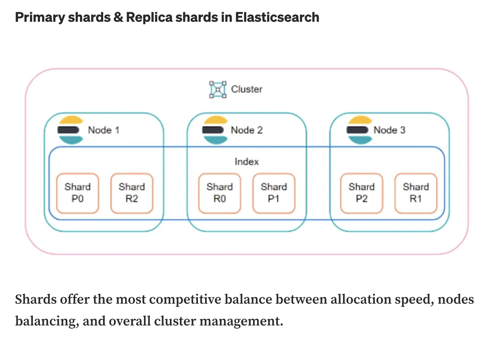
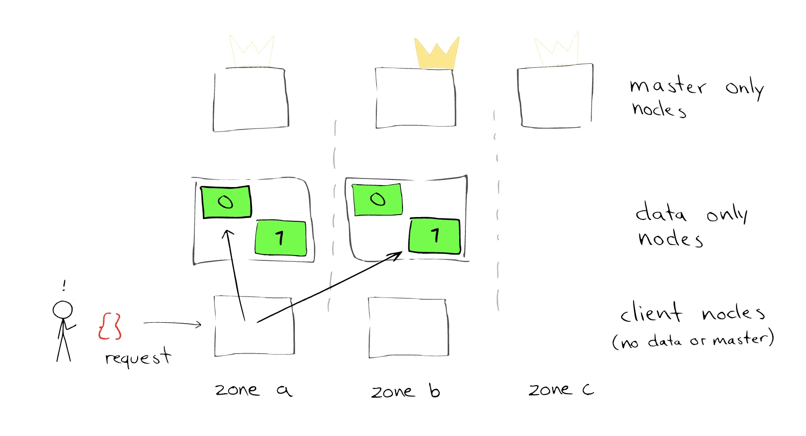
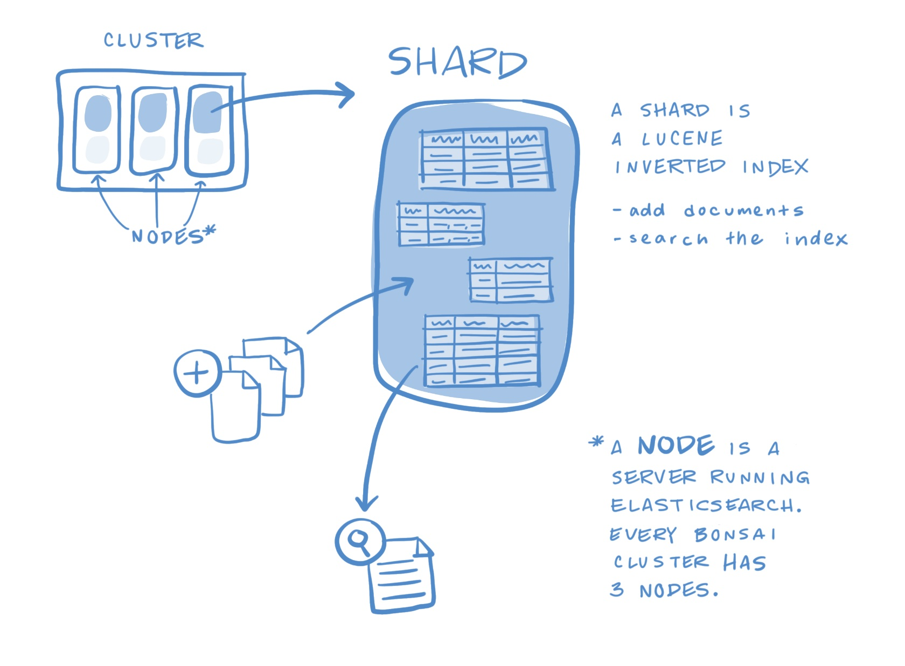

# Elasticsearch

references:
- https://blog.opstree.com/2019/10/01/tuning-of-elasticsearch-cluster/

## Types Of Nodes:
- Master Eligible-Node
Masters are meant for cluster/admin operations like allocation, state maintenance, index/alias creation, etc
 - Data Node
Data nodes hold data and perform data-related operations such as CRUD, search, and aggregations.
- Ingest Node
Ingest nodes are able to apply an ingest pipeline to a document in order to transform and enrich the document before indexing.
- Tribe Node
It is a special type of coordinating node that can connect to multiple clusters and perform search and other operations across all connected clusters.

## Shards and Replicas

- Shards: Further dividing index into multiple entities are called shards (shard = partition)
- Replicas: Making one or more copies of the index’s shards called as replica shards or simple replicas

By default, in Elasticsearch every index is allocated with 5 primary shards and single replica of each shard. That means for every index there will be 5 primary shards and replication of each will result in total of 10 shards per index.

Related image
Store, Search And Analyse!

Scenario
The first thing which comes in mind when I hear about logging solutions in my infrastructure is ELK (Elasticsearch, Logstash, Kibana).
But, what happens when logs face an upsurge in the quantity and hamper performance, which, in Elasticsearch words, we may also call “A Fall Back”
We need to get control of situation, and optimize our setup. For which, we require a need for tuning the Elasticsearch

What Is ElasticSearch?
It is a java based, open-source project build over Apache Lucene and released under the license of Apache. It has the ability to store, search and analyse document files in diverse format.

A Bit Of History
Image result for history drawing
Shay Banon was the founder of compass project, thought of need to create a scalable search engine which could support other languages than java.
Therefore, he started to build a whole new project which was the 3rd version of compass using JSON and HTTP interface. The first version of which was released in 2010.

ElasticSearch Cluster
Elasticsearch is a java based project which runs on Java Virtual Machines, wherein each JVM server is considered to be an elasticsearch node. In order to support scalability, elasticsearch holds up the concept of cluster in which multiple nodes runs on one or more host machines which can be grouped together into a cluster which has a unique name.
These clustered nodes holds up the entire data in the form of documents and provides the functionality of indexing and search of those documents.

Types Of Nodes:
- Master Eligible-Node
- Masters are meant for cluster/admin operations like allocation, state maintenance, index/alias creation, etc
- Data Node
- Data nodes hold data and perform data-related operations such as CRUD, search, and aggregations.
- Ingest Node
- Ingest nodes are able to apply an ingest pipeline to a document in order to transform and enrich the document before indexing.
- Tribe Node
- It is a special type of coordinating node that can connect to multiple clusters and perform search and other operations across all connected clusters.
- Image result for nodes in elasticsearch cluster
- Shards and Replicas
- Shards: Further dividing index into multiple entities are called shards
- Replicas: Making one or more copies of the index’s shards called as replica shards or simple replicas
- By default, in Elasticsearch every index is allocated with 5 primary shards and single replica of each shard. That means for every index there will be 5 primary shards and replication of each will result in total of 10 shards per index.

Image result for shards and replicas in elasticsearch cluster
Types Of Tuning in ElasticSearch:
- Index Performance Tuning
- Use Bulk Requests
- Use multiple workers/threads to send data to Elasticsearch
- Unset or increase the refresh interval
- Disable refresh and replicas for initial loads
- Disable swapping
- Give memory to the file-system cache
- Use faster hardware
- Indexing buffer size ( Increase the size of the indexing buffer – JAVA Heap Size )
- Search Performance Tuning
- Give memory to the file-system cache
- Use faster hardware
- Document modeling (documents should not be joined)
- Search as few fields as possible
- Pre-index data (give values to your search)
- Shards might help with throughput, but not always
- Use index sorting to speed up conjunctions
- Warm up the file-system cache (index.store.preload)
