# Coroutines and channels: actors model


If you’re coming from Java, you probably associate asynchronous with threads. And that means you’ve dealt with shared mutable state. You’ve spent countless hours chasing down deadlocks and race conditions. You’ve taken care when modifying shared state using locking primitives like `synchronized`. You might have even used higher order locking functions like `Semaphores` and `Latches`.

At this point you can see that concurrency is hard. It’s really hard. When you take a single threaded piece of code and make it concurrent, you inherently introduce a tremendous amount of complexity.

If you’ve been using Kotlin, you’ve probably heard of Coroutines. Coroutines aren’t new. They’ve existed since the 60s/70s. They’re part of a different concurrency model known as: [“Communicating Sequential Processes” (CSP)](https://en.wikipedia.org/wiki/Communicating_sequential_processes). Kotlin’s concurrency model builds off of two primitives: [Coroutines](https://kotlinlang.org/docs/reference/coroutines-overview.html) and [Channels](https://kotlinlang.org/docs/reference/coroutines/channels.html). These concurrency primitives make reasoning about concurrency simpler and promote testability. And IMO, they’re also one of the more exciting parts of learning the language.

This article introduces you to the concept of Coroutines and Channels through illustrations.

# **Coroutines**

Coroutines is a new computation, and it's suspendable: when performing network requests, it is suspended and releases the underlying thread. When the network request returns the result, the computation is resumed.

Coroutines run on top of threads and can be suspended. When a coroutine is suspended, the corresponding computation is paused, removed from the thread, and stored in memory. Meanwhile, the thread is free to be occupied by other tasks:


When the computation is ready to be continued, it is returned to a thread (not necessarily the same one).

The coroutine resumes only after the corresponding response is received:


# **Runblocking**

With this instruction we are saying that whatever is going to execute inside the block is going to wait to be done.
So the main thread is blocked until the coroutines inside are done, for instance

```kotlin
runBlocking{
    // whatever to wait for until is done
}
```
Runs a new coroutine and blocks the current thread until its completion. 
This function should not be used from a coroutine. 
It is designed to bridge regular blocking code to libraries that are written in suspending style, 
to be used in main functions and in tests.
```kotlin
expect fun <T> runBlocking(
    context: CoroutineContext = EmptyCoroutineContext, 
    block: suspend CoroutineScope.() -> T
): T
```
Remember for kotlin you can specify some many params and the last one can be a block 
which can be a lambda. Why is you can use runBlocking {} in this way, because the {} means the 
second parameter.


# **Single Thread Coffee Shop**

I’ll use the analogy of ordering a Cappuccino at a coffee shop to explain Coroutines and Channels. Let’s start with one Barista serving orders.

The Barista:

1. Takes an order
2. Grinds the coffee beans (30 seconds… it’s a really slow coffee grinder)
3. Pulls a shot of espresso (20 seconds)
4. Steams the milk (10 seconds)
5. Combines the steamed milk with the shot of espresso (5 seconds… for some fancy latte art)
6. Serves the Cappuccino

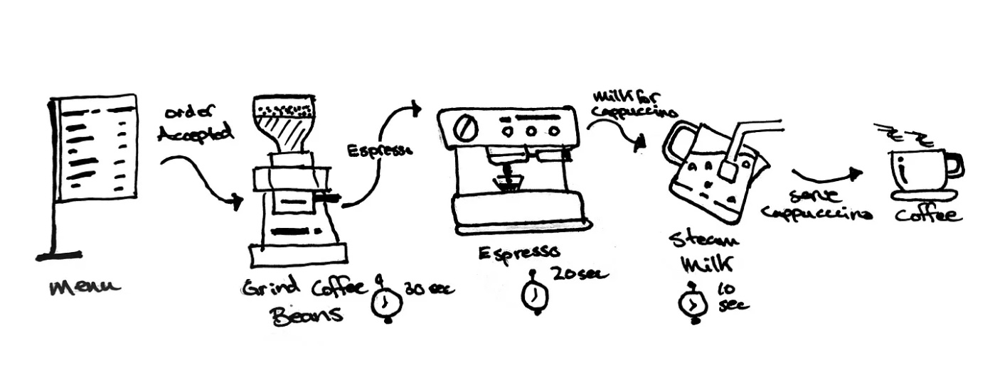

This is like a single thread application — one Barista performing all the work sequentially. We can model each step as a function in a program. And because this is a single thread program, the current function has to complete before moving on to the next function. Here’s what the program looks like ([try it out](https://try.kotlinlang.org/#/UserProjects/lli12ad0vgqrmcg2s3ohk0d4jq/8usu2fh349t8kr3b5cb6toek0)):

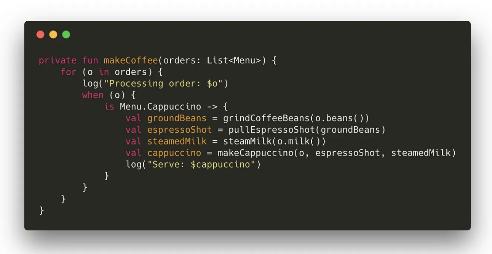

The output of this looks like:

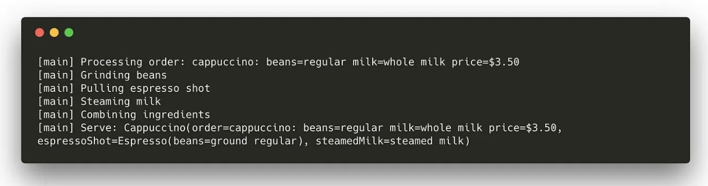

Conceptually, this program is very simple. It’s easy to reason about and understand. But it’s not efficient. What happens when the Coffee Shop gets popular and we hire two more employees. How does our current conceptual model allow for three employees to operate together but independently. How do we scale our program. How can the program take advantage of multiple threads to make Cappuccinos. Concurrency becomes an important part of the solution.

# **Concurrent Coffee Shop**

Let’s assume, for our Coffee Shop analogy, we’ve hired another Barista and a cashier. And for now, let’s assume that we have two Coffee Grinders and our Espresso Machine can pull two shots at once. We’ll make one more optimization. The Barista can pull a shot of espresso *and* steam the milk at the same time. Once both are complete, the Barista can combine the two together.

Here’s what we have now:

1. The cashier takes a new order. The cashier waits until one of the Baristas starts processing that order before accepting new orders.
2. An available Barista will take the order and grind coffee beans (30 seconds)
3. Take the ground coffee beans to the espresso machine and pull an espresso shot (20 sec)
4. While the espresso is being made, the Barista steams the milk (10 sec)
5. Once the espresso shot and steamed milk are ready, the Barista will combine them to make a Cappuccino (5 seconds)
6. Serve the Cappuccino

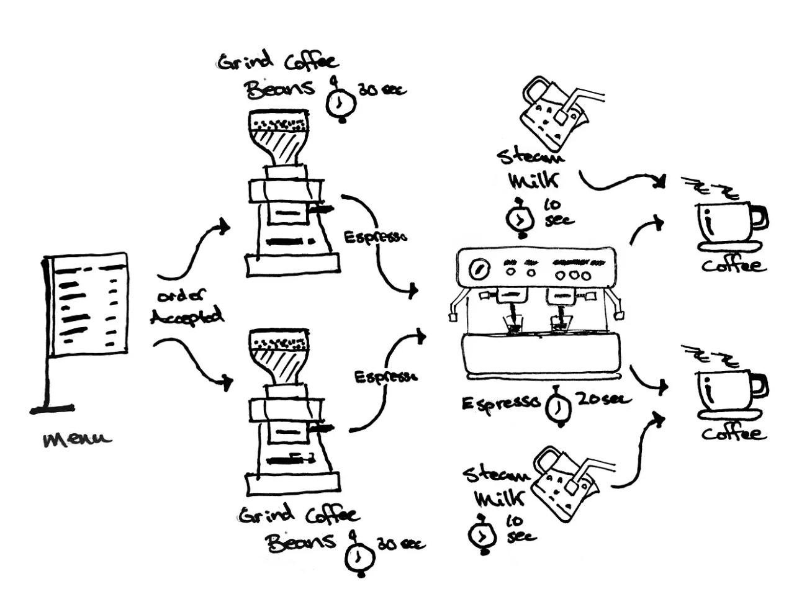

Now we have a system that’s much more efficient. There’s multiple parts of the program that can run concurrently.

But to support this type of behavior we’re going to need a way to create a cashier and two Baristas that can do things independently. We’ll need a way for the Baristas to talk to the cashier. And we’ll need a way for the Baristas to operate the Espresso Machine (think of the Espresso Machine as a shared resource) without conflicting with each other.

# **Threads and Coroutines**

In our example above, we can represent the Baristas and the cashier as coroutines. But what exactly are coroutines. To answer that, let’s first refresh what threads are.

> Concurrency is not parallelism
>

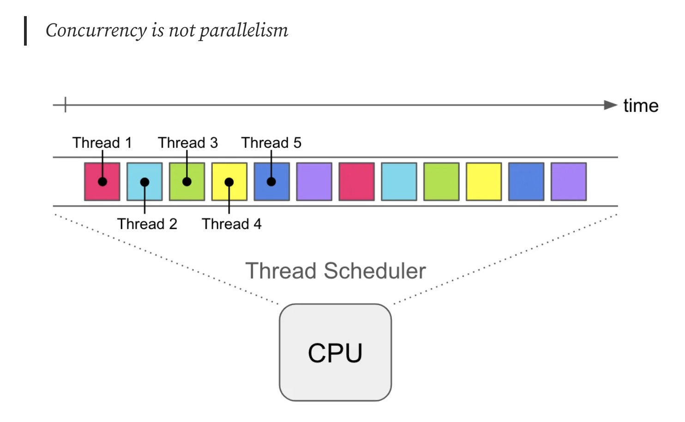

Threads allow units of work to execute concurrently. Each Java thread is allocated in user space but is mapped to a kernel thread. That means the operating system manages these threads. The operating system schedules a slice of time for each thread to run. If the thread isn’t done executing in that window, the operating system interrupts the thread and switches to another thread. This is known as preemptive scheduling. On a single core processor, we can only have one thread running at a time. The fast preemptive scheduling of threads by the operating system is what allows for independent units of work to execute concurrently. Now, most modern phones have multi core CPUs. This allows for parallelism. Thread A can be executing on CPU core 1 while Thread B can be executing on CPU core 2. It’s an important distinction to make — concurrency is not parallelism. The last thing about threads is that they’re expensive. On the JVM, you can expect each thread to be about 1MB in size. Each thread has it’s own stack. And lastly is the cost of thread scheduling, context switching, and CPU cache invalidation.

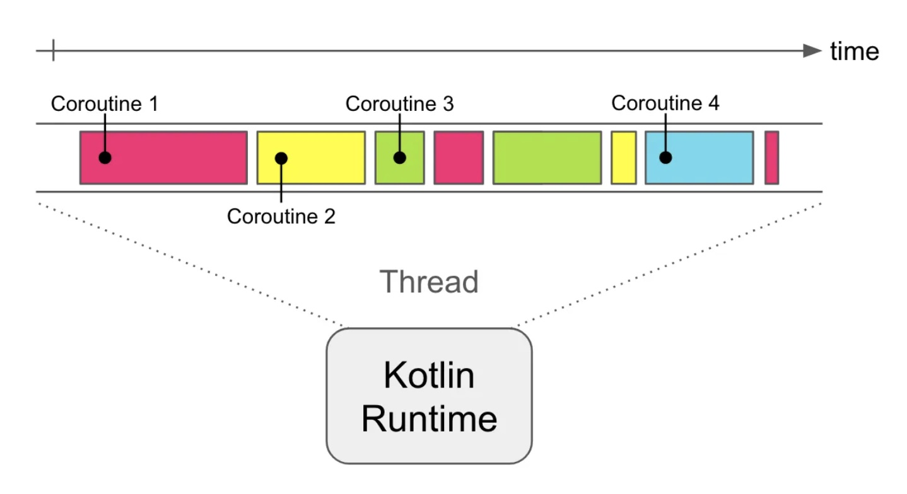

Conceptually, coroutines are like threads. They execute units of work concurrently. But unlike threads, coroutines aren’t necessarily bound to any particular thread. A coroutine can start executing in one thread, suspend execution, and resume on a different thread. Coroutines aren’t managed by the operating system. They’re managed at the user space level by the Kotlin Runtime. That means there is no time slice allocated to a coroutine to perform a unit of work. That also means there’s no scheduler overhead. Instead, coroutines perform cooperative multitasking. When one coroutine hits a suspension point, the Kotlin Runtime will find another coroutine to resume. You can think of this like having multiple coroutines multiplexed on to a single thread. Coroutines have a small memory footprint — a few dozen bytes. That gives you a very high level of concurrency with very little overhead.

Let’s update our first example so two coroutines process the list of orders concurrently ([try it out](https://try.kotlinlang.org/#/UserProjects/lli12ad0vgqrmcg2s3ohk0d4jq/qjuof3b2ggv3eg3eltlqal2m0p)).

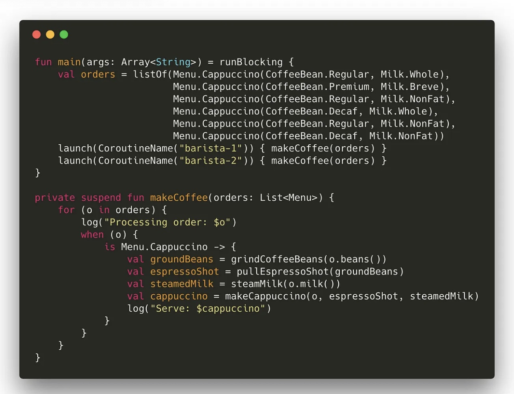

Starting a new coroutine is as simple as calling `launch`. The above example starts two coroutines from `main`. Coroutines must be associated with a coroutine scope. This ensures coroutines are cleaned up without you having to explicitly manage the lifecycle of the coroutine. In our example, we start the coroutines inside the scope defined by `runBlocking`. This means, the `main` function won’t terminate until the two child coroutines (`barista-1` and `barista-2`) have completed.

**Tip:** If you’re trying this out on Android, please review [Structured Concurrency and CoroutineScope](https://github.com/Kotlin/kotlinx.coroutines/blob/master/ui/coroutines-guide-ui.md#structured-concurrency-lifecycle-and-coroutine-parent-child-hierarchy).

The second thing we did is add the `suspend` modifier to the `makeCoffee` function. If you trace each method inside this function, you’ll notice they also have the `suspend` modifier applied to their function declarations. And if you look at these functions, you’ll notice they all call `delay` instead of `Thread.sleep`. The `delay` function places the coroutine in a suspended state for some period of time without blocking the thread it’s running on. That means the Kotlin Runtime can find another coroutine to resume on this thread. This concept allows coroutines to use threads with a high degree of efficiency. Something that an operating system thread scheduler could never achieve.

**Tip:** Try removing the `suspend` keyword. You’ll get a helpful error message 😉.

The output of this looks like:


This is great! We now have two Baristas making coffee concurrently. And, they’re both operating on the same thread! But how do we have the two Baristas talk to each other? This is where channels come in.

**Tip:** By specifying a [dispatcher](https://kotlin.github.io/kotlinx.coroutines/kotlinx-coroutines-core/kotlinx.coroutines/-dispatchers/index.html) you can change the thread pool a coroutine is assigned to execute in:

```
launch(Dispatchers.Default + CoroutineName(“barista-1”)) {
    makeCoffee(ordersChannel)
}
```

# **Channels**

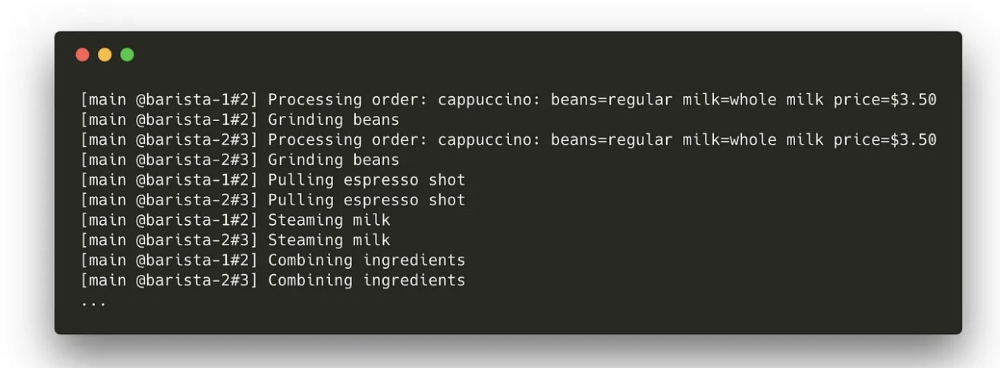

You can think of a channel as a pipe between two coroutines. That pipe facilitates the transfer of information between those two coroutines. One coroutine can send information on that pipe. The other coroutine will wait to receive the information. This concept of communication between coroutines is different than threads.

> Do not communicate by sharing memory; instead, share memory by communicating.
> 

When you’re writing software that involves coordinating with blocking resources (network, database, cache, etc) or computationally intensive operations, you offload this to threads. So now you have things that are shared between threads. To share something safely, you rely on locking the resource or memory so that two threads can’t read or write to it at the same time. This is typically how threads communicate — through shared memory. But it also causes all sorts of issues like race conditions, deadlocks, etc.

Channels promote a different perspective on communicating: **don’t communicate by sharing memory, share by communicating.**

Let’s update our example to use a channel to communicate processing orders between the Cashier and the two Baristas ([try it out](https://try.kotlinlang.org/#/UserProjects/lli12ad0vgqrmcg2s3ohk0d4jq/7e843adqq0lmp72ug4dj34ictv)).

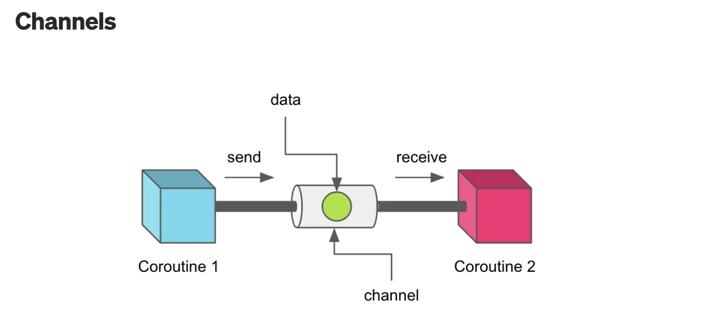

Before we dive in to the code, let’s take a moment to understand the changes conceptually. Below is a visualization of what the code above is doing.

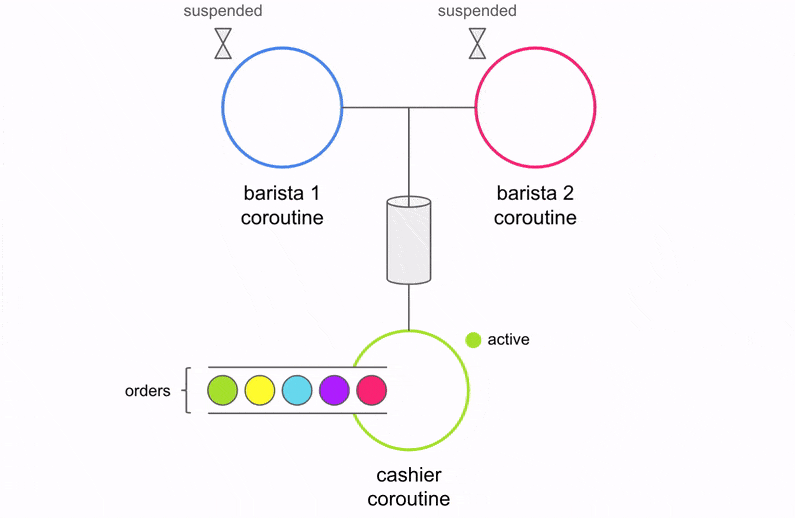

There are three coroutines (Cashier, Barista 1, and Barista 2) operating independently and performing specific units of work. The Cashier communicates with the two Baristas via the channel. The Cashier accepts an order, places it on the channel, and waits for one of the two Baristas to accept the order. This is how coroutines synchronize with each other. Once the Barista finishes making coffee, it will sync up with the Cashier to process the next order. What if there aren’t any orders yet? The two Baristas will suspend execution and wait until an order arrives on the channel.

The first thing we need to do is create the channel:

```
val ordersChannel = Channel<Menu>()
```

Next, we need to send orders on this channel. Sending on a channel is a suspendible operation and needs to be invoked from within a coroutine. We create a new Cashier coroutine for this purpose.

```
launch { // launches the cashier coroutine
    for (o in orders) { ordersChannel.send(o) }
    ordersChannel.close() // don't forget to close channels when you're done with them!
}
```

Now we have a way for the cashier to send orders to make coffee in a safe way. The next thing we need to do is update the logic for the two Baristas to consume from this channel.

The `makeCoffee` function now accepts a channel instead of a list. The function will iterate over the channel as it did with the list. When there is nothing available on the channel, the function suspends execution.

```
private suspend fun makeCoffee(ordersChannel: Channel<Menu>) {
    ...
}
```

Closing a channel is like a terminal event. This signals to the functions reading from that channel that there is nothing left to process. This terminates the loop inside `makeCoffee` and allows the coroutine to finish. What if we never closed the channel? That means both Barista coroutines would be in an indefinite suspended state (waiting for something to arrive on the channel). And because the two coroutines belong to the `runBlocking` scope, the main function would never complete.

Here’s what the output looks like:

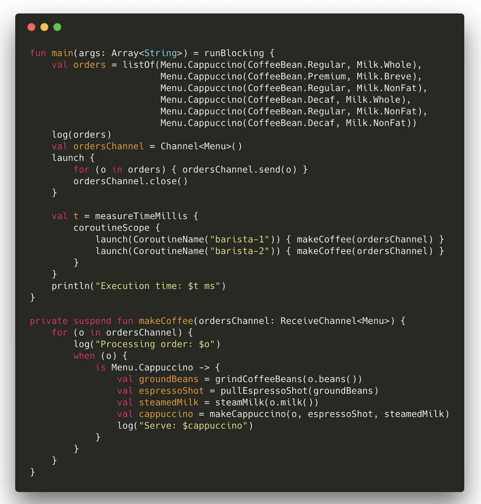

Notice how both Baristas are concurrently processing different orders. Also, notice that the two coroutines are executing on a single thread (main thread). This is great! Now we have a way for our two Baristas to concurrently process orders and communicate with the cashier.

# **Properties of Channels**

Channels form the foundational component for communicating between coroutines. A `Channel` implements both the `SendChannel` and `ReceiveChannel` interface. Let’s take a look at some of the properties of channels.

## **Suspending Execution while Sending or Receiving**

Sending on a channel or receiving from a channel can suspend execution. We saw above, when the cashier sends an order on a channel, the coroutine suspends execution until another coroutine is able to receive from that channel. Similarly, we saw that the Barista suspends execution when receiving from the channel until an order is available on the channel.

## **Types of Channel Buffers**

Channels offer flexibility in terms of communicating messages between coroutines.

**Rendezvous (Unbuffered)**

This is the default channel buffer type. It doesn’t have a buffer. This is why a coroutine is suspended until both the receiving and sending coroutines come together at the same time to transfer the data.

`val channel = Channel<Menu>(capacity = Channel.RENDEZVOUS)`

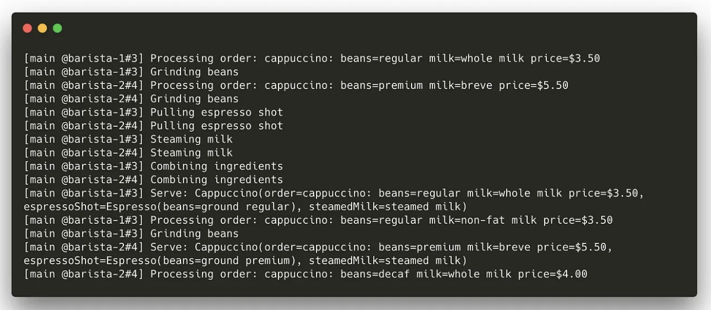

**Conflated**

This creates a channel with a fixed buffer of size 1. If the receiving coroutine can’t keep up with producer, the producer overwrites the last item in the buffer. When the receiving coroutine is ready to take the next value, it receives the last value sent by the producer coroutine. This also means that the producer coroutine doesn’t suspend execution when sending to the channel. The receiving coroutine will still suspend execution until something becomes available on the channel.

`val channel = Channel<Menu>(capacity = Channel.CONFLATED)`

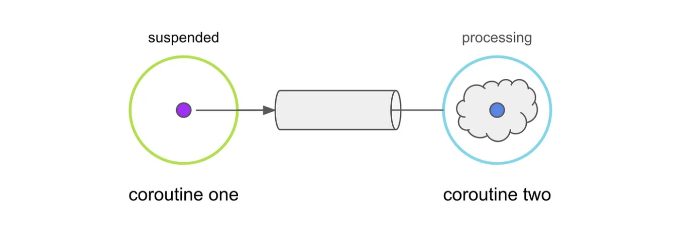

**Buffered**

This mode creates a channel with a fixed size buffer. The buffer is backed by an Array. The producing coroutine will suspend on send if the buffer is full. The receiving coroutine will suspend if the buffer is empty.

`val channel = Channel<Menu>(capacity = 10)`

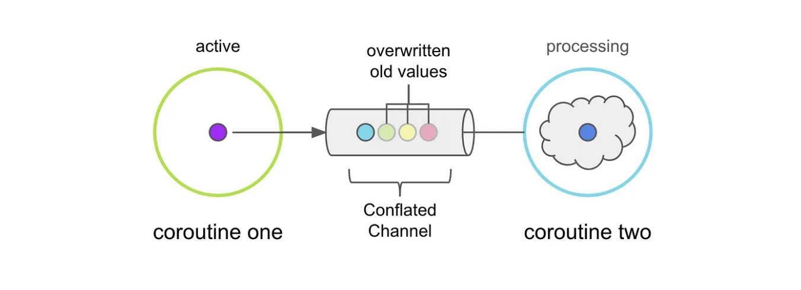

**Unlimited**

In this mode, a channel is created with an unbounded buffer. The buffer is backed by a LinkedList. Items produced too quickly are buffered unboundedly. If the buffer isn’t drained, items continue to accumulate until memory is exhausted. This results in an `OutOfMemoryException`. The producing coroutine never suspends sending to the channel. But if the buffer is empty, the receiving coroutine will suspend.

`val channel = Channel<Menu>(capacity = Channel.UNLIMITED)`

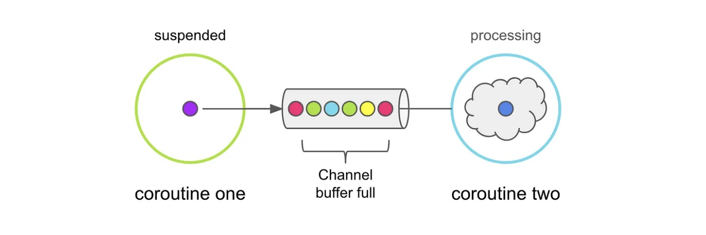

## **Coroutine Builders**

We’ve had to associate a channel with a coroutine in order to send to or receive from. But we can use coroutine builders to simplify creating a coroutine and a channel.

**[Produce](https://kotlin.github.io/kotlinx.coroutines/kotlinx-coroutines-core/kotlinx.coroutines.channels/produce.html)**

This creates a new `ReceiveChannel`. Internally, it launches a coroutine within a `ProducerScope` to send values on the channel. When there’s nothing left to send, the channel is implicitly closed and the coroutine resource is released.

We can simplify the creation of our `orderChannel` in the example above to look like this:

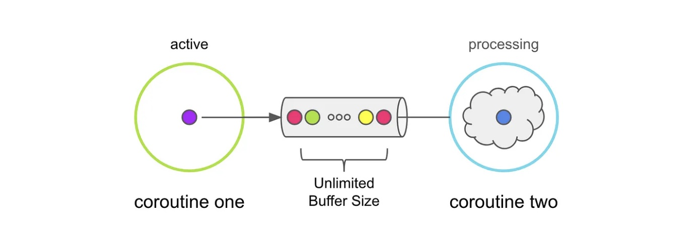

**[Actor](https://kotlin.github.io/kotlinx.coroutines/kotlinx-coroutines-core/kotlinx.coroutines.channels/actor.html)**

Similar to produce, this creates a new `SendChannel`. Internally, it launches a coroutine within an `ActorScope` used to receive values on the channel. You can think of this like exposing a mailbox and internally processing those items within the context of that Actor coroutine.

**Tip:** Unlike the `produce` coroutine builder, you’ll need to explicitly stop the actor when it’s no longer needed. Be sure to call `actor.close()`

## **Backpressure**

If you’re coming from the RxJava world, then you’re probably familiar with the concept and importance of backpressure. What’s great about channels is they have backpressure built right in. Backpressure is propagated upstream based on the different channel buffer modes used.

# **Adding the Espresso Machine**

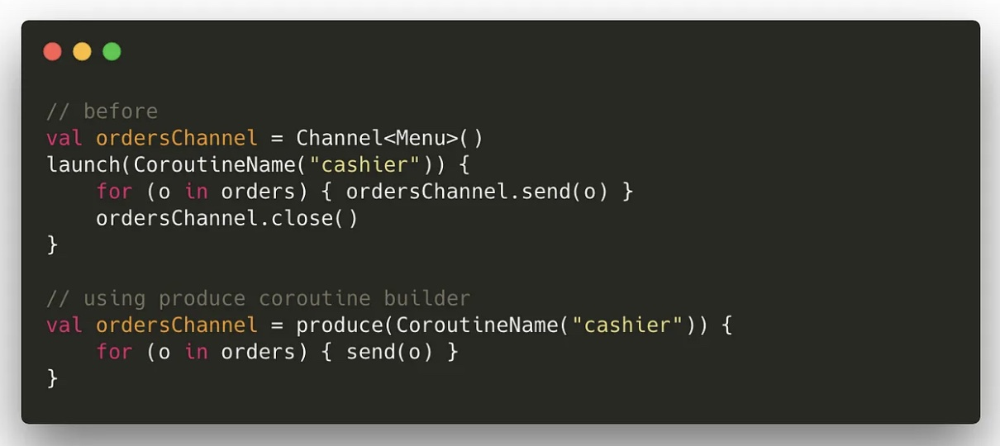

Our Coffee Shop implementation currently supports two Baristas making coffee. But, conceptually, it’s like they’re using two instances of an espresso machine. How do we construct an espresso machine that the two Baristas can share?

The Baristas also currently execute each step sequentially. There’s opportunity to optimize this. How can we change our program so the Baristas can steam the milk while pulling a shot of espresso?

Our espresso machine has two steam wands and two portafilters. The input to a steam wand is milk and the output is steamed milk. The input to a portafilter is ground coffee beans and the output is an espresso shot.

One approach is to model these two functions as suspendible. That way the caller will provide the input (type of milk or type of ground coffee beans) and await the output (steamed milk or an espresso shot). But what about the internals of the espresso machine? How does the espresso machine limit the number of espresso shots pulled at the same time?

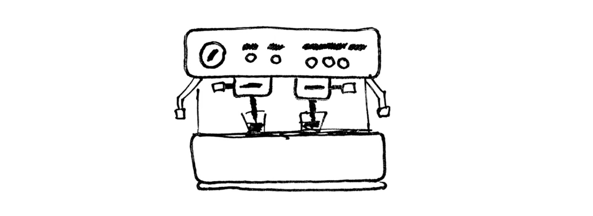

What if we constructed two channels, one for the portafilter and one for the steam wand, with a fixed buffer size of 2. We could then send the input to the appropriate channel. Using the channel is a good way to communicate. But setting the buffer size to 2 doesn’t mean we’re pulling two espresso shots at once. Rather, it means we can have up to two pending espresso shot requests while pulling one.

What if we create a channel for each portafilter. And similarly, we create a channel for each steam wand. This is closer to what we want. We can launch a coroutine for each portafilter and associate each portafilter with a channel. This is a good candidate for an actor.

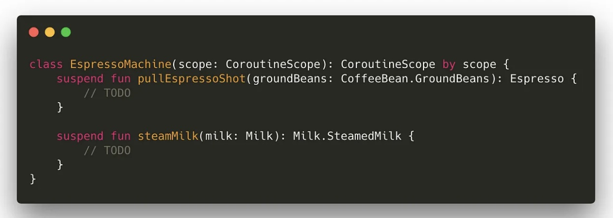

Now we just need a way to select the portafilter to send to. And if both portafilters are in use then we should suspend until one becomes available. The same applies for the two steam wands.

Conceptually, this is what we’re trying to do:

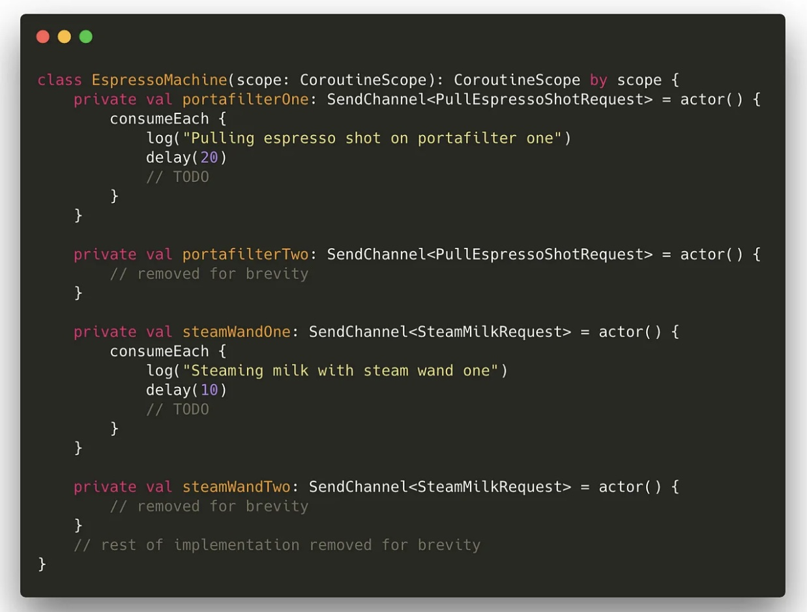

We want coroutine one to send the “blue” data to either coroutine two or coroutine three — which ever becomes available first.

## **Selecting channels**

What we need is a way to select a channel to send to (or receive from). Kotlin provides just that with the `[select](https://kotlinlang.org/docs/reference/coroutines/select-expression.html)` expression. It works a lot like a `switch` statement but for channels. `select` picks the first channel that is ready. By ready we mean this could be the first channel that is ready to send to or ready to receive from. The `select` expression suspends if none of the channels are ready.

Here’s what the updated espresso machine code looks like now:

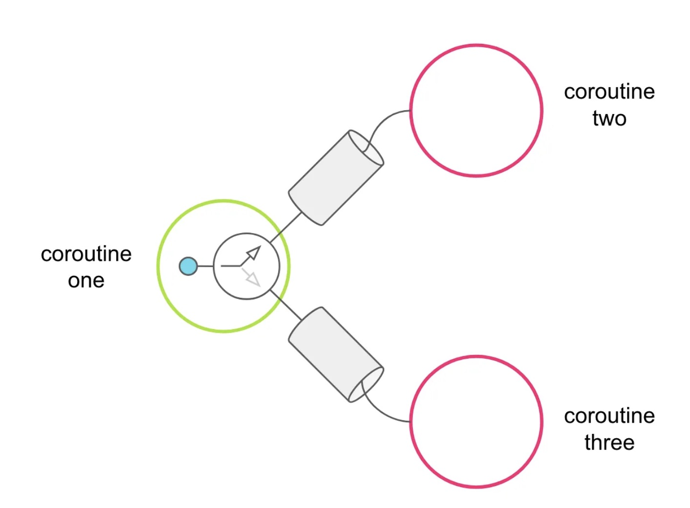

Because both functions are pretty much the same, we’ll focus on `pullEspressoShot`. The function selects over the two portafilter channels to send to. But we need a way to communicate the result from the portafilter actor back to the select statement. This is why we create a channel and pass that along with the request to the portafilter. Once the request is sent to the channel, we wait for a response and deliver the result. The portafilter implementation sends the result on the provided channel and then closes the channel.

But we’re not done yet. We created four channels, two for the steam wand and two for the portafilters. Those channels are also associated with coroutines. We created them as actors. That means we must close the actors. We introduce a `shutdown` function to do that.

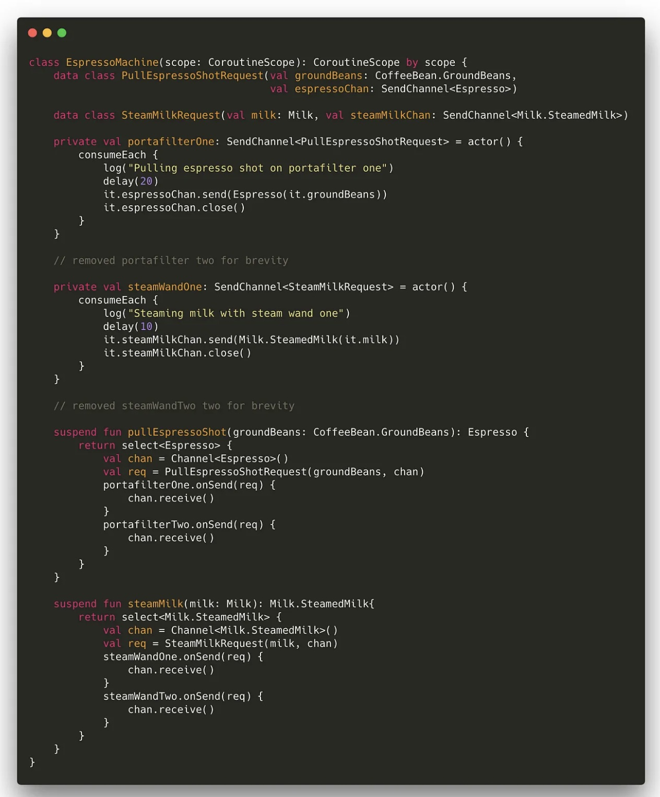

Have a look at the complete espresso machine [here](https://try.kotlinlang.org/#/UserProjects/lli12ad0vgqrmcg2s3ohk0d4jq/32b0045mpesndkg2l7nqv2vpcj).

# **The Complete Picture**

Now we have a way to share the Espresso Machine between coroutines. Let’s update the program to take advantage of this. We can also pull an espresso shot and steam the milk at the same time ([try it out](https://try.kotlinlang.org/#/UserProjects/lli12ad0vgqrmcg2s3ohk0d4jq/cvtpiosfl36ls7iijlmoth7ghn)).

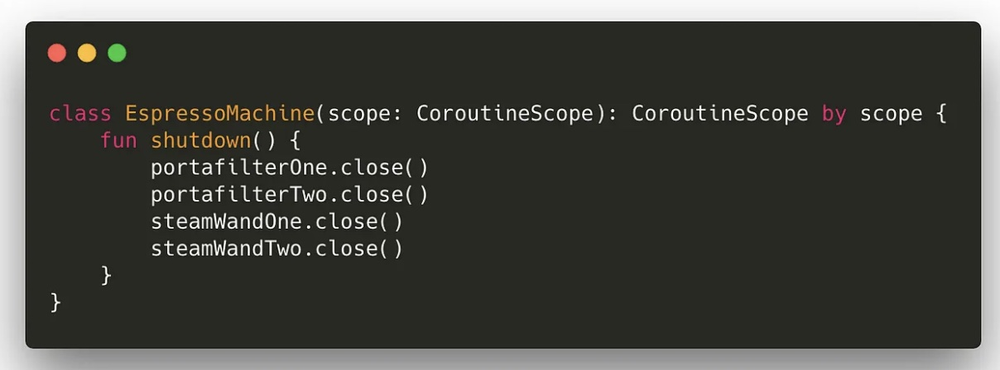

We create an instance of the Espresso Machine and pass that along to the `makeCoffee` function. Inside the `makeCoffee` function, we request an espresso shot and steamed milk from the espresso machine. But we want to do both of these asynchronously. By wrapping the call within an `async` block, we launch a coroutine and receive a `Deferred`. We can call `await` on the `Deferred` to receive the actual value.

The purpose of this article was to explain the basics of channels and coroutines. But there’s important information about both channels and coroutines that can get you in to some trouble. Channels and coroutines are no silver bullet for avoiding the familiar concurrency problems. Running in to deadlocks, memory leaks, and data races are still possible. But the concepts certainly make reasoning about concurrency simpler.

We looked at the fundamentals of coroutines and channels. We took a simple sequential program and turned it into a concurrent one. We looked at a few different patterns on how to share data and communicate across coroutines.

# **Credits**

Thanks to

[Joaquim Verges](https://medium.com/u/fafb5ad7b4c0?source=post_page-----db441400965f--------------------------------)

for reviewing this post and offering wonderful feedback.

# **Further reading**

[Structured concurrency](https://medium.com/@elizarov/structured-concurrency-722d765aa952) by Roman Elizarov

A great post explaining the importance of structured concurrency with coroutines.

[Kotlin Docs: Channels](https://kotlinlang.org/docs/reference/coroutines/channels.html)

The Kotlin docs describe a handful of ways to leverage channels

[Deadlocks in non-hierarchical CSP](https://medium.com/@elizarov/deadlocks-in-non-hierarchical-csp-e5910d137cc) by Roman Elizarov

Channels and coroutines are a great way to reason about concurrency but they don’t prevent deadlocks. This is a great post that walks you through a real problem and the gotchas.

[GopherCon 2018: Rethinking Classical Concurrency Patterns](https://youtu.be/5zXAHh5tJqQ) by Bryan C. Mills

A talk on concurrency patterns using go’s concurrency primitives (goroutines and channels).