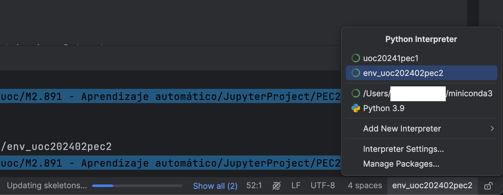
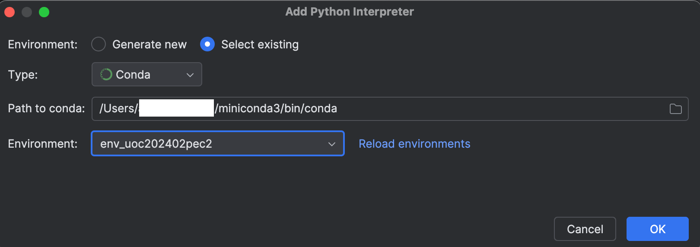
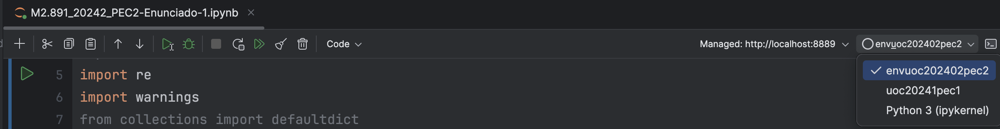
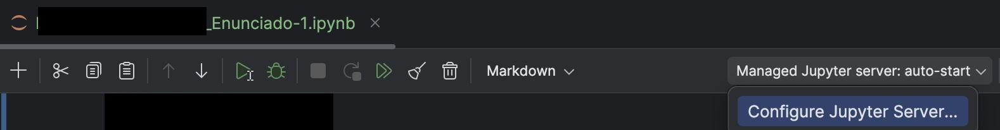
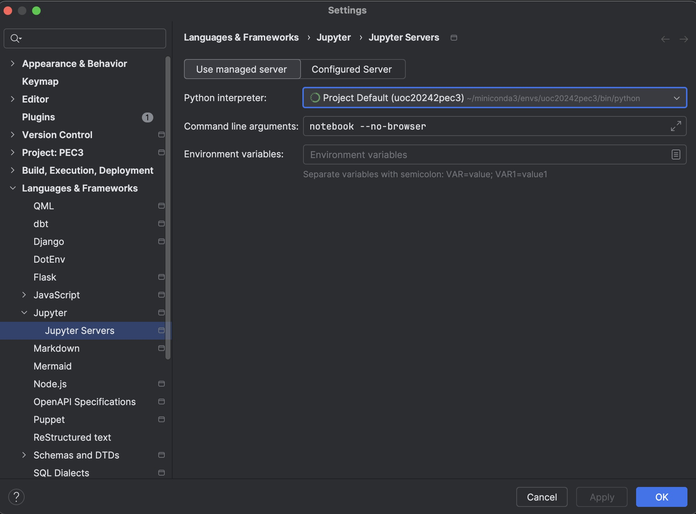
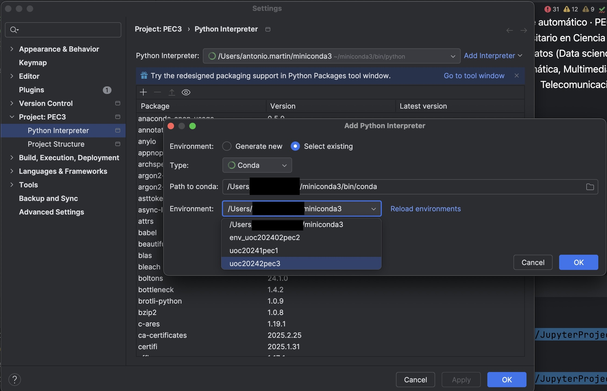
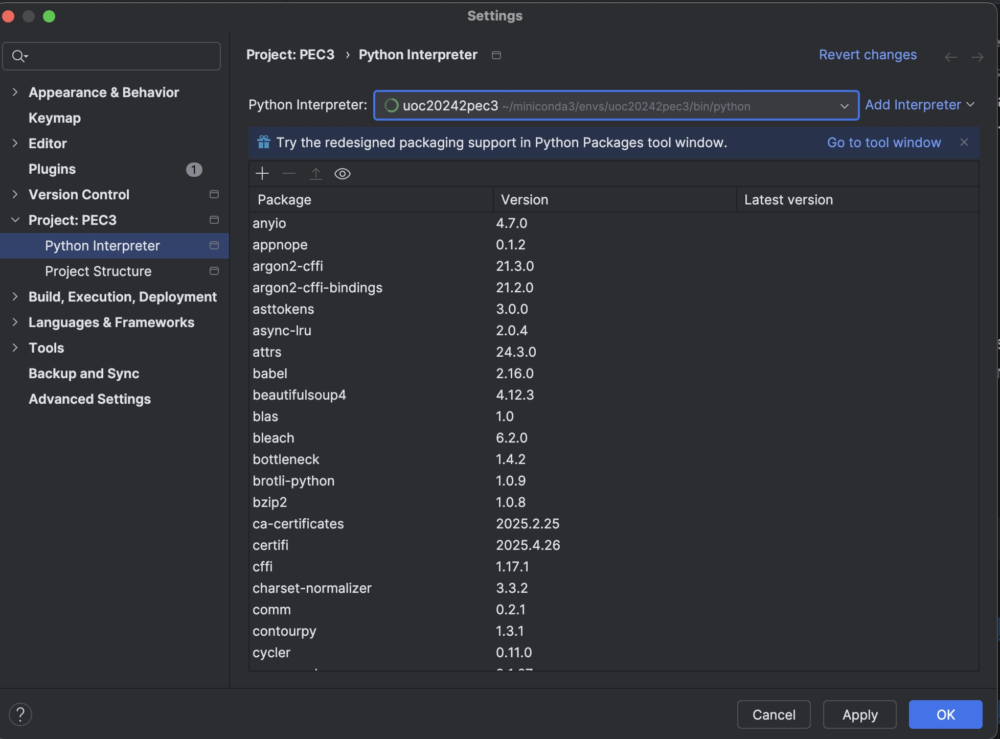

# First steps

## Installing conda.

For the latest Miniconda installers for Python 3.12, go to anaconda.com/download. The Miniconda installers are on the same page as the Anaconda Distribution installers, past registration.
Download the command line installer.

```
sh ./Miniconda3-latest-MacOSX-arm64.sh
```

### list packages

```bash
conda list  # Verifica paquetes de Conda
pip list    # Verifica paquetes de Pip
#
conda list | grep -E "numpy|pandas|torch|numba|implicit"
pip list | grep -E "implicit|umap|llvmlite|implicit"
```

### Update conda channels or repositories

```bash
conda update -n base -c defaults conda
```

## Create the environment with the provide config file yml
```
conda env create -f environment_uoc20242pec4.yml python=3.13.2
conda activate uoc20242pec4
```

## update the environment with the provide config file yml
```
conda env update -f environment_uoc20242pec4.yml --prune
conda env update -n uoc20242pec4 -f environment_uoc20242pec4.yml --prune
conda activate uoc20242pec4

```

## remove env

```bash
conda env remove -n uoc20242pec4
conda clean --all
```

### Activate
```
conda activate uoc20242pec4
```

### Deactivate
```
conda deactivate
```

### List environments
```
conda env list
```

### Clean cache
```
conda clean --all
```

### Remove environment
```
conda env remove -n uoc20242pec4
```

## Install kernel for jupyter notebook 

### Install the jupyter server to execute notebooks
```
conda install jupyter
```

After that, and after create environment. Select it in the bottom left corner:





All the import errors disappear from the notebook
Setup the notebook environment in the upper right corner



### alternative

Open the jupyter notebook. On the top right corner, choose configure Jupyter server.



Select python interpreter, choose the uoc20242pec3



Somtimes is needed to click on reload bottom



Apply the changes



You can do the same on the down right corner

And the end, the jupyter notebook has to be at the images shows, using the uoc20242pec3 environment.

### List

```
jupyter kernelspec list
```

### Install kernel
The notebooks use a kernel. The kernel is the environment which the libraries.
When you are using intellij o pycharm, you have to select a kernel or a new kernel for your notebook.
In the down-right corner, you can see the kernel for the notebook.
In the top-right corner, you can choose the kernel for the notebook. 

```
python -m ipykernel install --user --name=uoc20242pec4
```

Be sure that the env is the your custom environment created previously
```
which python
#> /Users/xxx/miniconda3/envs/environment_uoc20242pec4.yml/bin/python
```

### Remove/Uninstall kernel
The notebooks use a kernel. The kernel is the environment which the libraries.

```
jupyter kernelspec uninstall uoc20242pec4
```

### Install repositories or channels
a channel is the place where the packages are located at.
For instance, the channel is the artifactory, or another repository online, local o whatever which contains the packages or lib 
to download on your machine

```
conda install --channel <CHANNEL_NAME> <PKG_NAME>
```

### Install dependencies

```bash
conda install openpyxl
```

### Install pip dependencies

```bash
conda activate env_uoc202402pec2
pip install --force-reinstall \
    implicit==0.7.2 \
    llvmlite==0.44.0 \
    numba==0.61.0 \
    pynndescent==0.5.13 \
    tqdm==4.67.1 \
    umap-learn==0.5.7
```
One by one
```bash
pip install --force-reinstall llvmlite==0.44.0  # Requisito de numba
pip install --force-reinstall numba==0.61.0     # Depende de llvmlite
pip install --force-reinstall pynndescent==0.5.13
pip install --force-reinstall umap-learn==0.5.7
pip install --force-reinstall tqdm==4.67.1
# da error
pip install --force-reinstall implicit==0.7.2
```

### review versions

```bash
conda list | grep -E "numpy|pandas|torch|numba|implicit"
pip list | grep -E "implicit|umap|llvmlite|implicit"
```