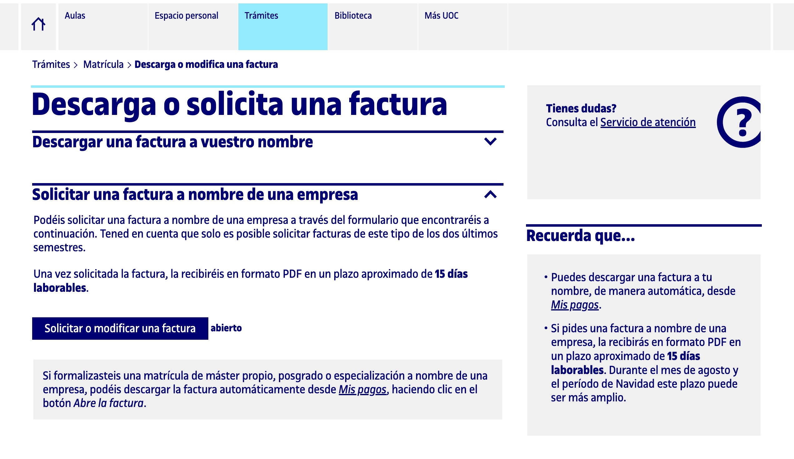
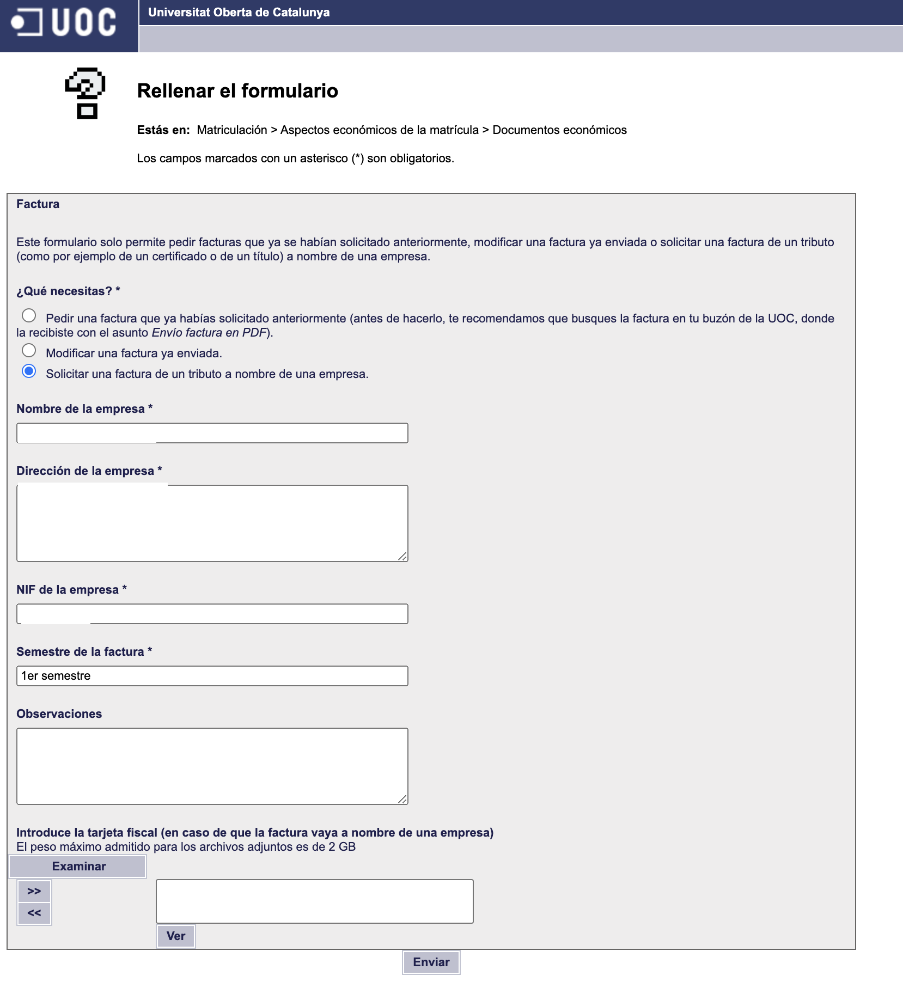

# matriculacion por empresa 

- Accede al campus
- Selecciona la opción de matriculación
- Haz la propuesta de matriculación
- El tutor te da el visto bueno en unos dias
- Continua con el proceso de matriculación
- A la hora de pagar selecciona en el desplagable de pago `opcion empresa` y añade el codigo de descuento proporcionado por tu empresa
- Se te genera un resumen de la matriculación con unos codigos de barras y referencias que puede usar la empresa para pagarte la matriculación.
- Desde mis pagos puedes ver el estado de la matriculación, pero poco más. Sal de aqui y vuelve a la ventana principal.
- Vete a Trámites > Matrícula > Te puede interesar... Descarga o solicita una factura > Solicitar una factura a nombre de una empresa

- Entra en esta opcion y rellena un formulario con los datos de la empresa y los tuyos.

- En unos dias te llegará la factura a tu correo.
- Entrega esta factura a tu empresa para que te pague la matriculación.

### Nota

El procedimiento de matrícula mediante pago empresa de un grado o máster universitario está temporalmente inhabilitado, volverá a activarse a partir del día 2 de septiembre. Puedes hacer tu matrícula a partir de esta fecha, a través del mismo formulario de matriculación disponible en el Campus Virtual, donde deberás seleccionar la forma de pago por empresa y poner en la casilla de "condiciones especiales" el código de descuento que te haya facilitado tu empresa.

Una vez hecha la matrícula,deberás solicitar la factura desde el formulario del Campus Virtual siguiendo la ruta >Trámites > Matrícula > Te puede interesar... Descarga o solicita una factura > Solicitar una factura a nombre de una empresa>. Una vez solicitada la factura, la recibirás en formato PDF en tu buzón de la UOC en un plazo máximo de 15 días.

### Formas de pago

Una vez confirmada la matrícula a los Estudios de Máster Universitario en Ciencia de Datos, nos ponemos en contacto contigo para ampliar la información sobre la forma de pago que has seleccionado.

Para efectuar el pago de la matrícula XXX € tu empresa necesitará tu hoja de matrícula.

Pueden efectuar el pago de las tres maneras siguientes.

- De manera virtual. Mediante los sistemas de banca electrónica que tienen habilitados algunas entidades financieras. Ten en cuenta que algunas entidades bancarias solo ofrecen estos servicios a sus clientes. Si efectúas el pago de manera virtual por medio del portal de CaixaBank ("la Caixa"), solo deberás rellenar la opción Emisora (y no la opción Código CPR) con el número que aparece al pie de la hoja de matrícula.
- En cajeros automáticos habilitados. Mediante el código de barras que aparece en la hoja de matrícula en cualquiera de las siguientes entidades financieras: CaixaBank ("la Caixa"), Banco Santander y Banco Bilbao Vizcaya Argentaria (BBVA).
- Presencialmente en la entidad bancaria. Mediante el código de barras que aparece en la hoja de matrícula en cualquiera de las siguientes entidades financieras: CaixaBank ("la Caixa"), Banco Santander y Banco Bilbao Vizcaya Argentaria (BBVA).
  Si tu empresa prefiere efectuar el pago con tarjeta o domiciliación bancaria, deberás modificar la forma de pago desde tu Espacio personal / Pagos / Mis pagos y elegir una de las dos formas de pago. Ten en cuenta que deberás tener a mano los datos necesarios (número de tarjeta o número de cuenta de la empresa) para introducirlas.

En caso de que tengas cualquier duda, puedes ponerte en contacto con el servicio de atención.

