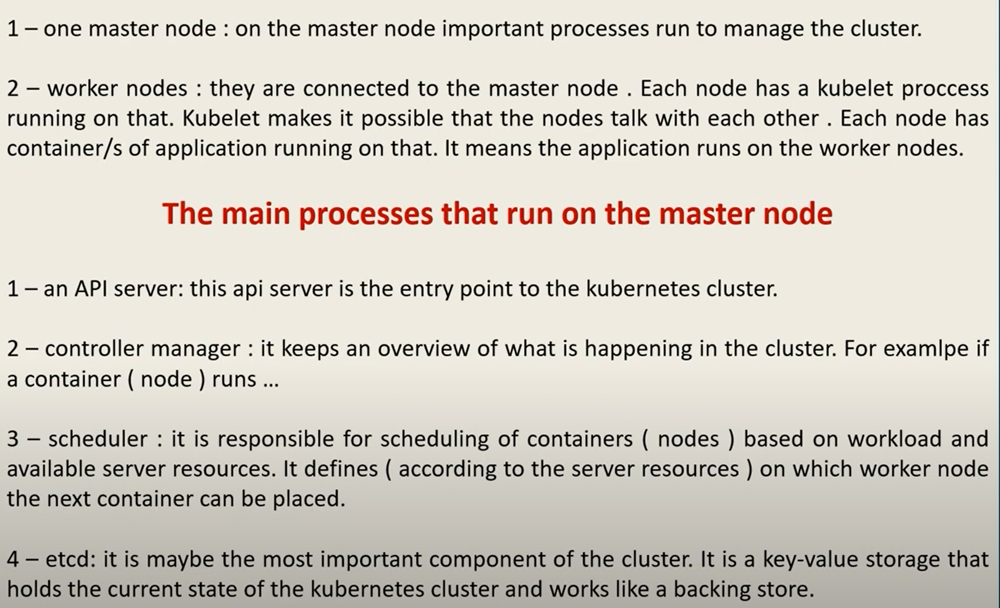
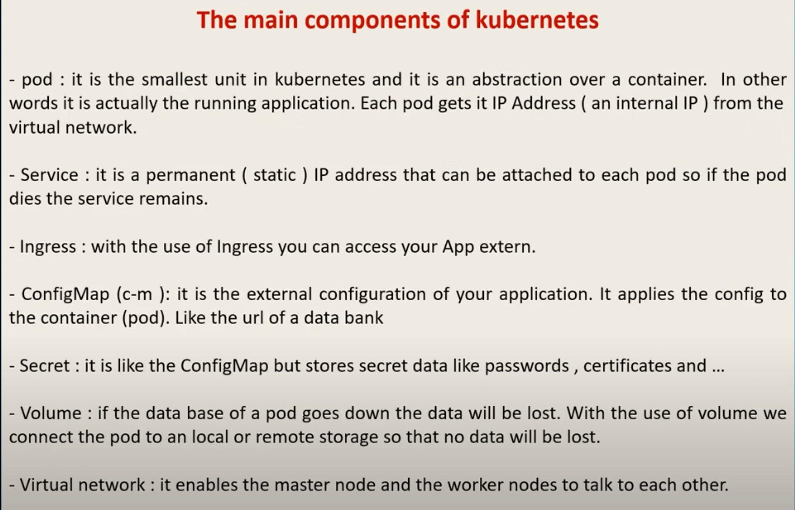

# tooling

Installing Kubernetes on cloud

## resources
[Creating a cluster with kubeadm](https://kubernetes.io/docs/setup/production-environment/tools/kubeadm/create-cluster-kubeadm/)

[Best Kubernetes Home Lab Tools in 2023](https://www.virtualizationhowto.com/2023/05/best-kubernetes-home-lab-tools-in-2023/)

[installing in spanish](https://www.youtube.com/watch?v=y_c_tPXusqM)

https://www.youtube.com/watch?v=j2C3nS9tjls&t=1s

## reduce windows partition
over the disk admin app, select the windows volume. Click the left mouse buttom and select reduce volume.  

## install kubernetes on linux
https://kubernetes.io/docs/tasks/tools/install-kubectl-linux/

## Build a Kubernetes Home Lab from Scratch step-by-step!

https://www.youtube.com/watch?v=_WW16Sp8-Jw

## Table of contents
The actual commands to disable swap
Installing Docker
Installing CURL
Adding the repository key for Kubernetes
Adding the actual Kubernetes repository
Running apt update
Installing kubeadm, kubelet, kubectl, and Kubernetes
Explaining why we are only running commands on the Kubernetes master node
Running the kubeadm init command
kubeadm init command finishes successfully and have the kubeadm join command
The worker nodes are now caught up with the master node
We still have the special join command to copy and paste into our worker nodes
Notice the output of workers. They have successfully joined the Kubernetes cluster
Kubectl commands are failing. This is because we haven't copied our kubeconfig to our HOME directory
Nodes are in the not ready state. This is because we haven't deployed container networking
We are going to deploy Calico for container networking
After container networking we check the STATE of our Kubernetes nodes
Wrapping up and thoughts on building a Kubernetes Home Lab from Scratch

do the same steps up to the `sudo kubeadm init` for the three laptops

## disable swap
kubelet don't need the swap partition to work well, so it's needed to disabled 
````bash
sudo swapoff -a
# open the file and commment the swap line
sudo vi /etc/fstab
# comment the swap line as save the file
````

## install on every laptop
install docker
install curl
````bash
## install docker and curl
sudo apt install docker.io -y
sudo apt install apt-transport curl -y

## install the k8s repositories
curl -s https://packages.cloud.google.com/apt/doc/apt-key.gpg | sudo apt-key add
sudo apt-add-repository "deb https://apt.kubernetes.io/ kubernetes-xenial main"
sudo apt update

## install the k8s tools
sudo apt install kubeadm kubelet kubectl kubernetes-cni -y

# the previous steps are the same for the master and worker nodes

## this step only on master node: create the cluster into the master node laptop
sudo kubeadm init

## after that run the `kubeadm join` command which is `prompt` from the master node to the console on the worker machines, to join the workers with the master. It's an automatic process.

## over master node machine
# error when run 
kubectl get nodes

## on the master node
mkdir -p $HOME/.kube
sudo cp -i /etc/kubernetes/admin.conf $HOME/.kube/config
sudo chown $(id -u):$(id -g) $HOME/.kube/config

# try another time, the nodes are listed but not-ready 
kubectl get nodes

# apply calico to fix it
kubectl apply -f https://docs.projectcalico.org/manifiest/calico.yaml

# try another time, the nodes are listed and ready 
kubectl get nodes
````

### calico
https://www.youtube.com/watch?v=kzM9GQTR8zk

calico as container network interface or CNI instead of flannel.

flannel is simple but calico gives us some flexibility of having more security and network administration related controls.
we need a file to store the calico configuration


## static ips problem on a bare metal / on premise installation

I have a bare metal kubernetes cluster installation, and I use the three computers as my personal room to explore and learn kubernetes, so everytime I run the linux machines the ips are changing because I have a wifi route which is in change to handle automatically the ip address when a new device is going to connect to the network. How can I handle this circunstance into my cluster, because the cluster has hardcoded the ips of the installation.

To handle changing IP addresses in your Kubernetes cluster, you can follow the steps below:

Update the `/etc/hosts` file on each node to include the new IP address of the other nodes in the cluster.
Regenerate the `admin.conf` file on each node with the new IP address using the command `kubeadm alpha phase kubeconfig admin --apiserver-advertise-address <new_ip>`. 
If you use an IP instead of a `hostname`, your API-server certificate will be invalid. So, either regenerate your certs (kubeadm alpha phase certs renew apiserver), `use hostnames` instead of `IPs` or add the `insecure --insecure-skip-tls-verify` flag when using `kubectl`.
Restart the kubelet service on each node using the command systemctl restart kubelet.





