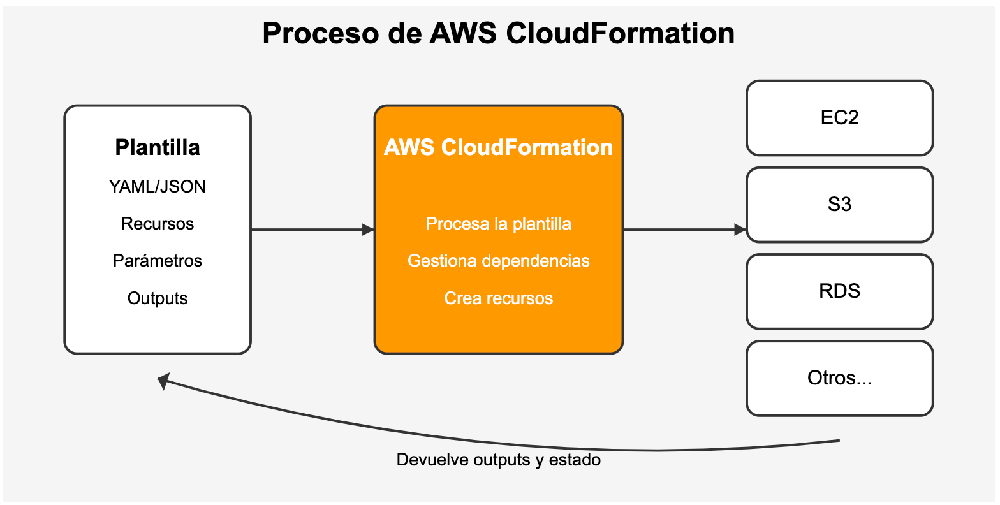

# intro

## ¿Qué es AWS CloudFormation?

AWS CloudFormation es un servicio que te permite definir y aprovisionar recursos de AWS mediante archivos de texto llamados *plantillas* (en YAML o JSON). Estas plantillas describen los recursos (como instancias EC2, bases de datos, VPC, etc.) y CloudFormation se encarga de crearlos, configurarlos y gestionarlos por ti, permitiéndote tratar toda la infraestructura como una sola unidad llamada *pila* o *stack*



## Estructura básica de una plantilla

Una plantilla sencilla de CloudFormation suele tener las siguientes secciones:

- **AWSTemplateFormatVersion:** Versión del formato de la plantilla.
- **Description:** Breve explicación de lo que hace la plantilla.
- **Resources:** Aquí defines los recursos que quieres crear (por ejemplo, una instancia EC2).
- **Outputs:** (Opcional) Para mostrar información útil al final, como direcciones IP o IDs.

Ejemplo básico en YAML para crear una instancia EC2:

```yaml
AWSTemplateFormatVersion: "2010-09-09"
Description: Crear una instancia EC2 básica
Resources:
  MyEC2Instance:
    Type: "AWS::EC2::Instance"
    Properties:
      ImageId: "ami-0c55b159cbfafe1f0" # Cambia por una AMI válida en tu región
      InstanceType: "t2.micro"
```

## Cómo hacer una prueba básica

1. **Accede a la consola de AWS** y busca el servicio "CloudFormation".
2. Haz clic en **"Crear pila"** y selecciona "Con recursos nuevos (estándar)".
3. Elige **"Cargar un archivo de plantilla"** y sube tu archivo YAML (como el del ejemplo anterior)[5].
4. Haz clic en **"Siguiente"**, ponle un nombre a la pila y sigue los pasos hasta "Crear pila".
5. Espera unos minutos a que se cree la pila. Podrás ver el progreso y, al finalizar, tendrás tu recurso creado.

## Validar tu plantilla antes de desplegar

Antes de desplegar, puedes validar tu plantilla con el comando:

```bash
aws cloudformation validate-template --template-body file://ruta/a/tu/plantilla.yaml
```
Esto te ayuda a detectar errores de sintaxis antes de crear la pila[5].

## Eliminar la pila despues de hacer la prueba

- **Elimina la pila:** Cuando termines tu prueba, elimina la pila desde la consola para borrar todos los recursos creados y evitar costos innecesarios.


Cuando terminas una prueba o experimento con AWS CloudFormation, **eliminar la pila** significa borrar la "stack" que creaste desde la consola de CloudFormation. Al hacer esto, CloudFormation elimina automáticamente todos los recursos que se crearon con esa pila (por ejemplo, instancias EC2, buckets S3, grupos de seguridad, etc.), a menos que hayas configurado explícitamente que algunos recursos se conserven usando políticas especiales como *DeletionPolicy*.

Esto es importante porque, si dejas los recursos activos, podrías seguir generando costos en tu cuenta de AWS. Eliminar la pila es una forma sencilla y segura de asegurarte de que todo lo que creaste para la prueba se borre y así evitar cargos innecesarios.

**¿Cómo se elimina una pila desde la consola?**
- Ve a la consola de AWS CloudFormation.
- Selecciona la pila que quieres eliminar.
- Haz clic en "Eliminar".
- Confirma la operación.

Una vez que inicias la eliminación, el proceso no se puede detener y la pila pasará al estado `DELETE_IN_PROGRESS` hasta que termine. Cuando finaliza, la pila desaparece de la lista principal (queda en estado `DELETE_COMPLETE`).

Si algún recurso no puede eliminarse (por ejemplo, un bucket S3 que aún tiene objetos), CloudFormation te lo indicará y podrás forzar la eliminación de la pila reteniendo esos recursos problemáticos.


-----


# Aprendiendo AWS CloudFormation

¡Claro que puedo ayudarte a aprender AWS CloudFormation! Vamos a empezar con lo básico y luego puedes ir construyendo sobre eso.

## ¿Qué es CloudFormation?

CloudFormation es un servicio de AWS que te permite crear y gestionar recursos de AWS mediante código (Infrastructure as Code). En lugar de configurar manualmente recursos a través de la consola, defines todos tus recursos en un archivo de plantilla y CloudFormation se encarga de aprovisionar y configurar estos recursos por ti.

## Conceptos básicos

- **Plantilla**: Archivo JSON o YAML que define los recursos de AWS
- **Stack**: Colección de recursos de AWS que gestionas como una unidad
- **Recursos**: Los componentes de AWS que quieres crear (EC2, S3, etc.)
- **Parámetros**: Variables que puedes pasar a tu plantilla
- **Outputs**: Valores que la plantilla devuelve cuando se ejecuta

## Un ejemplo práctico básico

Vamos a crear una plantilla simple para un bucket S3:

```yaml
AWSTemplateFormatVersion: '2010-09-09'
Description: 'Plantilla básica para crear un bucket S3'

Resources:
  MiPrimerBucket:
    Type: AWS::S3::Bucket
    Properties:
      BucketName: mi-primer-bucket-cf-123
      AccessControl: Private
      
Outputs:
  BucketName:
    Description: 'Nombre del bucket S3 creado'
    Value: !Ref MiPrimerBucket
  BucketARN:
    Description: 'ARN del bucket S3'
    Value: !GetAtt MiPrimerBucket.Arn

```


## Pasos para crear tu primera plantilla CloudFormation

1. **Crea el archivo de plantilla**: Guarda el código YAML que te mostré en un archivo llamado `mi-primer-template.yaml`

2. **Implementa la plantilla**: Tienes dos opciones:

   a) **Usando la consola de AWS**:
    - Ve a la consola de AWS y busca CloudFormation
    - Selecciona "Create stack" (Crear pila)
    - Elige "Upload a template file" (Cargar archivo de plantilla)
    - Sube tu archivo YAML y sigue las instrucciones

   b) **Usando la AWS CLI**:
   ```bash
   aws cloudformation create-stack --stack-name mi-primera-pila --template-body file://mi-primer-template.yaml
   ```

3. **Monitorea la creación de tu stack**:
    - CloudFormation mostrará el estado de la creación en la consola
    - Puedes ver eventos, recursos y output

## Beneficios de CloudFormation

- **Infraestructura como código**: Versiona y gestiona tu infraestructura
- **Automatización**: Despliegue y actualización automáticos
- **Consistencia**: El mismo código crea los mismos recursos cada vez
- **Control de cambios**: CloudFormation sabe qué recursos actualizar
- **Dependencias**: Gestiona automáticamente el orden de creación

## Siguientes pasos para aprender

1. **Añade más recursos**: Amplía tu plantilla con más tipos de recursos
2. **Usa parámetros**: Haz tu plantilla más flexible
3. **Crea dependencias**: Haz que unos recursos dependan de otros
4. **Usa funciones intrínsecas**: Como !Ref, !GetAtt, !Join, etc.
5. **Crea stacks anidados**: Dividir la infraestructura en componentes reusables


