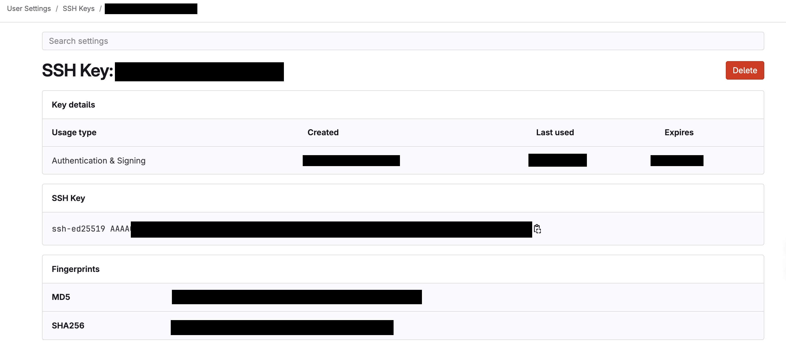

# Setting ssh keys

There are `ssh keys` needed for ssh connections and there is an `ssh agent`.

The ssh agent looks the keys into the `~/.ssh/config` map.
This file is only a map with the configurations and the keys.
You can say, if the url is this, then use the key x or whatever.

## creating ssh keys
You can have several keys if you want or only one for all. As you wish.

when you want to create a key, two files are created the public and the private files.
The public contains the public key, and this file is used into the github for the configuration of the repositories.

### Generating keys
```bash
# create the priv/pub keys
ssh-keygen -t ed25519 -C your_user@email.com" -f ~/.ssh/id_ed25519_your_user

# by default creates the id_rsa for the private key and the id_rsa_pub for the public key
# take care, if you have a previous id_rsa you are going to override them.
> Enter a file in which to save the key (/home/you/.ssh/id_rsa): [Press enter]

# do enter two times, leave it empty
> Enter passphrase (empty for no passphrase): [Type a passphrase]
> Enter same passphrase again: [Type passphrase again]
```
### add keys to the ~/ssh/config file, adding key to the agent

The ssh-agent stores the private keys into the macosx keystore.
to do that

```bash
# start the agent
eval "$(ssh-agent -s)"
# list keys
ssh-add -l
# add the key to the agent
ssh-add ~/.ssh/id_ed25519_your_user
```

this process will create the `~/ssh/config` file with the info. If it's not, you have to create it.

```bash
Host gitlab.com
    HostName gitlab.com
    User git
    IdentityFile ~/.ssh/id_ed25519_your_user
```

give the permissions to the file
```bash
chmod 600 ~/.ssh/id_ed25519_your_user
chmod 644 ~/.ssh/id_ed25519_your_user
```

test it
```
ssh -T git@gitlab.com
```

write `yes` and enter

## problem

```bash
git pull git@gitlab.com: Permission denied (publickey).
fatal: Could not read from remote repository.
Please make sure you have the correct access rights and the repository exists.
```

Review the previos steps, and if everything is ok,

go to gitlab -> yourprofile -> settings -> SSH keys

and add the public key to the gitlab.

```bash
cat ~/.ssh/id_ed25519_your_user.pub | pbcopy
```

with the key copied, paste it into the gitlab ssh keys.





