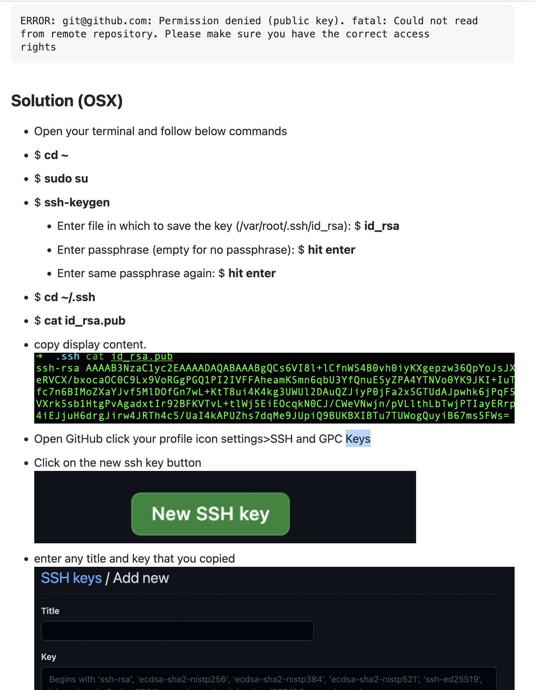

# Setting ssh keys

There are `ssh keys` needed for ssh connections and there is an `ssh agent`.

The ssh agent looks the keys into the `~/.ssh/config` map.
This file is only a map with the configurations and the keys.
You can say, if the url is this, then use the key x or whatever.

## creating ssh keys
You can have several keys if you want or only one for all. As you wish.

when you want to create a key, two files are created the public and the private files.
The public contains the public key, and this file is used into the github for the configuration of the repositories.

### Generating keys
```bash
# create the priv/pub keys
ssh-keygen -t rsa -b 4096 -C "your_email@gmail.com"

# by default creates the id_rsa for the private key and the id_rsa_pub for the public key
# take care, if you have a previous id_rsa you are going to override them.
> Enter a file in which to save the key (/home/you/.ssh/id_rsa): [Press enter]

# do enter two times, leave it empty
> Enter passphrase (empty for no passphrase): [Type a passphrase]
> Enter same passphrase again: [Type passphrase again]
```
### add keys to the ~/shh/config file, adding key to the agent

The ssh-agent stores the private keys into the macosx keystore.
to do that

```bash
ssh-add -K ~/.ssh/id_rsa
```

this process will create the `~/shh/config` file with the info. If it's not, you have to create it.

```bash
Host *
		AddKeysToAgent yes
		IgnoreUnknown UseKeychain
		UseKeychain yes
		IdentityFile ~/.ssh/id_rsa
```


reference:
- https://docs.github.com/en/authentication/connecting-to-github-with-ssh/adding-a-new-ssh-key-to-your-github-account

## problem

```bash
git pull git@github.com: Permission denied (publickey).
fatal: Could not read from remote repository.
Please make sure you have the correct access rights and the repository exists.
```

## Solution: ssh configuration

For seeing the previous ssh configurations
```bash
cat ~/.ssh/config
```

you can see the shh profiles 

```bash
Host *
		AddKeysToAgent yes
		IgnoreUnknown UseKeychain
		UseKeychain yes
		IdentityFile ~/.ssh/id_rsa

Host development
        User usuarioX
        Port 22223
        ProxyJump gate

Host gate
        Hostname gate.somedomain.com
        User someUser
        Port 22223
        ForwardAgent yes
        IdentityFile ~/.ssh/id_rsa

Host pre-somedomain* pre-somedomain01 pre-somedomain02
        User anotheruser
        Port 22223
        ProxyJump gate

Host somedomain.whatever.com
        Port 29418
        User someUser
        IdentityFile ~/.ssh/id_ed25519%
```

to get the public key of the `~/.ssh/id_rsa` you have to do 

```bash
cat ~/.ssh/id_rsa_pub
```

go to github -> yourprofile -> settings -> SSH keys

in this page, create a new ssh key, and paste the content of `id_rsa_pub`

reboot the intellij and do `git pull`to see if everything is ok.




