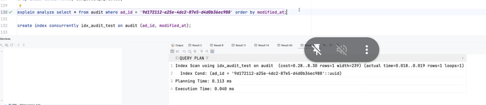
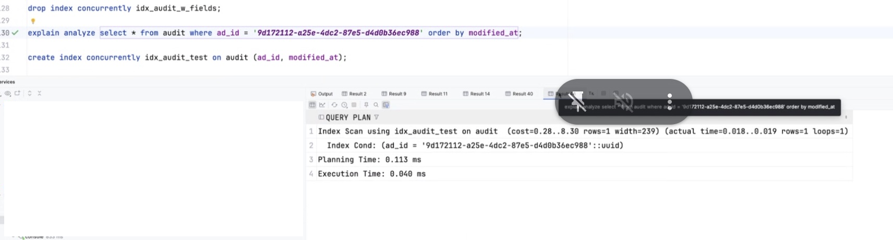
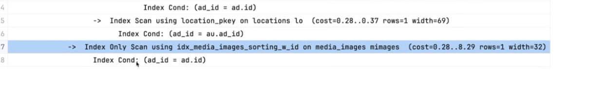
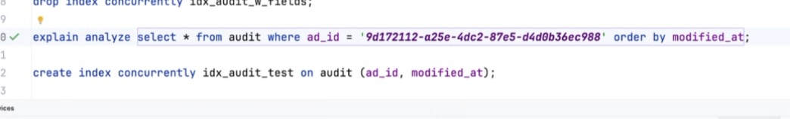
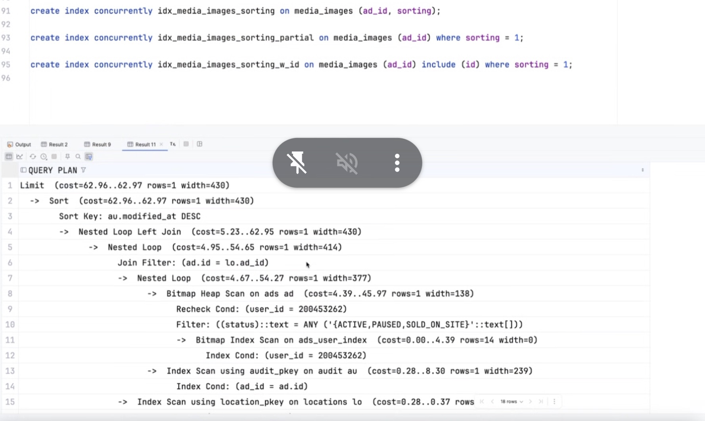

# index tunning

Para que sepamos que estamos usando un indice tenemos que ver en el explain plan que se se está haciendo uso del index scan. En ese caso se indica el nombre del indice que esta siendo usado.

~~_**_~~Hay tres casos que tenemos que tener en cuenta a la hora de crear un índice:

- cuales son los campos que retornamos en la consulta (proyección). Esto se indica en el `include`.

```sql
create index concurrently idx_media_images_sorting_w_id on media_images (ad_id) include (id) where
sorting = 1;
```

- cuales son los campos que estamos filtrando en el where

```sql
create index concurrently idx_media_images_sorting on media_images (ad_id, sorting);
```

- cuales son los campos que estamos ordenando en el order by

```sql
create index concurrently idx_media_images_sorting_partial on media_images (ad_id) where sorting = 1;
```












# Optimización de Índices en SQL: Casos Prácticos

Los índices en bases de datos son estructuras que mejoran significativamente el rendimiento de las consultas. Vamos a analizar los tres casos principales a considerar al crear un índice:

## 1. Campos en la Proyección (SELECT)

La proyección se refiere a los campos que seleccionamos para mostrar en los resultados.

### Ejemplo:
```sql
SELECT nombre, email FROM clientes WHERE ciudad = 'Madrid';
```

**Consideraciones:**
- Un índice que cubra tanto `nombre` y `email` (campos de proyección) como `ciudad` (campo de filtro) sería un "índice cubriente" (covering index)
- Este índice permitiría resolver la consulta completa desde el propio índice sin acceder a la tabla

**Índice óptimo:**
```sql
CREATE INDEX idx_clientes_ciudad_nombre_email ON clientes(ciudad, nombre, email);
```

## 2. Campos en la Cláusula WHERE (Filtros)

Los campos usados en filtros son candidatos primarios para indexación.

### Ejemplo:
```sql
SELECT * FROM pedidos WHERE fecha_pedido > '2023-01-01' AND estado = 'pendiente';
```

**Consideraciones:**
- Los campos en el WHERE determinan directamente la selectividad de la consulta
- El orden de los campos en el índice es crucial para su eficiencia

**Índice óptimo (si ambos campos son usados con frecuencia):**
```sql
CREATE INDEX idx_pedidos_estado_fecha ON pedidos(estado, fecha_pedido);
```

**Alternativa (si se consulta frecuentemente solo por fecha):**
```sql
CREATE INDEX idx_pedidos_fecha_estado ON pedidos(fecha_pedido, estado);
```

## 3. Campos en ORDER BY (Ordenamiento)

Los campos de ordenamiento afectan significativamente el rendimiento cuando se manejan grandes conjuntos de datos.

### Ejemplo:
```sql
SELECT id_producto, nombre FROM productos WHERE categoria = 'electrónica' ORDER BY precio DESC;
```

**Consideraciones:**
- Un índice que incluya los campos de filtro y ordenamiento evita operaciones de ordenamiento costosas
- La dirección del ordenamiento (ASC/DESC) debe considerarse al crear el índice

**Índice óptimo:**
```sql
CREATE INDEX idx_productos_categoria_precio ON productos(categoria, precio DESC);
```

## Ejemplo Combinado

Veamos un ejemplo que combina los tres casos:

```sql
SELECT nombre, apellido 
FROM empleados 
WHERE departamento = 'Ventas' AND fecha_contratacion > '2020-01-01' 
ORDER BY salario DESC 
LIMIT 10;
```

**Análisis:**
- **Proyección:** `nombre`, `apellido`
- **Filtros:** `departamento`, `fecha_contratacion`
- **Ordenamiento:** `salario` (descendente)

**Índice óptimo:**
```sql
CREATE INDEX idx_empleados_dept_fecha_salario ON empleados(departamento, fecha_contratacion, salario DESC);
```

**Índice cubriente completo:**
```sql
CREATE INDEX idx_empleados_completo ON empleados(departamento, fecha_contratacion, salario DESC, nombre, apellido);
```

Analizemos cada uno de estos índices para determinar a qué caso corresponde:

### 1. `create index concurrently idx_media_images_sorting_w_id on media_images (ad_id) include (id) where sorting = 1;`

Este es un **índice parcial con columna incluida**:
- **Filtro principal**: `ad_id` (columna indexada)
- **Columna incluida**: `id` (disponible en el índice pero no forma parte de la clave)
- **Condición parcial**: `sorting = 1` (solo incluye filas donde sorting = 1)

**Caso**: Optimizado para consultas que filtran por `ad_id` donde `sorting = 1` y necesitan acceder al campo `id`. Este índice corresponde a una combinación de casos:
- Caso 2 (WHERE): Filtra por `ad_id` y `sorting = 1`
- Caso 1 (proyección): Incluye `id` para evitar accesos a la tabla

**Ejemplo de consulta optimizada**:
```sql
SELECT id FROM media_images WHERE ad_id = 123 AND sorting = 1;
```

### 2. `create index concurrently idx_media_images_sorting on media_images (ad_id, sorting);`

Este es un **índice compuesto estándar**:
- **Columnas indexadas**: `ad_id` y `sorting` (en ese orden)

**Caso**: Optimizado para consultas que filtran por `ad_id` o por `ad_id` y `sorting`. También es útil para ordenamiento por `sorting` cuando se filtra por `ad_id`.
- Caso 2 (WHERE): Para filtrar por `ad_id` o la combinación `ad_id` y `sorting`
- Caso 3 (ORDER BY): Para ordenar por `sorting` cuando se filtra por `ad_id`

**Ejemplos de consultas optimizadas**:
```sql
SELECT * FROM media_images WHERE ad_id = 123;
SELECT * FROM media_images WHERE ad_id = 123 AND sorting = 1;
SELECT * FROM media_images WHERE ad_id = 123 ORDER BY sorting;
```

### 3. `create index concurrently idx_media_images_sorting_partial on media_images (ad_id) where sorting = 1;`

Este es un **índice parcial simple**:
- **Columna indexada**: `ad_id`
- **Condición parcial**: `sorting = 1` (solo incluye filas donde sorting = 1)

**Caso**: Optimizado específicamente para consultas que filtran por `ad_id` y tienen la condición `sorting = 1`.
- Caso 2 (WHERE): Especializado para filtros por `ad_id` cuando `sorting = 1`

**Ejemplo de consulta optimizada**:
```sql
SELECT * FROM media_images WHERE ad_id = 123 AND sorting = 1;
```

### Comparación y uso adecuado:

1. El primer índice es más específico y eficiente para seleccionar solo el `id` cuando `sorting = 1`.
2. El segundo índice es más versátil, permitiendo filtrar y ordenar por diferentes combinaciones.
3. El tercer índice es más compacto que el primero pero menos versátil que el segundo, optimizado específicamente para el filtro `sorting = 1`.

Los tres índices abordan principalmente el caso 2 (filtros en WHERE), pero con diferentes optimizaciones y extensiones para otros casos.


## Query para detectar locks en las bd de postgres


Query para detectar locks en las bd de postgres


```sql
SELECT blocked_locks.pid     AS blocked_pid,
       blocked_activity.usename  AS blocked_user,
       blocking_locks.pid     AS blocking_pid,
       blocking_activity.usename AS blocking_user,
       blocked_activity.query    AS blocked_statement,
       blocking_activity.query   AS current_statement_in_blocking_process
FROM  pg_catalog.pg_locks         blocked_locks
          JOIN pg_catalog.pg_stat_activity blocked_activity  ON blocked_activity.pid = blocked_locks.pid
          JOIN pg_catalog.pg_locks         blocking_locks
               ON blocking_locks.locktype = blocked_locks.locktype
                   AND blocking_locks.database IS NOT DISTINCT FROM blocked_locks.database
                   AND blocking_locks.relation IS NOT DISTINCT FROM blocked_locks.relation
                   AND blocking_locks.page IS NOT DISTINCT FROM blocked_locks.page
                   AND blocking_locks.tuple IS NOT DISTINCT FROM blocked_locks.tuple
                   AND blocking_locks.virtualxid IS NOT DISTINCT FROM blocked_locks.virtualxid
                   AND blocking_locks.transactionid IS NOT DISTINCT FROM blocked_locks.transactionid
                   AND blocking_locks.classid IS NOT DISTINCT FROM blocked_locks.classid
                   AND blocking_locks.objid IS NOT DISTINCT FROM blocked_locks.objid
                   AND blocking_locks.objsubid IS NOT DISTINCT FROM blocked_locks.objsubid
                   AND blocking_locks.pid != blocked_locks.pid
          JOIN pg_catalog.pg_stat_activity blocking_activity ON blocking_activity.pid = blocking_locks.pid
WHERE NOT blocked_locks.granted;
```